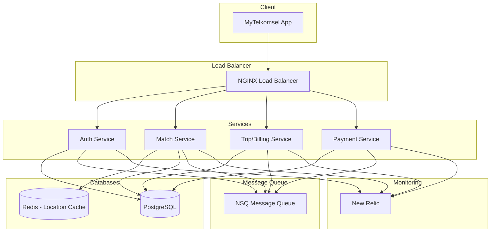

# NebengJek Backend

A microservices-based backend system for NebengJek, a ride-sharing feature within the MyTelkomsel app.

## Architecture Overview
### High-Level Design



### Key Features
- Real-time location tracking using Redis for caching
- Dynamic fare calculation (3000 IDR/km)
- Driver fare adjustment capability (≤100%)
- 5% admin fee deduction
- Asynchronous event processing using NSQ
- Load balancing with NGINX
- Monitoring with New Relic

### Technology Stack
- **Programming Languages**: Go, Node.js
- **Databases**: PostgreSQL, Redis
- **Message Queue**: NSQ
- **Load Balancer**: NGINX
- **Monitoring**: New Relic
- **Container Orchestration**: Docker, Docker Compose
- **API Protocol**: gRPC, REST

### Security Features
- JWT-based authentication
- Rate limiting
- Input validation
- Secure communication over TLS
- Secret management using Google Secret Manager

### Scalability Features
- Horizontal scaling capability
- Caching with Redis
- Load balancing
- Message queue for async processing
- Database connection pooling

## Architecture Overview

### High-Level Design

The system consists of four main microservices:
1. Auth Service - Handles user authentication and profile management
2. Match Service - Manages driver-customer matching within 1km radius
3. Trip/Billing Service - Handles trip management and cost calculation
4. Payment Service - Processes payments and settlements

### Technology Stack

- Go for microservices (implementing Clean Architecture)
- PostgreSQL for data storage
- Redis for caching and real-time location data
- NSQ for message queuing
- gRPC for inter-service communication
- Docker for containerization
- Nginx for API Gateway/Load Balancer
- New Relic for monitoring and observability
- Google Secret Manager for secrets management

### Clean Architecture

Each microservice follows the Clean Architecture pattern with the following layers:
- Domain Layer (entities and interfaces)
- Repository Layer (data access)
- Usecase Layer (business logic)
- Delivery Layer (HTTP/gRPC handlers)

## Project Structure

```
nebengjek-backend/
├─ auth-service/
│  ├─ domain/
│  ├─ repository/
│  ├─ usecase/
│  ├─ delivery/
│  └─ proto/
├─ match-service/
├─ trip-billing-service/
├─ payment-service/
├─ infrastructure/
└─ docs/
```

## Getting Started

### Prerequisites

- Go 1.19 or later
- Docker and Docker Compose
- PostgreSQL
- Redis
- NSQ
- protoc (Protocol Buffers compiler)

### Setup Instructions

1. Clone the repository
```bash
git clone https://github.com/YourUsername/nebengjek-backend.git
cd nebengjek-backend
```

2. Install dependencies for each service
```bash
cd auth-service && go mod download
cd ../match-service && go mod download
cd ../trip-billing-service && go mod download
cd ../payment-service && go mod download
```

3. Set up environment variables
- Copy `config.yaml.example` to `config.yaml` in each service's config directory
- Update the configurations with your settings
- Configure Google Secret Manager credentials if needed

4. Start the services using Docker Compose
```bash
docker-compose up
```

## Development

### Generating Protocol Buffers

After modifying any `.proto` files, regenerate the Go code:

```bash
protoc --go_out=. --go_opt=paths=source_relative \
    --go-grpc_out=. --go-grpc_opt=paths=source_relative \
    proto/*.proto
```

### Running Tests

Each service includes its own test suite. To run tests:

```bash
go test ./...
```

## Monitoring

- New Relic APM is integrated for performance monitoring
- Metrics, logs, and traces are automatically collected
- Access the New Relic dashboard for detailed insights

## License

MIT