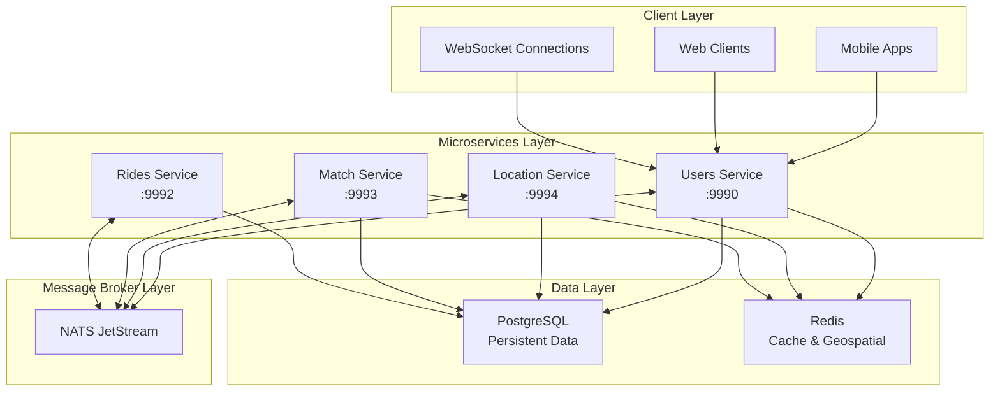

# NebengJek - Technical Documentation Hub

A lightweight, real-time trip-hailing and social matching platform integrated with MyTelkomsel.  
**Key Features**: MSISDN-based auth, driver-customer matching, dynamic pricing, and role-based workflows.

---

## 📚 Quick Reference Glossary

### Core Architecture
- **[Database Architecture](docs/database-architecture.md)** - PostgreSQL schema design, Redis implementation, data models, and performance optimization
- **[NATS Messaging System](docs/nats-messaging.md)** - JetStream architecture, event-driven communication, and asynchronous processing
- **[Business Logic Workflows](docs/business-logic-workflows.md)** - Domain-driven design, service responsibilities, and business rule implementation

### Technical Implementation  
- **[WebSocket Implementation](docs/websocket-implementation.md)** - Real-time communication, JWT authentication, and architectural rationale
- **[Security Implementation](docs/security-implementation.md)** - API key authentication, panic recovery, graceful shutdown, and security scanning
- **[Monitoring & Observability](docs/monitoring-observability.md)** - New Relic APM integration, Zap logging framework, and performance monitoring

### Development & Operations
- **[Testing Strategies](docs/testing-strategies.md)** - Unit testing with mocks, Redis integration testing, and coverage analysis
- **[CI/CD & Deployment](docs/cicd-deployment.md)** - GitHub Actions pipelines, Docker deployment, and graceful shutdown procedures

---

## 🏗️ System Overview

### Architecture at a Glance



### Technology Stack

| **Category** | **Technology** | **Purpose** | **Documentation** |
|--------------|----------------|-------------|-------------------|
| **Language** | Go 1.23 | Primary development language | - |
| **Web Framework** | Echo v4 | HTTP server and routing | - |
| **Database** | PostgreSQL with pgx | Primary data storage | [Database Architecture](docs/database-architecture.md) |
| **Cache/Session** | Redis | Caching, geospatial indexing | [Database Architecture](docs/database-architecture.md) |
| **Message Broker** | NATS JetStream | Event-driven communication | [NATS Messaging](docs/nats-messaging.md) |
| **WebSocket** | Gorilla WebSocket | Real-time communication | [WebSocket Implementation](docs/websocket-implementation.md) |
| **Authentication** | JWT + API Keys | Stateless authentication | [Security Implementation](docs/security-implementation.md) |
| **Monitoring** | New Relic APM | Performance monitoring | [Monitoring & Observability](docs/monitoring-observability.md) |
| **Logging** | Zap Logger | Structured JSON logging | [Monitoring & Observability](docs/monitoring-observability.md) |
| **Testing** | Testify, GoMock | Unit and integration testing | [Testing Strategies](docs/testing-strategies.md) |
| **Containerization** | Docker & Docker Compose | Service orchestration | [CI/CD & Deployment](docs/cicd-deployment.md) |

---

## 🔍 Service Glossary

### Users Service (Port: 9990)
**Primary Responsibilities**: User management, authentication, driver registration, real-time WebSocket communication

**Key Features**:
- MSISDN-based OTP authentication with Telkomsel validation
- JWT token generation and validation  
- Driver registration with vehicle information
- Real-time WebSocket connections for notifications
- Beacon status management for driver availability

**Documentation**: [Business Logic Workflows](docs/business-logic-workflows.md#user-domain-models)

### Location Service (Port: 9994)  
**Primary Responsibilities**: Geospatial operations, location tracking, proximity calculations

**Key Features**:
- Real-time location tracking and updates
- Geohash-based proximity calculations
- Redis geospatial indexing for fast queries
- Location history management with TTL

**Documentation**: [Database Architecture](docs/database-architecture.md#redis-implementation)

### Match Service (Port: 9993)
**Primary Responsibilities**: Driver-passenger matching, match proposals, confirmation handling

**Key Features**:
- Event-driven matching algorithm
- Driver pool management
- Match proposal and confirmation workflow
- Real-time match notifications via NATS

**Documentation**: [Business Logic Workflows](docs/business-logic-workflows.md#passenger-ride-request-and-matching-workflow)

### Rides Service (Port: 9992)
**Primary Responsibilities**: Ride lifecycle management, billing, payment processing

**Key Features**:
- Complete ride lifecycle management
- Dynamic billing calculation (3000 IDR/km base rate)
- Payment processing with 5% admin fee
- Ride history and analytics

**Documentation**: [Business Logic Workflows](docs/business-logic-workflows.md#ride-lifecycle-management-workflow)

---

## 💾 Data Architecture Glossary

### PostgreSQL Schema
- **Users & Drivers**: User management and driver registration
- **Matches**: Driver-passenger matching records
- **Rides**: Complete ride lifecycle tracking
- **Billing & Payments**: Financial transaction management

**Detailed Schema**: [Database Architecture](docs/database-architecture.md#postgresql-schema-design)

### Redis Implementation
- **Geospatial Indexing**: Real-time location tracking with `GEOADD`/`GEORADIUS`
- **TTL Management**: Automatic data expiration (30min availability, 5min OTP)
- **Caching Strategy**: Multi-layer caching for performance optimization

**Implementation Details**: [Database Architecture](docs/database-architecture.md#redis-implementation)

---

## 🌐 Communication Patterns Glossary

### Synchronous Communication (HTTP)
- User authentication and profile management
- Driver registration and internal service APIs
- API key authentication for service-to-service calls

### Real-time Communication (WebSocket)
- Location updates and driver availability
- Match notifications and confirmations
- Ride status updates and payment notifications

### Asynchronous Communication (NATS)
- Event-driven service communication
- Location tracking and match processing
- Ride updates and billing events

**Detailed Patterns**: [NATS Messaging System](docs/nats-messaging.md#event-driven-communication-patterns)

---

## 🔒 Security Glossary

### Authentication Methods
- **JWT WebSocket Authentication**: Token-based real-time connection security
- **API Key Authentication**: Service-to-service communication protection
- **MSISDN-based OTP**: Telkomsel integration for user verification

### Security Mechanisms
- **Panic Recovery**: Enhanced error handling with detailed logging
- **Input Validation**: Request sanitization and business rule enforcement
- **Secret Scanning**: GitLeaks integration for credential protection

**Security Details**: [Security Implementation](docs/security-implementation.md)

---

## 📊 Monitoring Glossary

### New Relic APM Integration
- **Distributed Tracing**: End-to-end request tracking across services
- **Custom Attributes**: Business context for transactions
- **Database Instrumentation**: PostgreSQL and Redis operation monitoring

### Zap Logging Framework
- **Structured JSON Logging**: Machine-readable log format
- **Log Correlation**: Request ID and trace ID correlation
- **Multiple Outputs**: Console, file, and New Relic forwarding

**Monitoring Setup**: [Monitoring & Observability](docs/monitoring-observability.md)

---

## 🧪 Testing Glossary

### Testing Strategies
- **Unit Testing**: GoMock-based dependency injection and mocking
- **Integration Testing**: Mini Redis for geospatial operation testing
- **Coverage Analysis**: Automated coverage reporting in CI/CD

### Testing Tools
- **Testify**: Assertion library and test suites
- **GoMock**: Mock generation for interfaces
- **Miniredis**: In-memory Redis for testing

**Testing Implementation**: [Testing Strategies](docs/testing-strategies.md)

---

## 🚀 Deployment Glossary

### CI/CD Pipeline
- **GitHub Actions**: Automated testing, security scanning, and deployment
- **SonarCloud Integration**: Code quality and security analysis
- **Docker Deployment**: Multi-service containerization strategy

### Graceful Shutdown
- **Signal Handling**: SIGINT/SIGTERM graceful shutdown
- **Resource Cleanup**: Database, Redis, and NATS connection management
- **Health Checks**: Comprehensive service health monitoring

**Deployment Details**: [CI/CD & Deployment](docs/cicd-deployment.md)

---

## 📈 Performance & Scalability

### Optimization Strategies
- **Geospatial Indexing**: Sub-millisecond location queries with Redis
- **Connection Pooling**: Efficient database resource utilization
- **Async Processing**: NATS-based event-driven architecture
- **Multi-layer Caching**: Redis and in-memory caching strategies

### Monitoring Metrics
- **Response Times**: P50, P95, P99 percentiles tracking
- **Error Rates**: 4xx/5xx error monitoring and alerting
- **Business Metrics**: User registration, matching success rates
- **Resource Utilization**: Database, Redis, and NATS performance

---

## 🔧 Configuration Glossary

### Environment Variables
```bash
# Database Configuration
DB_HOST=postgres
DB_PORT=5432
REDIS_HOST=redis
REDIS_PORT=6379

# NATS Configuration  
NATS_URL=nats://localhost:4222

# Business Logic Configuration
MATCHING_DEFAULT_RADIUS_KM=5.0
BILLING_BASE_RATE_PER_KM=3000
BILLING_ADMIN_FEE_PERCENT=5.0

# Security Configuration
JWT_SECRET_KEY=your-secret-key
API_KEY_MATCH_SERVICE=your-api-key

# Monitoring Configuration
NEW_RELIC_LICENSE_KEY=your-license-key
LOG_LEVEL=info
```

### Configurable Business Parameters
- **Matching Algorithm**: Search radius, driver limits, response timeouts
- **Billing Rules**: Base rates, admin fees, minimum/maximum fares
- **Location Settings**: TTL values, update intervals, service areas
- **Authentication**: OTP expiry, JWT expiry, rate limits

**Configuration Details**: [Business Logic Workflows](docs/business-logic-workflows.md#configurable-business-logic-parameters)

---

## 🚦 Getting Started

### Quick Setup
1. **Clone Repository**: `git clone <repository-url>`
2. **Install Dependencies**: `go mod download`
3. **Start Infrastructure**: `docker-compose up postgres redis nats`
4. **Run Migrations**: Execute SQL files in [`db/migrations/`](db/migrations/)
5. **Start Services**: `docker-compose up` or run individual services

### Development Workflow
1. **Follow Clean Architecture**: Handler → UseCase → Repository → Gateway
2. **Write Tests**: Unit tests with mocks, integration tests with Redis
3. **Use Code Generation**: `go generate ./...` for mocks
4. **Run Quality Checks**: Tests, linting, and security scanning

**Detailed Setup**: [CI/CD & Deployment](docs/cicd-deployment.md#deployment-configuration)

---

## 📖 Documentation Index

| **Topic** | **File** | **Description** |
|-----------|----------|-----------------|
| **Database Design** | [`docs/database-architecture.md`](docs/database-architecture.md) | PostgreSQL schema, Redis patterns, data models |
| **Messaging System** | [`docs/nats-messaging.md`](docs/nats-messaging.md) | NATS JetStream, event flows, async communication |
| **Real-time Communication** | [`docs/websocket-implementation.md`](docs/websocket-implementation.md) | WebSocket architecture, JWT auth, message handling |
| **Security & Auth** | [`docs/security-implementation.md`](docs/security-implementation.md) | API keys, panic recovery, security scanning |
| **Monitoring & Logs** | [`docs/monitoring-observability.md`](docs/monitoring-observability.md) | New Relic APM, Zap logging, performance metrics |
| **Business Logic** | [`docs/business-logic-workflows.md`](docs/business-logic-workflows.md) | Domain models, workflows, business rules |
| **Testing & Quality** | [`docs/testing-strategies.md`](docs/testing-strategies.md) | Unit tests, mocks, coverage analysis |
| **Deployment & CI/CD** | [`docs/cicd-deployment.md`](docs/cicd-deployment.md) | GitHub Actions, Docker, graceful shutdown |

---

## 🤝 Contributing

1. **Read Documentation**: Familiarize yourself with the architecture and patterns
2. **Follow Testing Standards**: Write tests for all business logic
3. **Maintain Coverage**: Ensure test coverage meets or exceeds current levels
4. **Security First**: Run security scans and follow secure coding practices
5. **Document Changes**: Update relevant documentation for new features

**Development Guidelines**: [Testing Strategies](docs/testing-strategies.md#test-data-management)

---

📄 **License**: MIT