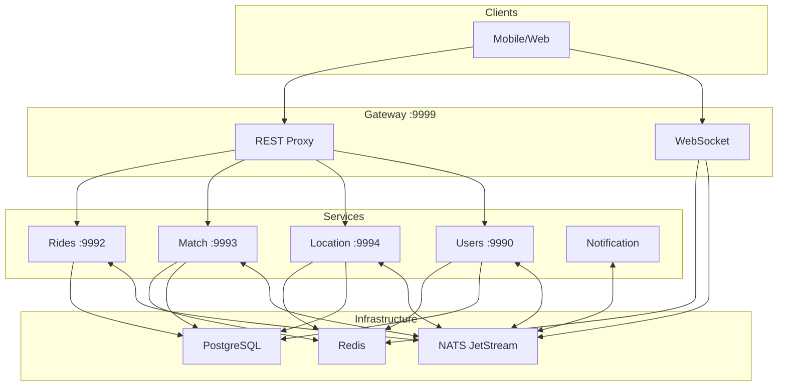

# NebengJek

A lightweight, real-time ride-hailing platform integrated with MyTelkomsel.
MSISDN-based auth, driver-customer matching, dynamic pricing (3000 IDR/km), and 5% admin fee.

## Architecture


```mermaid
graph TB
    subgraph "Clients"
        C[Mobile/Web]
    end

    subgraph "Gateway :9999"
        WS[WebSocket]
        REST[REST Proxy]
    end

    subgraph "Services"
        US[Users :9990]
        LS[Location :9994]
        MS[Match :9993]
        RS[Rides :9992]
        NS[Notification]
    end

    subgraph "Infrastructure"
        NATS[NATS JetStream]
        PG[PostgreSQL]
        RD[Redis]
    end

    C --> WS & REST
    REST --> US & LS & MS & RS
    WS --> NATS
    US & LS & MS & RS & NS <--> NATS
    US & LS & MS & RS --> PG
    US & LS & MS --> RD
    WS --> RD
```

| Service | Port | Purpose |
|---------|------|---------|
| Gateway | 9999 | WebSocket + REST proxy, Redis sessions, NATS broadcasting |
| Users | 9990 | Auth (MSISDN/OTP/JWT), user management, driver registration |
| Location | 9994 | Geospatial tracking, Redis geo-indexes |
| Match | 9993 | Driver-passenger matching algorithm |
| Rides | 9992 | Ride lifecycle, billing, payments |
| Notification | — | Selective event → user notification |

## Tech Stack

| Category | Technology |
|----------|-----------|
| Language | Go 1.23 |
| Framework | Echo v4 |
| Database | PostgreSQL (pgx) |
| Cache | Redis |
| Messaging | NATS JetStream |
| WebSocket | `github.com/coder/websocket` |
| Auth | JWT + API Keys |
| APM | New Relic |
| Logging | Go slog |
| Testing | Testify, GoMock, Miniredis |
| CI/CD | GitHub Actions, Docker |

## Documentation

| Doc | Contents |
|-----|----------|
| [System Architecture](docs/system-architecture.md) | Service overview, internal packages, communication patterns, data storage |
| [API Reference](docs/api-reference.md) | REST API endpoints for all services |
| [WebSocket Guide](docs/websocket-guide.md) | Real-time events, payloads, connection lifecycle, multi-gateway |
| [NATS Messaging](docs/nats-messaging.md) | JetStream streams, event schemas, service communication map |
| [Database Architecture](docs/database-architecture.md) | PostgreSQL schema, Redis patterns |
| [Business Logic Workflows](docs/business-logic-workflows.md) | Domain models, matching, ride lifecycle, billing |
| [Operations Guide](docs/operations-guide.md) | Middleware, tracing, logging, health checks, shutdown, security, HTTP client |
| [Development Guide](docs/development-guide.md) | Project structure, testing, CI/CD, Docker, local setup |

## Quick Start

```bash
git clone <repository-url>
go mod download
docker-compose up postgres redis nats    # Start infrastructure
go run ./cmd/gateway                      # Run gateway locally

# Or run everything:
docker-compose up
```

## Configuration

```bash
# Database
DB_HOST=localhost DB_PORT=5432 DB_NAME=nebengjek DB_USER=nebengjek

# Redis
REDIS_HOST=localhost REDIS_PORT=6379

# NATS
NATS_URL=nats://localhost:4222

# Auth
JWT_SECRET_KEY=your-secret
API_KEY_MATCH_SERVICE=your-key

# Business Logic
MATCHING_DEFAULT_RADIUS_KM=5.0
BILLING_BASE_RATE_PER_KM=3000
BILLING_ADMIN_FEE_PERCENT=5.0

# Monitoring
NEW_RELIC_LICENSE_KEY=your-key
LOG_LEVEL=info
```

## Development

```bash
go test ./...              # Run all tests
go test ./... -race        # With race detection
go generate ./...          # Regenerate mocks
go build ./...             # Build all
go vet ./...               # Static analysis
```

---

📄 **License**: MIT
