# Solution Development Assessment 2025 -- 1

**Solution Development Assessment 2025 -- 1**

Congratulations on your next assessment! How are you doing so far? Have fun with this assessment, and as always, do your best! This time, you are going to manage an Ojek Online named **NebengJek**, which combines a transportation app with a dating app. This Ojek Online will use Telkomsel's location services to detect users' locations, inform the nearest Ojek drivers, and allow drivers to pick up customers.

The difference between NebengJek and other services is that our system is **lite, simple, and fast**. Customers simply click the order button, and the system informs all nearest Ojek drivers. Drivers can then assess the feasibility of picking up the customer based on distance, time, and possibility. If the driver agrees, the customer is picked up. The process is equally simple for drivers: they turn on a "beacon button" to indicate availability, and they confirm their identity using the MyTelkomsel app (no jackets or physical attributes required). Customers verify the driver's app, hop on the bike, and the transaction begins.

Detailed sequence of interactions:

```plantuml
@startuml NebengJek Sequence

participant Driver as D
participant System as S
participant Customer as C

D -> S: Activate availability (beacon)
S -> S: Register driver location
C -> S: Request trip
S -> S: Find drivers within 1km
S -> D: Send trip request
S -> C: Send potential match
D --> S: Accept/Reject trip
C --> S: Accept/Reject match

alt Both Accept
    S -> D: Confirm match
    S -> C: Confirm match
    
    loop Every minute
        D -> S: Update location
        C -> S: Update location
        S -> S: Calculate distance/fare
    end
    
    D -> S: End trip
    S -> S: Calculate final fare
    D -> S: Adjust fare (≤100%)
    S -> S: Apply 5% admin fee
    C -> S: Process payment
    S -> D: Confirm payment
end

@enduml
```

1. **Driver workflow**:  
   - Drivers activate their availability to work (searching for customers within a 1 km radius).  
2. **Customer workflow**:  
   - Customers request a trip, and the system finds potential drivers within 1 km.  
3. **Matching**:  
   - When a match occurs, both parties receive a notification and decide to accept/reject.  
4. **Trip initiation**:  
   - If both agree, the driver picks up the customer, and the trip starts.  
5. **Billing**:  
   - Billing begins once the trip starts. Fare is calculated using real-time GPS data from both smartphones, tracking distance from the starting point.  
6. **Location updates**:  
   - MyTelkomsel updates locations every 1 minute (or faster).  
7. **Pricing**:  
   - **3000 IDR/km** is charged for every 1 km distance difference from the previous minute's location.  
8. **Trip completion**:  
   - After arrival, the driver closes the trip. The customer pays, and the driver can adjust the fare (100% or less). Drivers may charge less because NebengJek is not strictly a taxi service.  
9. **Admin fee**:  
   - MyTelkomsel deducts **5%** of the final transaction as an admin fee.  

**Key Notes**:  
- Pricing is **not fixed** upfront. It is dynamically calculated based on GPS data from both parties' MSISDN (mobile numbers).  
- The app is a lightweight module within MyTelkomsel. Telkomsel charges only 5% per transaction.  
- Drivers can adjust fares post-trip (100% or lower).  

---

## Tasks to Complete  
You must prepare the following for the NebengJek app:  

1. **Solution diagrams in `README.md`**:  
   a. High-level design architecture  
   b. Low-level design architecture  
   c. ERD document  

2. **Tool configurations**:  
   - Config files for queuing, load balancer, and cloud systems (commit to Git).  

3. **Microservice code**:  
   - Code for the ticketing backend (supports ticket purchasing). Use **Java, NodeJS, or Golang**.  

4. **End-to-end tests**:  
   - Validate all business cases (e.g., matching, billing, admin fee).  

---

## Submission Guidelines  
- Use a **free Git cloud repository** (e.g., GitHub, GitLab).  
- Include all code, configs, and design documents in **one project**.  
- Provide the Git URL before starting the project.  
- **Mandatory documents** (in `.md` format):  
   - High-level architecture  
   - Low-level architecture  
   - ERD diagram  
- Additional diagrams (e.g., Word/Docs) can be linked in the `README.md`.  
- Use **dummy/stub services** and **fake data** if needed. Declare assumptions in `README.md`.  

---

## Technical Requirements  
1. **Architecture principles**:  
   - Cost-effective, manageable, secure, scalable, high-performance, efficient, highly available, fault-tolerant, and recoverable.  
2. **Code standards**:  
   - Testable (prioritize business logic tests).  
3. **Third-party tools**:  
   - List all libraries/frameworks in `README.md` with justifications.  

---

## Final Checklist  
- [ ] Code and `README.md` are in one Git repository.  
- [ ] Diagrams (high-level, low-level, ERD) are included in `README.md`.  
- [ ] Config files for tools (queuing, load balancer, cloud) are committed.  
- [ ] All third-party tools are justified in `README.md`.  
- [ ] Tests cover critical business cases.  

**By submitting, you confirm this work is entirely your own.**