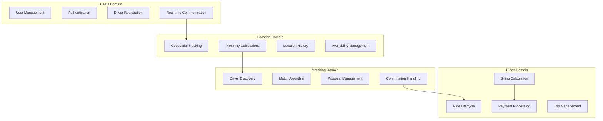
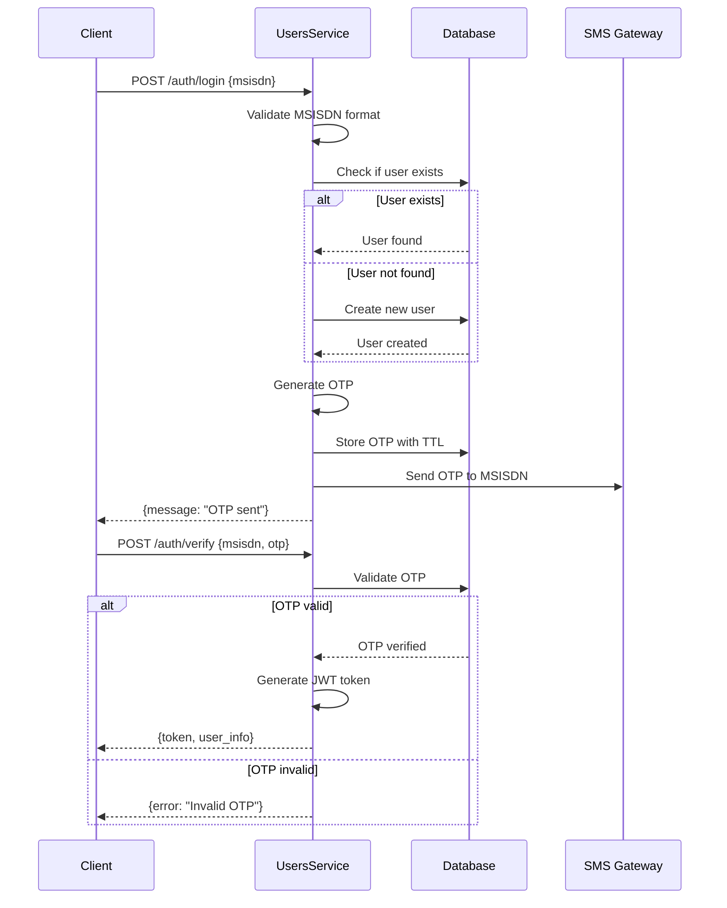
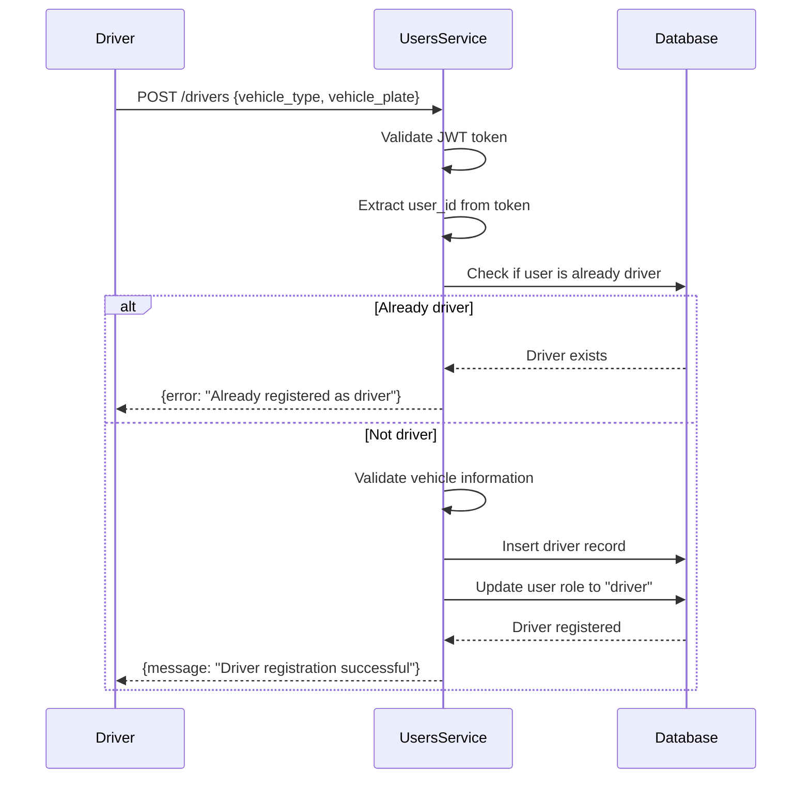
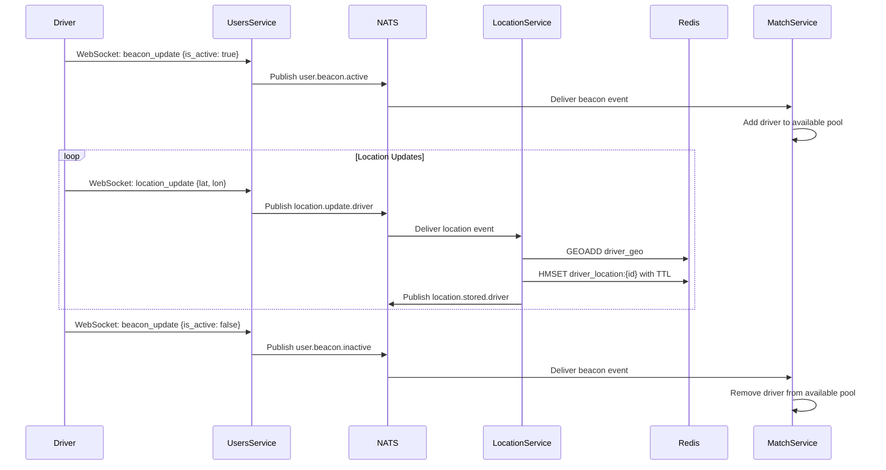
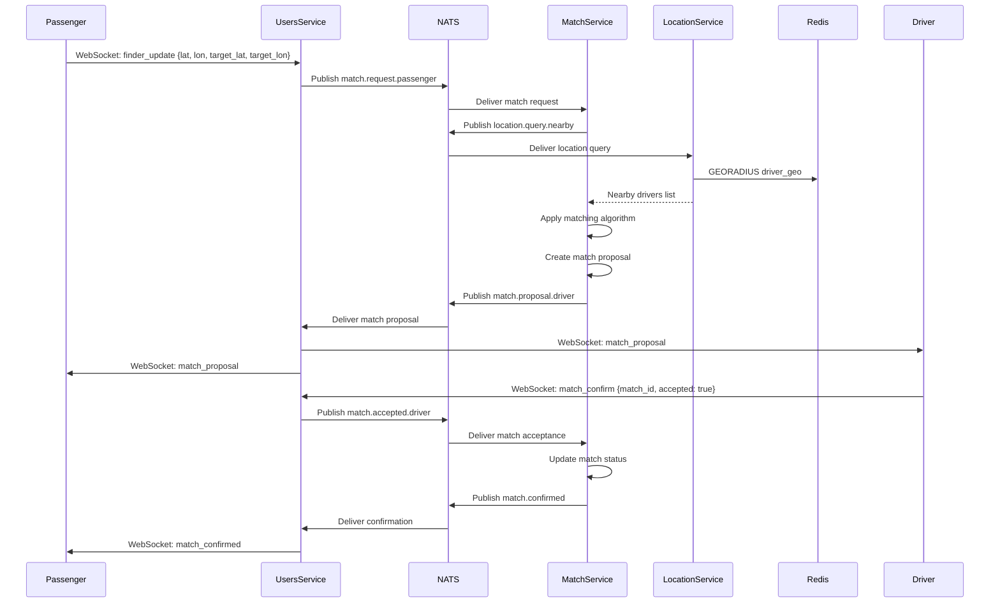
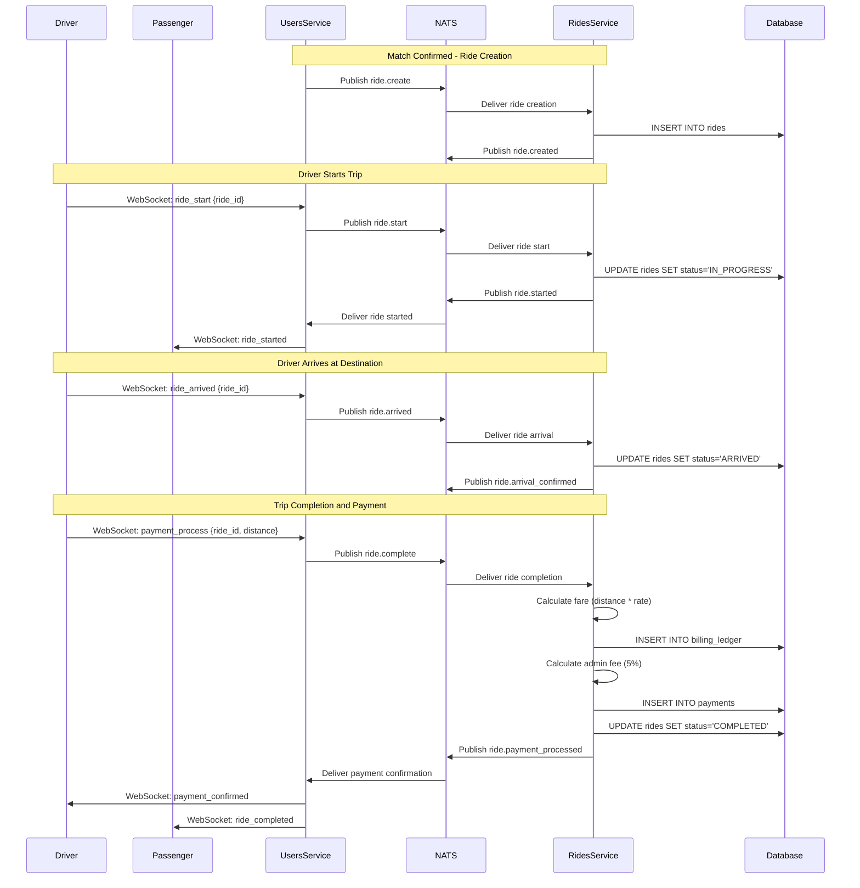

# Business Logic Workflows

## Overview

NebengJek implements domain-driven design with clear separation of business logic across four core services. This document details the business workflows, domain models, and service interactions that power the ride-hailing platform.

## Domain-Driven Service Architecture

### Service Responsibilities



### Domain Models

#### User Domain Models
```go
// Core User Entity
type User struct {
    ID        string    `json:"id" db:"id"`
    MSISDN    string    `json:"msisdn" db:"msisdn"`
    Fullname  string    `json:"fullname" db:"fullname"`
    Role      string    `json:"role" db:"role"` // "driver" or "passenger"
    IsActive  bool      `json:"is_active" db:"is_active"`
    CreatedAt time.Time `json:"created_at" db:"created_at"`
    UpdatedAt time.Time `json:"updated_at" db:"updated_at"`
}

// Driver Value Object
type Driver struct {
    UserID       string `json:"user_id" db:"user_id"`
    VehicleType  string `json:"vehicle_type" db:"vehicle_type"`
    VehiclePlate string `json:"vehicle_plate" db:"vehicle_plate"`
}

// Authentication Value Objects
type OTP struct {
    MSISDN    string    `json:"msisdn"`
    Code      string    `json:"code"`
    ExpiresAt time.Time `json:"expires_at"`
    Verified  bool      `json:"verified"`
}
```

#### Location Domain Models
```go
// Location Value Object
type Location struct {
    UserID    string    `json:"user_id"`
    Latitude  float64   `json:"latitude"`
    Longitude float64   `json:"longitude"`
    Timestamp time.Time `json:"timestamp"`
    Role      string    `json:"role"`
}

// Geospatial Query Models
type NearbyDriversQuery struct {
    Latitude  float64 `json:"latitude"`
    Longitude float64 `json:"longitude"`
    RadiusKM  float64 `json:"radius_km"`
    Limit     int     `json:"limit"`
}

type NearbyDriver struct {
    UserID    string  `json:"user_id"`
    Distance  float64 `json:"distance"`
    Latitude  float64 `json:"latitude"`
    Longitude float64 `json:"longitude"`
}
```

#### Matching Domain Models
```go
// Match Aggregate
type Match struct {
    ID                  string    `json:"id" db:"id"`
    DriverID           string    `json:"driver_id" db:"driver_id"`
    PassengerID        string    `json:"passenger_id" db:"passenger_id"`
    DriverLocation     Point     `json:"driver_location" db:"driver_location"`
    PassengerLocation  Point     `json:"passenger_location" db:"passenger_location"`
    TargetLocation     *Point    `json:"target_location" db:"target_location"`
    Status             string    `json:"status" db:"status"`
    DriverConfirmed    bool      `json:"driver_confirmed" db:"driver_confirmed"`
    PassengerConfirmed bool      `json:"passenger_confirmed" db:"passenger_confirmed"`
    CreatedAt          time.Time `json:"created_at" db:"created_at"`
    UpdatedAt          time.Time `json:"updated_at" db:"updated_at"`
}

// Match Events
type MatchProposal struct {
    MatchID      string  `json:"match_id"`
    DriverID     string  `json:"driver_id"`
    PassengerID  string  `json:"passenger_id"`
    Distance     float64 `json:"distance"`
    EstimatedETA int     `json:"estimated_eta"`
}
```

#### Rides Domain Models
```go
// Ride Aggregate
type Ride struct {
    RideID      string    `json:"ride_id" db:"ride_id"`
    DriverID    string    `json:"driver_id" db:"driver_id"`
    PassengerID string    `json:"passenger_id" db:"passenger_id"`
    Status      string    `json:"status" db:"status"`
    TotalCost   int       `json:"total_cost" db:"total_cost"`
    CreatedAt   time.Time `json:"created_at" db:"created_at"`
    UpdatedAt   time.Time `json:"updated_at" db:"updated_at"`
}

// Billing Value Objects
type BillingLedger struct {
    EntryID   string    `json:"entry_id" db:"entry_id"`
    RideID    string    `json:"ride_id" db:"ride_id"`
    Distance  float64   `json:"distance" db:"distance"`
    Cost      int       `json:"cost" db:"cost"`
    CreatedAt time.Time `json:"created_at" db:"created_at"`
}

type Payment struct {
    PaymentID    string    `json:"payment_id" db:"payment_id"`
    RideID       string    `json:"ride_id" db:"ride_id"`
    AdjustedCost int       `json:"adjusted_cost" db:"adjusted_cost"`
    AdminFee     int       `json:"admin_fee" db:"admin_fee"`
    DriverPayout int       `json:"driver_payout" db:"driver_payout"`
    Status       string    `json:"status" db:"status"`
    CreatedAt    time.Time `json:"created_at" db:"created_at"`
}
```

## Business Workflows

### 1. User Authentication Workflow



#### Authentication Business Rules
- **MSISDN Validation**: Must be valid Indonesian mobile number format
- **OTP Expiry**: 5 minutes TTL for security
- **JWT Expiry**: 24 hours for user sessions
- **Rate Limiting**: Max 3 OTP requests per MSISDN per hour

### 2. Driver Registration Workflow



#### Driver Registration Business Rules
- **Vehicle Types**: Allowed values: "motorcycle", "car", "van"
- **Plate Format**: Indonesian vehicle plate number validation
- **One Vehicle**: One driver can only register one vehicle
- **Role Update**: User role automatically updated to "driver"

### 3. Driver Availability and Location Workflow



#### Availability Business Rules
- **Beacon Status**: Active drivers are available for matching
- **Location TTL**: 30 minutes expiry for location data
- **Update Frequency**: Location updates every 10-30 seconds
- **Geofencing**: Drivers must be within service area

### 4. Passenger Ride Request and Matching Workflow



#### Matching Business Rules
- **Search Radius**: 5km default, configurable per request
- **Driver Limit**: Maximum 5 drivers per match request
- **Response Time**: 30 seconds timeout for driver response
- **Priority Algorithm**: Distance-based with ETA calculation

### 5. Ride Lifecycle Management Workflow



#### Ride Lifecycle Business Rules
- **Status Flow**: PENDING → IN_PROGRESS → ARRIVED → COMPLETED
- **Fare Calculation**: Base rate 3000 IDR per kilometer
- **Admin Fee**: 5% of total fare
- **Driver Payout**: 95% of total fare
- **Payment Processing**: Automatic upon ride completion

## Configurable Business Logic Parameters

### Configuration Structure

#### Business Rules Configuration
```go
type BusinessConfig struct {
    Matching MatchingConfig `json:"matching"`
    Billing  BillingConfig  `json:"billing"`
    Location LocationConfig `json:"location"`
    Auth     AuthConfig     `json:"auth"`
}

type MatchingConfig struct {
    DefaultRadiusKM      float64 `json:"default_radius_km"`
    MaxDriversPerRequest int     `json:"max_drivers_per_request"`
    ResponseTimeoutSec   int     `json:"response_timeout_sec"`
    MaxRetries          int     `json:"max_retries"`
}

type BillingConfig struct {
    BaseRatePerKM    int     `json:"base_rate_per_km"`    // IDR per kilometer
    AdminFeePercent  float64 `json:"admin_fee_percent"`   // Percentage
    MinimumFare      int     `json:"minimum_fare"`        // Minimum fare in IDR
    MaximumFare      int     `json:"maximum_fare"`        // Maximum fare in IDR
}

type LocationConfig struct {
    AvailabilityTTLMinutes int     `json:"availability_ttl_minutes"`
    UpdateIntervalSec      int     `json:"update_interval_sec"`
    ServiceAreaRadiusKM    float64 `json:"service_area_radius_km"`
}

type AuthConfig struct {
    OTPExpiryMinutes int `json:"otp_expiry_minutes"`
    JWTExpiryHours   int `json:"jwt_expiry_hours"`
    MaxOTPAttempts   int `json:"max_otp_attempts"`
}
```

#### Environment-Based Configuration
```bash
# Matching Configuration
MATCHING_DEFAULT_RADIUS_KM=5.0
MATCHING_MAX_DRIVERS_PER_REQUEST=5
MATCHING_RESPONSE_TIMEOUT_SEC=30
MATCHING_MAX_RETRIES=3

# Billing Configuration
BILLING_BASE_RATE_PER_KM=3000
BILLING_ADMIN_FEE_PERCENT=5.0
BILLING_MINIMUM_FARE=5000
BILLING_MAXIMUM_FARE=500000

# Location Configuration
LOCATION_AVAILABILITY_TTL_MINUTES=30
LOCATION_UPDATE_INTERVAL_SEC=15
LOCATION_SERVICE_AREA_RADIUS_KM=50

# Authentication Configuration
AUTH_OTP_EXPIRY_MINUTES=5
AUTH_JWT_EXPIRY_HOURS=24
AUTH_MAX_OTP_ATTEMPTS=3
```

## Service Logic Handling Patterns

### 1. Use Case Pattern Implementation

#### User Service Use Case Example
**File**: [`services/users/usecase/user.go`](../services/users/usecase/user.go)

```go
type UserUC struct {
    userRepo UserRepo
    userGW   UserGW
    config   *models.Config
}

func (uc *UserUC) CreateUser(ctx context.Context, req models.CreateUserRequest) (*models.User, error) {
    // Business validation
    if err := uc.validateCreateUserRequest(req); err != nil {
        return nil, fmt.Errorf("validation failed: %w", err)
    }

    // Check if user already exists
    existingUser, err := uc.userRepo.GetByMSISDN(ctx, req.MSISDN)
    if err == nil && existingUser != nil {
        return nil, errors.New("user already exists")
    }

    // Create user entity
    user := models.User{
        MSISDN:    req.MSISDN,
        Fullname:  req.Fullname,
        Role:      req.Role,
        IsActive:  true,
        CreatedAt: time.Now(),
        UpdatedAt: time.Now(),
    }

    // Persist user
    createdUser, err := uc.userRepo.Create(ctx, user)
    if err != nil {
        return nil, fmt.Errorf("failed to create user: %w", err)
    }

    return createdUser, nil
}

func (uc *UserUC) validateCreateUserRequest(req models.CreateUserRequest) error {
    // MSISDN validation
    if !isValidMSISDN(req.MSISDN) {
        return errors.New("invalid MSISDN format")
    }

    // Role validation
    if req.Role != "driver" && req.Role != "passenger" {
        return errors.New("invalid role")
    }

    // Fullname validation
    if len(req.Fullname) < 2 || len(req.Fullname) > 255 {
        return errors.New("invalid fullname length")
    }

    return nil
}
```

### 2. Repository Pattern Implementation

#### Location Repository with Business Logic
**File**: [`services/location/repository/location.go`](../services/location/repository/location.go)

```go
type LocationRepo struct {
    redis  *redis.Client
    config *models.Config
}

func (r *LocationRepo) StoreLocation(ctx context.Context, userID string, latitude, longitude float64, role string) error {
    // Business validation
    if err := r.validateLocation(latitude, longitude); err != nil {
        return fmt.Errorf("location validation failed: %w", err)
    }

    // Store in geospatial index
    geoKey := fmt.Sprintf("%s_geo", role)
    err := r.redis.GeoAdd(ctx, geoKey, &redis.GeoLocation{
        Name:      userID,
        Longitude: longitude,
        Latitude:  latitude,
    }).Err()
    if err != nil {
        return fmt.Errorf("failed to store location in geo index: %w", err)
    }

    // Store detailed location data
    locationKey := fmt.Sprintf("%s_location:%s", role, userID)
    locationData := map[string]interface{}{
        "latitude":  latitude,
        "longitude": longitude,
        "timestamp": time.Now().Unix(),
        "user_id":   userID,
    }

    err = r.redis.HMSet(ctx, locationKey, locationData).Err()
    if err != nil {
        return fmt.Errorf("failed to store location data: %w", err)
    }

    // Set TTL based on configuration
    ttl := time.Duration(r.config.Location.AvailabilityTTLMinutes) * time.Minute
    err = r.redis.Expire(ctx, locationKey, ttl).Err()
    if err != nil {
        return fmt.Errorf("failed to set location TTL: %w", err)
    }

    return nil
}

func (r *LocationRepo) validateLocation(latitude, longitude float64) error {
    // Validate latitude range
    if latitude < -90 || latitude > 90 {
        return errors.New("latitude must be between -90 and 90")
    }

    // Validate longitude range
    if longitude < -180 || longitude > 180 {
        return errors.New("longitude must be between -180 and 180")
    }

    // Validate service area (Indonesia bounds)
    if latitude < -11 || latitude > 6 || longitude < 95 || longitude > 141 {
        return errors.New("location outside service area")
    }

    return nil
}
```

### 3. Gateway Pattern Implementation

#### Match Service Gateway
**File**: [`services/match/gateway/http.go`](../services/match/gateway/http.go)

```go
type HTTPGateway struct {
    locationClient *http.APIKeyClient
    config         *models.Config
}

func (g *HTTPGateway) GetNearbyDrivers(ctx context.Context, latitude, longitude, radiusKM float64) ([]models.NearbyDriver, error) {
    // Business validation
    if err := g.validateProximityQuery(latitude, longitude, radiusKM); err != nil {
        return nil, fmt.Errorf("proximity query validation failed: %w", err)
    }

    // Prepare request
    query := models.NearbyDriversQuery{
        Latitude:  latitude,
        Longitude: longitude,
        RadiusKM:  radiusKM,
        Limit:     g.config.Matching.MaxDriversPerRequest,
    }

    // Make HTTP request to location service
    endpoint := "/internal/locations/nearby-drivers"
    var drivers []models.NearbyDriver
    
    err := g.locationClient.PostJSON(ctx, endpoint, query, &drivers)
    if err != nil {
        return nil, fmt.Errorf("failed to get nearby drivers: %w", err)
    }

    // Apply business rules filtering
    filteredDrivers := g.applyBusinessFilters(drivers)

    return filteredDrivers, nil
}

func (g *HTTPGateway) validateProximityQuery(latitude, longitude, radiusKM float64) error {
    if latitude < -90 || latitude > 90 {
        return errors.New("invalid latitude")
    }
    if longitude < -180 || longitude > 180 {
        return errors.New("invalid longitude")
    }
    if radiusKM <= 0 || radiusKM > 50 {
        return errors.New("radius must be between 0 and 50 km")
    }
    return nil
}

func (g *HTTPGateway) applyBusinessFilters(drivers []models.NearbyDriver) []models.NearbyDriver {
    var filtered []models.NearbyDriver
    
    for _, driver := range drivers {
        // Filter by maximum distance
        if driver.Distance <= g.config.Matching.DefaultRadiusKM {
            filtered = append(filtered, driver)
        }
    }
    
    // Sort by distance (closest first)
    sort.Slice(filtered, func(i, j int) bool {
        return filtered[i].Distance < filtered[j].Distance
    })
    
    // Limit results
    if len(filtered) > g.config.Matching.MaxDriversPerRequest {
        filtered = filtered[:g.config.Matching.MaxDriversPerRequest]
    }
    
    return filtered
}
```

## Error Handling and Business Rules Enforcement

### Business Exception Handling

#### Custom Business Errors
```go
type BusinessError struct {
    Code    string `json:"code"`
    Message string `json:"message"`
    Field   string `json:"field,omitempty"`
}

func (e BusinessError) Error() string {
    return e.Message
}

// Predefined business errors
var (
    ErrUserAlreadyExists = BusinessError{
        Code:    "USER_ALREADY_EXISTS",
        Message: "User with this MSISDN already exists",
        Field:   "msisdn",
    }
    
    ErrInvalidMSISDN = BusinessError{
        Code:    "INVALID_MSISDN",
        Message: "MSISDN format is invalid",
        Field:   "msisdn",
    }
    
    ErrDriverNotAvailable = BusinessError{
        Code:    "DRIVER_NOT_AVAILABLE",
        Message: "No drivers available in the area",
    }
    
    ErrRideAlreadyActive = BusinessError{
        Code:    "RIDE_ALREADY_ACTIVE",
        Message: "User already has an active ride",
    }
)
```

#### Business Rule Validation
```go
func (uc *UserUC) validateBusinessRules(ctx context.Context, userID string, action string) error {
    switch action {
    case "start_ride":
        // Check if user already has active ride
        activeRide, err := uc.userGW.GetActiveRide(ctx, userID)
        if err == nil && activeRide != nil {
            return ErrRideAlreadyActive
        }
        
    case "register_driver":
        // Check if user is already a driver
        user, err := uc.userRepo.GetByID(ctx, userID)
        if err != nil {
            return err
        }
        if user.Role == "driver" {
            return BusinessError{
                Code:    "ALREADY_DRIVER",
                Message: "User is already registered as a driver",
            }
        }
    }
    
    return nil
}
```

## Performance and Scalability Considerations

### Business Logic Optimization

#### Caching Strategy
```go
// Cache frequently accessed business data
func (uc *MatchUC) GetAvailableDrivers(ctx context.Context, location models.Location) ([]models.Driver, error) {
    cacheKey := fmt.Sprintf("available_drivers:%f:%f", location.Latitude, location.Longitude)
    
    // Try cache first
    if cached, err := uc.cache.Get(ctx, cacheKey); err == nil {
        var drivers []models.Driver
        if err := json.Unmarshal(cached, &drivers); err == nil {
            return drivers, nil
        }
    }
    
    // Fetch from repository
    drivers, err := uc.locationGW.GetNearbyDrivers(ctx, location.Latitude, location.Longitude, 5.0)
    if err != nil {
        return nil, err
    }
    
    // Cache result for 30 seconds
    if data, err := json.Marshal(drivers); err == nil {
        uc.cache.Set(ctx, cacheKey, data, 30*time.Second)
    }
    
    return drivers, nil
}
```

#### Async Processing
```go
// Process non-critical business logic asynchronously
func (uc *RideUC) CompleteRide(ctx context.Context, rideID string, distance float64) error {
    // Update ride status immediately
    err := uc.rideRepo.UpdateStatus(ctx, rideID, "COMPLETED")
    if err != nil {
        return err
    }
    
    // Process billing asynchronously
    go func() {
        if err := uc.processBilling(context.Background(), rideID, distance); err != nil {
            logger.Error("Failed to process billing", 
                logger.String("ride_id", rideID),
                logger.Err(err))
        }
    }()
    
    return nil
}
```

## See Also
- [Database Architecture](database-architecture.md)
- [NATS Messaging System](nats-messaging.md)
- [WebSocket Implementation](websocket-implementation.md)
- [Testing Strategies](testing-strategies.md)
- [Security Implementation](security-implementation.md)