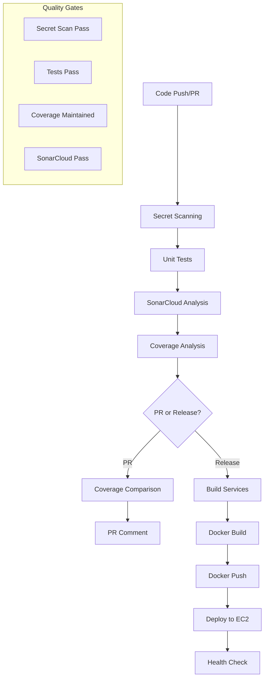

# CI/CD and Deployment

## Overview

NebengJek implements automated CI/CD pipelines using GitHub Actions for continuous integration, testing, security scanning, and deployment. The system supports automated testing, code quality analysis, and production deployment with graceful shutdown procedures.

## CI/CD Pipeline Architecture

### Pipeline Overview



### Workflow Files

#### Continuous Integration
**File**: [`.github/workflows/continuous-integration.yml`](../.github/workflows/continuous-integration.yml)

```yaml
name: continuous-integration

on:
  pull_request:
    branches: [ master ]
  push:
    branches: [ master ]

permissions:
  contents: read
  pull-requests: write

jobs:
  secret-scan:
    name: Secret Scanning
    runs-on: ubuntu-latest
    steps:
      - name: Checkout code
        uses: actions/checkout@v3
        with:
          fetch-depth: 0

      - name: Run GitLeaks Secret Scan
        uses: gitleaks/gitleaks-action@v2
        env:
          GITHUB_TOKEN: ${{ secrets.GITHUB_TOKEN }}
          GITLEAKS_LICENSE: ${{ secrets.GITLEAKS_LICENSE }}

  test:
    name: Run Unit Tests
    runs-on: ubuntu-latest
    needs: secret-scan
    
    services:
      redis:
        image: redis
        ports:
          - 6379:6379
        options: >-
          --health-cmd "redis-cli ping"
          --health-interval 10s
          --health-timeout 5s
          --health-retries 5

    steps:
      - name: Checkout code
        uses: actions/checkout@v3
        with:
          fetch-depth: 0

      - name: Set up Go
        uses: actions/setup-go@v4
        with:
          go-version: '1.23'
          cache: true

      - name: Install dependencies
        run: go mod download

      - name: Run tests with coverage
        run: go test ./... -race -coverprofile=coverage.txt -covermode=atomic

      - name: SonarCloud Scan
        uses: SonarSource/sonarqube-scan-action@v5.0.0
        env:
          GITHUB_TOKEN: ${{ secrets.GITHUB_TOKEN }}
          SONAR_TOKEN: ${{ secrets.SONAR_TOKEN }}

      - name: Generate coverage report for current branch
        run: |
          go tool cover -func=coverage.txt > coverage_report.txt
          total_coverage=$(grep -E "^total:" coverage_report.txt | awk '{print $3}')
          echo "CURRENT_BRANCH_COVERAGE=$total_coverage" >> $GITHUB_ENV
```

#### Continuous Deployment
**File**: [`.github/workflows/continuous-delivery.yml`](../.github/workflows/continuous-delivery.yml)

```yaml
name: continuous-delivery

on:
  release:
    types: [published]

jobs:
  deploy:
    name: Build and Deploy
    runs-on: ubuntu-latest
    
    steps:
      - name: Checkout code
        uses: actions/checkout@v3

      - name: Set up Go
        uses: actions/setup-go@v4
        with:
          go-version: '1.23'

      - name: Run tests
        run: go test ./...

      - name: Build services
        run: |
          GOOS=linux GOARCH=amd64 go build -o users ./cmd/users
          GOOS=linux GOARCH=amd64 go build -o location ./cmd/location
          GOOS=linux GOARCH=amd64 go build -o match ./cmd/match
          GOOS=linux GOARCH=amd64 go build -o rides ./cmd/rides

      - name: Login to Docker Hub
        uses: docker/login-action@v2
        with:
          username: ${{ secrets.DOCKER_USERNAME }}
          password: ${{ secrets.DOCKER_PASSWORD }}

      - name: Build and push Docker images
        run: |
          # Build and push each service
          docker build -f cmd/users/Dockerfile -t nebengjek/users:${{ github.ref_name }} -t nebengjek/users:latest .
          docker push nebengjek/users:${{ github.ref_name }}
          docker push nebengjek/users:latest
          
          docker build -f cmd/location/Dockerfile -t nebengjek/location:${{ github.ref_name }} -t nebengjek/location:latest .
          docker push nebengjek/location:${{ github.ref_name }}
          docker push nebengjek/location:latest
          
          docker build -f cmd/match/Dockerfile -t nebengjek/match:${{ github.ref_name }} -t nebengjek/match:latest .
          docker push nebengjek/match:${{ github.ref_name }}
          docker push nebengjek/match:latest
          
          docker build -f cmd/rides/Dockerfile -t nebengjek/rides:${{ github.ref_name }} -t nebengjek/rides:latest .
          docker push nebengjek/rides:${{ github.ref_name }}
          docker push nebengjek/rides:latest

      - name: Deploy to EC2
        uses: appleboy/ssh-action@v0.1.5
        with:
          host: ${{ secrets.EC2_HOST }}
          username: ${{ secrets.EC2_USERNAME }}
          key: ${{ secrets.EC2_PRIVATE_KEY }}
          script: |
            cd /opt/nebengjek
            docker-compose pull
            docker-compose up -d
            docker system prune -f
```

## Security Scanning

### GitLeaks Configuration

#### Secret Detection Rules
**File**: [`.gitleaks.toml`](../.gitleaks.toml)

```toml
title = "NebengJek Security Configuration"

[extend]
useDefault = true

[[rules]]
description = "API Key"
id = "api-key"
regex = '''(?i)(api[_-]?key|apikey)['"]*\s*[:=]\s*['"][a-zA-Z0-9]{20,}['"]'''
tags = ["key", "API"]

[[rules]]
description = "Database URL"
id = "database-url"
regex = '''(?i)(database[_-]?url|db[_-]?url)['"]*\s*[:=]\s*['"][^'"]+['"]'''
tags = ["database", "url"]

[[rules]]
description = "JWT Secret"
id = "jwt-secret"
regex = '''(?i)(jwt[_-]?secret|secret[_-]?key)['"]*\s*[:=]\s*['"][a-zA-Z0-9]{20,}['"]'''
tags = ["jwt", "secret"]

[allowlist]
description = "Allowlist for test files"
files = [
    '''.*_test\.go$''',
    '''.*\.example$''',
    '''.*\.template$'''
]
```

#### Secret Scanning Integration
```yaml
secret-scan:
  name: Secret Scanning
  runs-on: ubuntu-latest
  steps:
    - name: Checkout code
      uses: actions/checkout@v3
      with:
        fetch-depth: 0  # Full history scan

    - name: Run GitLeaks Secret Scan
      uses: gitleaks/gitleaks-action@v2
      env:
        GITHUB_TOKEN: ${{ secrets.GITHUB_TOKEN }}
        GITLEAKS_LICENSE: ${{ secrets.GITLEAKS_LICENSE }}
```

### SonarCloud Integration

#### Quality Gate Configuration
**File**: [`sonar-project.properties`](../sonar-project.properties)

```properties
# Project Configuration
sonar.projectKey=piresc_nebengjek
sonar.organization=nebengjek-prod
sonar.host.url=https://sonarcloud.io

# Coverage Analysis
sonar.go.coverage.reportPaths=coverage.txt
sonar.coverage.exclusions=**/cmd/**/main.go,**/mocks/**

# Code Exclusions
sonar.exclusions=**/*_test.go,**/vendor/**,**/bin/**

# Quality Gate Rules
sonar.qualitygate.wait=true
```

#### SonarCloud Workflow Integration
```yaml
- name: SonarCloud Scan
  uses: SonarSource/sonarqube-scan-action@v5.0.0
  env:
    GITHUB_TOKEN: ${{ secrets.GITHUB_TOKEN }}
    SONAR_TOKEN: ${{ secrets.SONAR_TOKEN }}
```

## Docker Deployment Strategy

### Multi-Service Docker Architecture

#### Service Dockerfiles

##### Users Service Dockerfile
**File**: [`cmd/users/Dockerfile`](../cmd/users/Dockerfile)

```dockerfile
FROM golang:1.23-alpine AS builder

WORKDIR /app
COPY go.mod go.sum ./
RUN go mod download

COPY . .
RUN CGO_ENABLED=0 GOOS=linux go build -a -installsuffix cgo -o users ./cmd/users

FROM alpine:latest
RUN apk --no-cache add ca-certificates tzdata
WORKDIR /root/

COPY --from=builder /app/users .
COPY --from=builder /app/config ./config

EXPOSE 9990

CMD ["./users"]
```

##### Location Service Dockerfile
**File**: [`cmd/location/Dockerfile`](../cmd/location/Dockerfile)

```dockerfile
FROM golang:1.23-alpine AS builder

WORKDIR /app
COPY go.mod go.sum ./
RUN go mod download

COPY . .
RUN CGO_ENABLED=0 GOOS=linux go build -a -installsuffix cgo -o location ./cmd/location

FROM alpine:latest
RUN apk --no-cache add ca-certificates tzdata
WORKDIR /root/

COPY --from=builder /app/location .
COPY --from=builder /app/config ./config

EXPOSE 9994

CMD ["./location"]
```

#### Docker Compose Configuration
**File**: [`docker-compose.yml`](../docker-compose.yml)

```yaml
version: '3.8'

services:
  # Infrastructure Services
  postgres:
    image: postgres:15-alpine
    environment:
      POSTGRES_DB: nebengjek
      POSTGRES_USER: nebengjek
      POSTGRES_PASSWORD: ${POSTGRES_PASSWORD}
    ports:
      - "5432:5432"
    volumes:
      - postgres_data:/var/lib/postgresql/data
      - ./db/migrations:/docker-entrypoint-initdb.d
    healthcheck:
      test: ["CMD-SHELL", "pg_isready -U nebengjek"]
      interval: 10s
      timeout: 5s
      retries: 5

  redis:
    image: redis:7-alpine
    ports:
      - "6379:6379"
    volumes:
      - redis_data:/data
    healthcheck:
      test: ["CMD", "redis-cli", "ping"]
      interval: 10s
      timeout: 5s
      retries: 5

  nats:
    image: nats:2.10-alpine
    ports:
      - "4222:4222"
      - "8222:8222"
    command: ["-js", "-m", "8222"]
    healthcheck:
      test: ["CMD", "wget", "--quiet", "--tries=1", "--spider", "http://localhost:8222/healthz"]
      interval: 10s
      timeout: 5s
      retries: 5

  # Application Services
  users-service:
    image: nebengjek/users:latest
    ports:
      - "9990:9990"
    environment:
      - DB_HOST=postgres
      - DB_PORT=5432
      - DB_NAME=nebengjek
      - DB_USER=nebengjek
      - DB_PASSWORD=${POSTGRES_PASSWORD}
      - REDIS_HOST=redis
      - REDIS_PORT=6379
      - NATS_URL=nats://nats:4222
    depends_on:
      postgres:
        condition: service_healthy
      redis:
        condition: service_healthy
      nats:
        condition: service_healthy
    restart: unless-stopped

  location-service:
    image: nebengjek/location:latest
    ports:
      - "9994:9994"
    environment:
      - DB_HOST=postgres
      - DB_PORT=5432
      - DB_NAME=nebengjek
      - DB_USER=nebengjek
      - DB_PASSWORD=${POSTGRES_PASSWORD}
      - REDIS_HOST=redis
      - REDIS_PORT=6379
      - NATS_URL=nats://nats:4222
    depends_on:
      postgres:
        condition: service_healthy
      redis:
        condition: service_healthy
      nats:
        condition: service_healthy
    restart: unless-stopped

  match-service:
    image: nebengjek/match:latest
    ports:
      - "9993:9993"
    environment:
      - DB_HOST=postgres
      - DB_PORT=5432
      - DB_NAME=nebengjek
      - DB_USER=nebengjek
      - DB_PASSWORD=${POSTGRES_PASSWORD}
      - REDIS_HOST=redis
      - REDIS_PORT=6379
      - NATS_URL=nats://nats:4222
    depends_on:
      postgres:
        condition: service_healthy
      redis:
        condition: service_healthy
      nats:
        condition: service_healthy
    restart: unless-stopped

  rides-service:
    image: nebengjek/rides:latest
    ports:
      - "9992:9992"
    environment:
      - DB_HOST=postgres
      - DB_PORT=5432
      - DB_NAME=nebengjek
      - DB_USER=nebengjek
      - DB_PASSWORD=${POSTGRES_PASSWORD}
      - REDIS_HOST=redis
      - REDIS_PORT=6379
      - NATS_URL=nats://nats:4222
    depends_on:
      postgres:
        condition: service_healthy
      redis:
        condition: service_healthy
      nats:
        condition: service_healthy
    restart: unless-stopped

volumes:
  postgres_data:
  redis_data:

networks:
  default:
    name: nebengjek-network
```

## Graceful Shutdown Implementation

### Shutdown Manager

#### Graceful Server Implementation
**File**: [`internal/pkg/server/server.go`](../internal/pkg/server/server.go)

```go
type GracefulServer struct {
    echo   *echo.Echo
    logger *logger.ZapLogger
    port   int
}

func NewGracefulServer(e *echo.Echo, zapLogger *logger.ZapLogger, port int) *GracefulServer {
    return &GracefulServer{
        echo:   e,
        logger: zapLogger,
        port:   port,
    }
}

func (s *GracefulServer) Start() error {
    // Start server in goroutine
    go func() {
        addr := fmt.Sprintf(":%d", s.port)
        s.logger.Info("Starting HTTP server", logger.String("address", addr))
        
        if err := s.echo.Start(addr); err != nil && err != http.ErrServerClosed {
            s.logger.Fatal("Failed to start server", logger.Err(err))
        }
    }()

    // Wait for interrupt signal to gracefully shutdown
    quit := make(chan os.Signal, 1)
    signal.Notify(quit, syscall.SIGINT, syscall.SIGTERM)
    
    sig := <-quit
    s.logger.Info("Received shutdown signal", logger.String("signal", sig.String()))

    return s.shutdown()
}

func (s *GracefulServer) shutdown() error {
    // Create shutdown context with timeout
    ctx, cancel := context.WithTimeout(context.Background(), 30*time.Second)
    defer cancel()

    s.logger.Info("Starting graceful shutdown...")

    // Shutdown HTTP server
    if err := s.echo.Shutdown(ctx); err != nil {
        s.logger.Error("Server forced to shutdown", logger.Err(err))
        return err
    }

    s.logger.Info("Server exited gracefully")
    return nil
}
```

#### Multi-Component Shutdown Manager
```go
type ShutdownManager struct {
    functions []func(context.Context) error
    logger    *logger.ZapLogger
}

func NewShutdownManager(logger *logger.ZapLogger) *ShutdownManager {
    return &ShutdownManager{
        functions: make([]func(context.Context) error, 0),
        logger:    logger,
    }
}

func (sm *ShutdownManager) Add(fn func(context.Context) error) {
    sm.functions = append(sm.functions, fn)
}

func (sm *ShutdownManager) Shutdown(ctx context.Context) error {
    sm.logger.Info("Starting graceful shutdown of components", logger.Int("components", len(sm.functions)))

    for i, fn := range sm.functions {
        sm.logger.Info("Shutting down component", logger.Int("component", i+1))
        
        if err := fn(ctx); err != nil {
            sm.logger.Error("Component shutdown failed", 
                logger.Int("component", i+1), 
                logger.Err(err))
            return err
        }
    }

    sm.logger.Info("All components shut down successfully")
    return nil
}
```

### Service Shutdown Implementation

#### Main Function Shutdown Pattern
**File**: [`cmd/users/main.go`](../cmd/users/main.go)

```go
func main() {
    // ... initialization code ...

    // Start server in goroutine
    go func() {
        addr := fmt.Sprintf(":%d", configs.Server.Port)
        zapLogger.Info("Starting HTTP server",
            logger.String("address", addr),
            logger.String("app", appName))

        if err := e.Start(addr); err != nil && err != http.ErrServerClosed {
            zapLogger.Fatal("Failed to start server", logger.Err(err))
        }
    }()

    // Graceful shutdown
    quit := make(chan os.Signal, 1)
    signal.Notify(quit, syscall.SIGINT, syscall.SIGTERM)

    // Wait for interrupt signal
    sig := <-quit
    zapLogger.Info("Received shutdown signal", logger.String("signal", sig.String()))

    // Create shutdown context with timeout
    ctx, cancel := context.WithTimeout(context.Background(), 30*time.Second)
    defer cancel()

    // Shutdown HTTP server
    zapLogger.Info("Shutting down HTTP server...")
    if err := e.Shutdown(ctx); err != nil {
        zapLogger.Error("Server forced to shutdown", logger.Err(err))
    }

    // Close PostgreSQL connection
    zapLogger.Info("Closing PostgreSQL connection...")
    postgresClient.Close()

    // Close Redis connection
    zapLogger.Info("Closing Redis connection...")
    if err := redisClient.Close(); err != nil {
        zapLogger.Error("Error closing Redis connection", logger.Err(err))
    }

    // Close NATS connection
    zapLogger.Info("Closing NATS connection...")
    natsClient.Close()

    // Shutdown New Relic
    if nrApp != nil {
        zapLogger.Info("Shutting down New Relic...")
        nrApp.Shutdown(10 * time.Second)
    }

    // Sync and close logger
    zapLogger.Info("Server exiting gracefully")
    _ = zapLogger.Sync()
}
```

## Health Checks and Monitoring

### Enhanced Health Service

#### Health Check Implementation
**File**: [`internal/pkg/health/health.go`](../internal/pkg/health/health.go)

```go
type HealthService struct {
    checkers map[string]HealthChecker
    logger   *logger.ZapLogger
}

type HealthChecker interface {
    Check() error
}

type HealthStatus struct {
    Status   string        `json:"status"`
    Duration time.Duration `json:"duration"`
    Error    string        `json:"error,omitempty"`
}

func NewHealthService(logger *logger.ZapLogger) *HealthService {
    return &HealthService{
        checkers: make(map[string]HealthChecker),
        logger:   logger,
    }
}

func (hs *HealthService) AddChecker(name string, checker HealthChecker) {
    hs.checkers[name] = checker
}

func (hs *HealthService) CheckHealth() map[string]HealthStatus {
    results := make(map[string]HealthStatus)
    
    for name, checker := range hs.checkers {
        start := time.Now()
        err := checker.Check()
        duration := time.Since(start)
        
        status := HealthStatus{
            Status:   "healthy",
            Duration: duration,
        }
        
        if err != nil {
            status.Status = "unhealthy"
            status.Error = err.Error()
        }
        
        results[name] = status
        
        hs.logger.Info("Health check completed",
            logger.String("component", name),
            logger.String("status", status.Status),
            logger.Duration("duration", duration),
        )
    }
    
    return results
}
```

#### Component Health Checkers
```go
// PostgreSQL Health Checker
type PostgresHealthChecker struct {
    client *database.PostgresClient
}

func NewPostgresHealthChecker(client *database.PostgresClient) HealthChecker {
    return &PostgresHealthChecker{client: client}
}

func (c *PostgresHealthChecker) Check() error {
    ctx, cancel := context.WithTimeout(context.Background(), 5*time.Second)
    defer cancel()
    
    return c.client.GetDB().PingContext(ctx)
}

// Redis Health Checker
type RedisHealthChecker struct {
    client *database.RedisClient
}

func NewRedisHealthChecker(client *database.RedisClient) HealthChecker {
    return &RedisHealthChecker{client: client}
}

func (c *RedisHealthChecker) Check() error {
    ctx, cancel := context.WithTimeout(context.Background(), 5*time.Second)
    defer cancel()
    
    return c.client.GetClient().Ping(ctx).Err()
}

// NATS Health Checker
type NATSHealthChecker struct {
    client *nats.Client
}

func NewNATSHealthChecker(client *nats.Client) HealthChecker {
    return &NATSHealthChecker{client: client}
}

func (c *NATSHealthChecker) Check() error {
    if !c.client.IsConnected() {
        return errors.New("NATS client not connected")
    }
    
    js, err := c.client.JetStream()
    if err != nil {
        return fmt.Errorf("JetStream not available: %w", err)
    }
    
    _, err = js.StreamInfo("LOCATION")
    return err
}
```

### Health Endpoints

#### Enhanced Health Endpoints
```go
func RegisterEnhancedHealthEndpoints(e *echo.Echo, appName, version string, healthService *HealthService) {
    // Basic ping endpoint
    e.GET("/ping", func(c echo.Context) error {
        return c.JSON(http.StatusOK, map[string]string{
            "status":  "ok",
            "service": appName,
            "version": version,
            "time":    time.Now().UTC().Format(time.RFC3339),
        })
    })

    // Detailed health check endpoint
    e.GET("/health", func(c echo.Context) error {
        healthResults := healthService.CheckHealth()
        
        overallStatus := "healthy"
        for _, result := range healthResults {
            if result.Status != "healthy" {
                overallStatus = "unhealthy"
                break
            }
        }
        
        response := map[string]interface{}{
            "status":     overallStatus,
            "service":    appName,
            "version":    version,
            "timestamp":  time.Now().UTC().Format(time.RFC3339),
            "components": healthResults,
        }
        
        statusCode := http.StatusOK
        if overallStatus != "healthy" {
            statusCode = http.StatusServiceUnavailable
        }
        
        return c.JSON(statusCode, response)
    })

    // Readiness probe endpoint
    e.GET("/ready", func(c echo.Context) error {
        healthResults := healthService.CheckHealth()
        
        for _, result := range healthResults {
            if result.Status != "healthy" {
                return c.JSON(http.StatusServiceUnavailable, map[string]string{
                    "status": "not ready",
                    "reason": "dependencies not healthy",
                })
            }
        }
        
        return c.JSON(http.StatusOK, map[string]string{
            "status": "ready",
        })
    })

    // Liveness probe endpoint
    e.GET("/live", func(c echo.Context) error {
        return c.JSON(http.StatusOK, map[string]string{
            "status": "alive",
        })
    })
}
```

## Deployment Configuration

### Environment Configuration

#### Production Environment Variables
```bash
# Database Configuration
DB_HOST=postgres
DB_PORT=5432
DB_NAME=nebengjek
DB_USER=nebengjek
DB_PASSWORD=${POSTGRES_PASSWORD}
DB_MAX_OPEN_CONNS=25
DB_MAX_IDLE_CONNS=5

# Redis Configuration
REDIS_HOST=redis
REDIS_PORT=6379
REDIS_PASSWORD=${REDIS_PASSWORD}
REDIS_DB=0

# NATS Configuration
NATS_URL=nats://nats:4222
NATS_CLUSTER_ID=nebengjek-cluster

# Application Configuration
LOG_LEVEL=info
LOG_TYPE=hybrid
SERVER_PORT=9990

# New Relic Configuration
NEW_RELIC_ENABLED=true
NEW_RELIC_LICENSE_KEY=${NEW_RELIC_LICENSE_KEY}
NEW_RELIC_APP_NAME=nebengjek-users-service
NEW_RELIC_LOGS_ENABLED=true

# Security Configuration
JWT_SECRET_KEY=${JWT_SECRET_KEY}
API_KEY_USERS_SERVICE=${API_KEY_USERS_SERVICE}
API_KEY_LOCATION_SERVICE=${API_KEY_LOCATION_SERVICE}
API_KEY_MATCH_SERVICE=${API_KEY_MATCH_SERVICE}
API_KEY_RIDES_SERVICE=${API_KEY_RIDES_SERVICE}
```

### Deployment Scripts

#### Production Deployment Script
```bash
#!/bin/bash
set -e

echo "Starting NebengJek deployment..."

# Pull latest images
echo "Pulling latest Docker images..."
docker-compose pull

# Stop existing services
echo "Stopping existing services..."
docker-compose down

# Start services with health checks
echo "Starting services..."
docker-compose up -d

# Wait for services to be healthy
echo "Waiting for services to be healthy..."
for service in postgres redis nats users-service location-service match-service rides-service; do
    echo "Checking $service..."
    timeout 60 bash -c "until docker-compose ps $service | grep -q 'healthy\|Up'; do sleep 2; done"
    echo "$service is ready"
done

# Run health checks
echo "Running health checks..."
for port in 9990 9991 9992 9993; do
    curl -f http://localhost:$port/health || exit 1
done

echo "Deployment completed successfully!"

# Clean up old images
echo "Cleaning up old Docker images..."
docker system prune -f
```

## Monitoring and Alerting

### Deployment Monitoring

#### Service Health Monitoring
```bash
#!/bin/bash
# Health monitoring script

SERVICES=("users-service:9990" "location-service:9994" "match-service:9993" "rides-service:9992")

for service_port in "${SERVICES[@]}"; do
    IFS=':' read -r service port <<< "$service_port"
    
    response=$(curl -s -o /dev/null -w "%{http_code}" http://localhost:$port/health)
    
    if [ "$response" != "200" ]; then
        echo "ALERT: $service health check failed (HTTP $response)"
        # Send alert to monitoring system
    else
        echo "$service is healthy"
    fi
done
```

#### Docker Container Monitoring
```bash
#!/bin/bash
# Container monitoring script

containers=$(docker-compose ps -q)

for container in $containers; do
    status=$(docker inspect --format='{{.State.Status}}' $container)
    health=$(docker inspect --format='{{.State.Health.Status}}' $container 2>/dev/null || echo "no-health-check")
    
    if [ "$status" != "running" ]; then
        echo "ALERT: Container $container is not running (status: $status)"
    elif [ "$health" = "unhealthy" ]; then
        echo "ALERT: Container $container is unhealthy"
    else
        echo "Container $container is healthy"
    fi
done
```

## Troubleshooting

### Common Deployment Issues

#### Service Startup Issues
```bash
# Check service logs
docker-compose logs users-service

# Check container status
docker-compose ps

# Restart specific service
docker-compose restart users-service

# Check health endpoints
curl http://localhost:9990/health
```

#### Database Connection Issues
```bash
# Check PostgreSQL logs
docker-compose logs postgres

# Test database connection
docker-compose exec postgres psql -U nebengjek -d nebengjek -c "SELECT 1;"

# Check database migrations
docker-compose exec postgres psql -U nebengjek -d nebengjek -c "\dt"
```

#### NATS Connection Issues
```bash
# Check NATS logs
docker-compose logs nats

# Check NATS streams
docker-compose exec nats nats stream list

# Test NATS connectivity
docker-compose exec nats nats server check
```

## See Also
- [Security Implementation](security-implementation.md)
- [Monitoring and Observability](monitoring-observability.md)
- [Testing Strategies](testing-strategies.md)
- [Database Architecture](database-architecture.md)