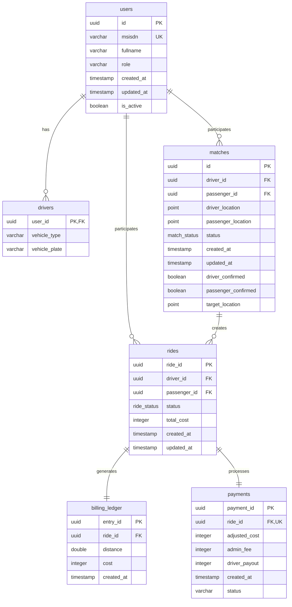

# Database Architecture

## Overview

NebengJek uses a dual-database architecture combining PostgreSQL for persistent data storage and Redis for caching, real-time data, and geospatial operations.

## PostgreSQL Schema Design

### Core Tables

#### Users Table
```sql
CREATE TABLE IF NOT EXISTS users (
    id uuid NOT NULL DEFAULT gen_random_uuid(),
    msisdn character varying(20) NOT NULL,
    fullname character varying(255) NOT NULL,
    role character varying(20) NOT NULL, -- 'driver' or 'passenger'
    created_at timestamp without time zone NOT NULL,
    updated_at timestamp without time zone NOT NULL,
    is_active boolean NOT NULL DEFAULT true,
    CONSTRAINT users_pkey PRIMARY KEY (id),
    CONSTRAINT users_msisdn_key UNIQUE (msisdn)
);
```

#### Drivers Table
```sql
CREATE TABLE IF NOT EXISTS drivers (
    user_id uuid NOT NULL,
    vehicle_type character varying(50) NOT NULL,
    vehicle_plate character varying(20) NOT NULL,
    CONSTRAINT drivers_pkey PRIMARY KEY (user_id),
    CONSTRAINT drivers_user_id_fkey FOREIGN KEY (user_id) REFERENCES users(id) ON DELETE CASCADE
);
```

#### Matches Table
```sql
CREATE TABLE IF NOT EXISTS matches (
    id uuid NOT NULL DEFAULT gen_random_uuid(),
    driver_id uuid NOT NULL,
    passenger_id uuid NOT NULL,
    driver_location point NOT NULL,
    passenger_location point NOT NULL,
    status match_status NOT NULL DEFAULT 'PENDING'::match_status,
    created_at timestamp with time zone NOT NULL DEFAULT CURRENT_TIMESTAMP,
    updated_at timestamp with time zone NOT NULL DEFAULT CURRENT_TIMESTAMP,
    driver_confirmed boolean NOT NULL DEFAULT false,
    passenger_confirmed boolean NOT NULL DEFAULT false,
    target_location point NULL,
    CONSTRAINT matches_pkey PRIMARY KEY (id),
    CONSTRAINT matches_driver_id_fkey FOREIGN KEY (driver_id) REFERENCES users(id),
    CONSTRAINT matches_passenger_id_fkey FOREIGN KEY (passenger_id) REFERENCES users(id)
);
```

#### Rides Table
```sql
CREATE TABLE IF NOT EXISTS rides (
    ride_id uuid NOT NULL DEFAULT gen_random_uuid(),
    driver_id uuid NOT NULL,
    passenger_id uuid NOT NULL,
    status ride_status NOT NULL DEFAULT 'PENDING'::ride_status,
    total_cost integer NOT NULL DEFAULT 0,
    created_at timestamp with time zone NULL DEFAULT CURRENT_TIMESTAMP,
    updated_at timestamp with time zone NULL DEFAULT CURRENT_TIMESTAMP,
    CONSTRAINT rides_pkey PRIMARY KEY (ride_id),
    CONSTRAINT rides_driver_id_fkey FOREIGN KEY (driver_id) REFERENCES users(id),
    CONSTRAINT rides_passenger_id_fkey FOREIGN KEY (passenger_id) REFERENCES users(id)
);
```

#### Billing Ledger Table
```sql
CREATE TABLE IF NOT EXISTS billing_ledger (
    entry_id uuid NOT NULL DEFAULT gen_random_uuid(),
    ride_id uuid NOT NULL,
    distance double precision NOT NULL,
    cost integer NOT NULL,
    created_at timestamp with time zone NULL DEFAULT CURRENT_TIMESTAMP,
    CONSTRAINT billing_ledger_pkey PRIMARY KEY (entry_id),
    CONSTRAINT billing_ledger_ride_id_fkey FOREIGN KEY (ride_id) REFERENCES rides(ride_id),
    CONSTRAINT positive_distance CHECK (distance > 0),
    CONSTRAINT positive_cost CHECK (cost > 0)
);
```

#### Payments Table
```sql
CREATE TABLE IF NOT EXISTS payments (
    payment_id uuid NOT NULL DEFAULT gen_random_uuid(),
    ride_id uuid NOT NULL,
    adjusted_cost integer NOT NULL,
    admin_fee integer NOT NULL,
    driver_payout integer NOT NULL,
    created_at timestamp with time zone NULL DEFAULT CURRENT_TIMESTAMP,
    status character varying(20) NOT NULL DEFAULT 'PENDING'::character varying,
    CONSTRAINT payments_pkey PRIMARY KEY (payment_id),
    CONSTRAINT payments_ride_id_fkey FOREIGN KEY (ride_id) REFERENCES rides(ride_id),
    CONSTRAINT payments_ride_id_key UNIQUE (ride_id),
    CONSTRAINT positive_adjusted_cost CHECK (adjusted_cost > 0),
    CONSTRAINT positive_admin_fee CHECK (admin_fee > 0),
    CONSTRAINT positive_driver_payout CHECK (driver_payout > 0),
    CONSTRAINT check_payment_status CHECK (status IN ('PENDING', 'ACCEPTED', 'REJECTED', 'PROCESSED'))
);
```

### Entity Relationship Diagram



## Redis Implementation

### Data Structures and Usage Patterns

#### 1. Geospatial Location Tracking
- **Keys**: `driver_geo`, `passenger_geo`, `driver_location:{id}`, `passenger_location:{id}`
- **Data Structure**: Redis Geo-indexes and Hash maps
- **TTL**: 30 minutes (configurable via `LOCATION_AVAILABILITY_TTL_MINUTES`)
- **Purpose**: Real-time location tracking and proximity queries

**Implementation Example:**
```go
// Add driver location to geo-index
err := redisClient.GeoAdd(ctx, "driver_geo", &redis.GeoLocation{
    Name:      driverID,
    Longitude: longitude,
    Latitude:  latitude,
}).Err()

// Set TTL for location data
err = redisClient.Expire(ctx, fmt.Sprintf("driver_location:%s", driverID), 30*time.Minute).Err()
```

#### 2. Active Ride Tracking
- **Keys**: `active_ride:driver:{driverID}`, `active_ride:passenger:{passengerID}`
- **Data Structure**: Hash maps
- **TTL**: 24 hours (configurable via `MATCH_ACTIVE_RIDE_TTL_HOURS`)
- **Purpose**: Track ongoing rides and prevent double-booking

#### 3. OTP Storage
- **Keys**: `user_otp:{msisdn}`
- **Data Structure**: String values
- **TTL**: 5 minutes (hardcoded for security)
- **Purpose**: Temporary storage of one-time passwords

#### 4. Driver Availability
- **Keys**: `available_drivers`, `available_passengers`
- **Data Structure**: Sorted sets and Lists
- **TTL**: 30 minutes
- **Purpose**: Maintain pools of available users for matching

### Redis Best Practices Implementation

#### TTL Management
Every Redis key MUST have a TTL set to prevent memory leaks:

```go
// ✅ CORRECT - Set TTL with initial value
err := redisClient.Set(ctx, key, value, 30*time.Minute)

// ✅ CORRECT - Set TTL immediately after creation
err := redisClient.HMSet(ctx, key, data)
if err != nil {
    return err
}
err = redisClient.Expire(ctx, key, 30*time.Minute)
```

#### Configuration
```bash
# Environment Variables
LOCATION_AVAILABILITY_TTL_MINUTES=30
MATCH_ACTIVE_RIDE_TTL_HOURS=24
```

## Database Connections and Configuration

### PostgreSQL Configuration
- **Driver**: pgx (PostgreSQL driver for Go)
- **Connection Pooling**: Configured for optimal performance
- **Migrations**: SQL-based migrations in [`db/migrations/`](../db/migrations/)

### Redis Configuration
- **Client**: go-redis v9
- **Features**: Geospatial commands, TTL management, clustering support
- **Health Checks**: Integrated health monitoring

## Performance Optimizations

### Indexing Strategy
- **Primary Keys**: UUID with btree indexes
- **Foreign Keys**: Automatic indexes for referential integrity
- **Geospatial**: PostGIS extensions for location-based queries
- **Composite Indexes**: Added in [`db/migrations/01-add-indexes.sql`](../db/migrations/01-add-indexes.sql)

### Query Optimization
- **Connection Pooling**: Efficient database connection management
- **Prepared Statements**: Used throughout repository layer
- **Batch Operations**: For bulk data operations
- **Read Replicas**: Supported architecture for scaling reads

## Data Migration and Versioning

### Migration Files
1. [`00-create-databases.sql`](../db/migrations/00-create-databases.sql) - Core schema creation
2. [`01-add-indexes.sql`](../db/migrations/01-add-indexes.sql) - Performance indexes

### Migration Strategy
- **Sequential Versioning**: Numbered migration files
- **Rollback Support**: Each migration includes rollback procedures
- **Environment Consistency**: Same migrations across all environments

## Monitoring and Health Checks

### Database Health Monitoring
- **PostgreSQL Health Checker**: [`internal/pkg/health/postgres.go`](../internal/pkg/health/postgres.go)
- **Redis Health Checker**: [`internal/pkg/health/redis.go`](../internal/pkg/health/redis.go)
- **Connection Pool Monitoring**: Real-time connection status

### Performance Metrics
- **Query Performance**: Tracked via New Relic APM
- **Connection Pool Usage**: Monitored and alerted
- **Redis Memory Usage**: TTL effectiveness monitoring
- **Geospatial Query Performance**: Location service optimization

## Security Considerations

### Data Protection
- **Encrypted Connections**: TLS for PostgreSQL and Redis
- **Access Control**: Role-based database permissions
- **Data Validation**: Input sanitization and validation
- **Audit Logging**: Database operation logging

### Backup and Recovery
- **Automated Backups**: Regular PostgreSQL backups
- **Point-in-Time Recovery**: Transaction log archiving
- **Redis Persistence**: RDB and AOF backup strategies
- **Disaster Recovery**: Multi-region backup storage

## See Also
- [NATS Messaging System](nats-messaging.md)
- [Monitoring and Observability](monitoring-observability.md)
- [API Reference](api-reference.md)