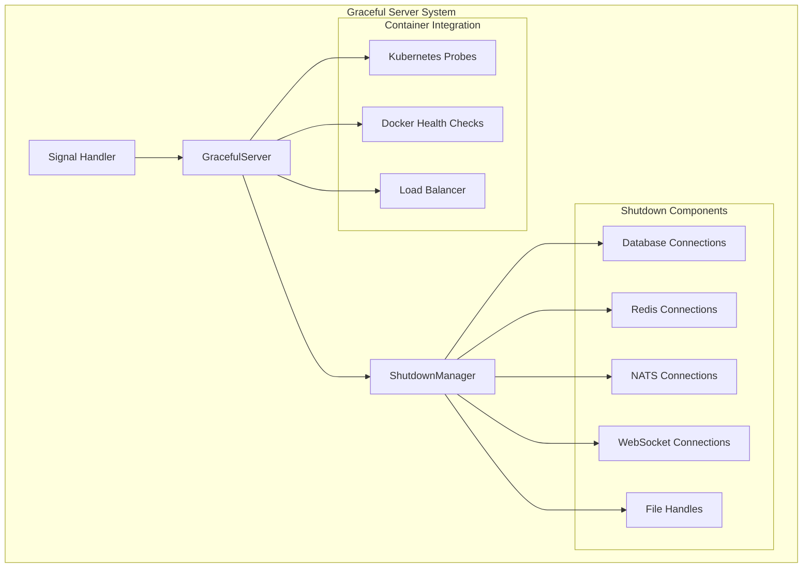

# Graceful Server Management

## Overview

The NebengJek Graceful Server Management system provides robust shutdown handling for containerized environments, ensuring clean resource cleanup and zero-downtime deployments. The system handles SIGINT and SIGTERM signals gracefully, coordinates component shutdown, and integrates with health checks for seamless container orchestration.

## Architecture



## Core Components

### GracefulServer

The [`GracefulServer`](../internal/pkg/server/server.go:18) wraps Echo server with graceful shutdown capabilities:

```go
type GracefulServer struct {
    echo   *echo.Echo
    logger *slog.Logger
    port   int
}
```

**Key Features**:
- Signal handling for SIGINT and SIGTERM
- Configurable shutdown timeout (30 seconds default)
- Structured logging for shutdown events
- Integration with Echo server lifecycle

### ShutdownManager

The [`ShutdownManager`](../internal/pkg/server/server.go:79) coordinates cleanup of multiple components:

```go
type ShutdownManager struct {
    logger    *slog.Logger
    functions []func(context.Context) error
}
```

**Key Features**:
- Component registration for cleanup
- Sequential shutdown execution
- Error handling and logging
- Context-aware timeout support

## Signal Handling

### Supported Signals

The graceful server handles the following signals:

- **SIGINT** (Ctrl+C): Interactive interrupt signal
- **SIGTERM**: Termination signal from container orchestrators

```go
func (s *GracefulServer) Start() error {
    // Start server in a goroutine
    go func() {
        addr := fmt.Sprintf(":%d", s.port)
        s.logger.Info("Starting HTTP server", logger.String("address", addr))

        if err := s.echo.Start(addr); err != nil && err != http.ErrServerClosed {
            s.logger.Error("Failed to start server", logger.Err(err))
            os.Exit(1)
        }
    }()

    // Wait for interrupt signal to gracefully shutdown the server
    quit := make(chan os.Signal, 1)
    // Kill signal sent from terminal (Ctrl+C)
    // SIGTERM signal sent from Kubernetes or Docker
    signal.Notify(quit, os.Interrupt, syscall.SIGTERM)

    // Block until signal is received
    sig := <-quit
    s.logger.Info("Received shutdown signal", logger.String("signal", sig.String()))

    // Graceful shutdown with timeout
    return s.Shutdown()
}
```

### Shutdown Timeout

The system uses a 30-second timeout for graceful shutdown:

```go
func (s *GracefulServer) Shutdown() error {
    s.logger.Info("Shutting down server gracefully...")

    // Create context with timeout for shutdown
    ctx, cancel := context.WithTimeout(context.Background(), 30*time.Second)
    defer cancel()

    // Shutdown the server
    if err := s.echo.Shutdown(ctx); err != nil {
        s.logger.Error("Server forced to shutdown", logger.Err(err))
        return err
    }

    s.logger.Info("Server shutdown completed")
    return nil
}
```

## Component Cleanup

### Registration Pattern

Components register cleanup functions with the ShutdownManager:

```go
func main() {
    // Create shutdown manager
    shutdownManager := server.NewShutdownManager(logger)
    
    // Register database cleanup
    shutdownManager.Register(func(ctx context.Context) error {
        logger.Info("Closing database connections")
        return pgClient.Close()
    })
    
    // Register Redis cleanup
    shutdownManager.Register(func(ctx context.Context) error {
        logger.Info("Closing Redis connections")
        return redisClient.Close()
    })
    
    // Register NATS cleanup
    shutdownManager.Register(func(ctx context.Context) error {
        logger.Info("Closing NATS connections")
        natsClient.Close()
        return nil
    })
}
```

### Cleanup Execution

The ShutdownManager executes cleanup functions sequentially:

```go
func (sm *ShutdownManager) Shutdown(ctx context.Context) error {
    sm.logger.Info("Starting graceful shutdown of components", 
        logger.Int("components", len(sm.functions)))

    for i, fn := range sm.functions {
        if err := fn(ctx); err != nil {
            sm.logger.Error("Error during component shutdown",
                logger.Int("component", i),
                logger.Err(err))
            // Continue with other components even if one fails
        }
    }

    sm.logger.Info("All components shutdown completed")
    return nil
}
```

## Implementation Guide

### Basic Server Setup

```go
package main

import (
    "context"
    "log/slog"
    "os"
    
    "github.com/labstack/echo/v4"
    "github.com/piresc/nebengjek/internal/pkg/server"
    "github.com/piresc/nebengjek/internal/pkg/logger"
)

func main() {
    // Initialize logger
    logger := slog.New(slog.NewJSONHandler(os.Stdout, &slog.HandlerOptions{
        Level: slog.LevelInfo,
    }))

    // Create Echo instance
    e := echo.New()
    
    // Setup routes
    setupRoutes(e)
    
    // Create graceful server
    gracefulServer := server.NewGracefulServer(e, logger, 9990)
    
    // Start server with graceful shutdown
    if err := gracefulServer.Start(); err != nil {
        logger.Error("Server failed", logger.Err(err))
        os.Exit(1)
    }
}
```

### Complete Service Integration

```go
package main

import (
    "context"
    "log/slog"
    "os"
    
    "github.com/piresc/nebengjek/internal/pkg/server"
    "github.com/piresc/nebengjek/internal/pkg/database"
    "github.com/piresc/nebengjek/internal/pkg/nats"
)

func main() {
    logger := slog.New(slog.NewJSONHandler(os.Stdout, nil))
    
    // Initialize dependencies
    pgClient, err := database.NewPostgresClient(cfg.Database)
    if err != nil {
        logger.Error("Failed to connect to PostgreSQL", logger.Err(err))
        os.Exit(1)
    }
    
    redisClient, err := database.NewRedisClient(cfg.Redis)
    if err != nil {
        logger.Error("Failed to connect to Redis", logger.Err(err))
        os.Exit(1)
    }
    
    natsClient, err := nats.NewClient(cfg.NATS)
    if err != nil {
        logger.Error("Failed to connect to NATS", logger.Err(err))
        os.Exit(1)
    }
    
    // Create shutdown manager
    shutdownManager := server.NewShutdownManager(logger)
    
    // Register cleanup functions
    registerCleanupFunctions(shutdownManager, pgClient, redisClient, natsClient)
    
    // Setup Echo server
    e := echo.New()
    setupMiddleware(e, logger)
    setupRoutes(e)
    
    // Create graceful server
    gracefulServer := server.NewGracefulServer(e, logger, cfg.Server.Port)
    
    // Start server
    if err := gracefulServer.Start(); err != nil {
        logger.Error("Server failed", logger.Err(err))
        
        // Cleanup on failure
        ctx, cancel := context.WithTimeout(context.Background(), 10*time.Second)
        defer cancel()
        shutdownManager.Shutdown(ctx)
        
        os.Exit(1)
    }
    
    // Cleanup after graceful shutdown
    ctx, cancel := context.WithTimeout(context.Background(), 10*time.Second)
    defer cancel()
    shutdownManager.Shutdown(ctx)
}

func registerCleanupFunctions(sm *server.ShutdownManager, pgClient *database.PostgresClient, redisClient *database.RedisClient, natsClient *nats.Client) {
    // Database cleanup
    sm.Register(func(ctx context.Context) error {
        if pgClient != nil {
            return pgClient.Close()
        }
        return nil
    })
    
    // Redis cleanup
    sm.Register(func(ctx context.Context) error {
        if redisClient != nil {
            return redisClient.Close()
        }
        return nil
    })
    
    // NATS cleanup
    sm.Register(func(ctx context.Context) error {
        if natsClient != nil {
            natsClient.Close()
        }
        return nil
    })
    
    // WebSocket cleanup (if applicable)
    sm.Register(func(ctx context.Context) error {
        // Close WebSocket connections
        return nil
    })
}
```

## Container Integration

### Docker Configuration

#### Dockerfile

```dockerfile
FROM golang:1.23-alpine AS builder

WORKDIR /app
COPY go.mod go.sum ./
RUN go mod download

COPY . .
RUN CGO_ENABLED=0 GOOS=linux go build -o main ./cmd/users

FROM alpine:latest
RUN apk --no-cache add ca-certificates
WORKDIR /root/

COPY --from=builder /app/main .

# Add health check
HEALTHCHECK --interval=30s --timeout=10s --start-period=5s --retries=3 \
    CMD wget --no-verbose --tries=1 --spider http://localhost:9990/health || exit 1

EXPOSE 9990

# Use exec form to ensure proper signal handling
CMD ["./main"]
```

#### Docker Compose

```yaml
version: '3.8'
services:
  users-service:
    build: ./cmd/users
    ports:
      - "9990:9990"
    environment:
      - DB_HOST=postgres
      - REDIS_HOST=redis
      - NATS_URL=nats://nats:4222
    healthcheck:
      test: ["CMD", "wget", "--no-verbose", "--tries=1", "--spider", "http://localhost:9990/health"]
      interval: 30s
      timeout: 10s
      retries: 3
      start_period: 40s
    depends_on:
      postgres:
        condition: service_healthy
      redis:
        condition: service_healthy
      nats:
        condition: service_healthy
    restart: unless-stopped
    stop_grace_period: 35s  # Allow time for graceful shutdown
```

### Kubernetes Integration

#### Deployment Configuration

```yaml
apiVersion: apps/v1
kind: Deployment
metadata:
  name: users-service
  labels:
    app: users-service
spec:
  replicas: 3
  strategy:
    type: RollingUpdate
    rollingUpdate:
      maxUnavailable: 1
      maxSurge: 1
  selector:
    matchLabels:
      app: users-service
  template:
    metadata:
      labels:
        app: users-service
    spec:
      containers:
      - name: users-service
        image: nebengjek/users-service:latest
        ports:
        - containerPort: 9990
          name: http
        env:
        - name: DB_HOST
          value: "postgres-service"
        - name: REDIS_HOST
          value: "redis-service"
        - name: NATS_URL
          value: "nats://nats-service:4222"
        
        # Graceful shutdown configuration
        lifecycle:
          preStop:
            exec:
              command: ["/bin/sh", "-c", "sleep 5"]
        
        # Health checks
        livenessProbe:
          httpGet:
            path: /health/live
            port: 9990
          initialDelaySeconds: 30
          periodSeconds: 10
          timeoutSeconds: 5
          failureThreshold: 3
        
        readinessProbe:
          httpGet:
            path: /health/ready
            port: 9990
          initialDelaySeconds: 5
          periodSeconds: 5
          timeoutSeconds: 3
          failureThreshold: 3
        
        # Resource limits
        resources:
          requests:
            memory: "128Mi"
            cpu: "100m"
          limits:
            memory: "256Mi"
            cpu: "200m"
      
      # Graceful shutdown timeout
      terminationGracePeriodSeconds: 35
```

#### Service Configuration

```yaml
apiVersion: v1
kind: Service
metadata:
  name: users-service
  labels:
    app: users-service
spec:
  selector:
    app: users-service
  ports:
  - port: 9990
    targetPort: 9990
    protocol: TCP
    name: http
  type: ClusterIP
```

## Health Check Integration

### Coordinated Shutdown

The graceful server coordinates with health checks during shutdown:

```go
func (s *GracefulServer) Shutdown() error {
    s.logger.Info("Shutting down server gracefully...")
    
    // Health checks will start returning unhealthy status
    // This allows load balancers to stop routing traffic
    
    // Create context with timeout for shutdown
    ctx, cancel := context.WithTimeout(context.Background(), 30*time.Second)
    defer cancel()
    
    // Shutdown the server
    if err := s.echo.Shutdown(ctx); err != nil {
        s.logger.Error("Server forced to shutdown", logger.Err(err))
        return err
    }
    
    s.logger.Info("Server shutdown completed")
    return nil
}
```

### Load Balancer Coordination

```go
// Health check handler that respects shutdown state
func (h *HealthHandler) ReadinessCheck(c echo.Context) error {
    if h.isShuttingDown {
        return c.JSON(http.StatusServiceUnavailable, map[string]interface{}{
            "status": "shutting_down",
            "message": "Service is shutting down",
        })
    }
    
    // Normal health check logic
    return h.performHealthChecks(c)
}
```

## Best Practices

### Signal Handling

1. **Handle Both Signals**: Always handle both SIGINT and SIGTERM
2. **Graceful Timeout**: Use appropriate timeout values (30 seconds recommended)
3. **Resource Cleanup**: Ensure all resources are properly cleaned up
4. **Error Handling**: Continue cleanup even if some components fail

### Container Considerations

1. **Exec Form**: Use exec form in CMD to ensure proper signal handling
2. **Grace Period**: Set terminationGracePeriodSeconds > shutdown timeout
3. **PreStop Hook**: Use preStop hooks for additional cleanup time
4. **Health Checks**: Coordinate health checks with shutdown state

### Logging Strategy

1. **Structured Logging**: Use structured logging for shutdown events
2. **Component Tracking**: Log each component's shutdown status
3. **Error Context**: Provide context for shutdown errors
4. **Timing Information**: Log shutdown timing for monitoring

## Monitoring and Observability

### Shutdown Metrics

Track shutdown performance and reliability:

```go
var (
    shutdownDuration = prometheus.NewHistogram(
        prometheus.HistogramOpts{
            Name: "graceful_shutdown_duration_seconds",
            Help: "Duration of graceful shutdown",
        },
    )
    
    shutdownErrors = prometheus.NewCounterVec(
        prometheus.CounterOpts{
            Name: "graceful_shutdown_errors_total",
            Help: "Number of graceful shutdown errors",
        },
        []string{"component"},
    )
)

func (sm *ShutdownManager) Shutdown(ctx context.Context) error {
    start := time.Now()
    defer func() {
        shutdownDuration.Observe(time.Since(start).Seconds())
    }()
    
    for i, fn := range sm.functions {
        if err := fn(ctx); err != nil {
            shutdownErrors.WithLabelValues(fmt.Sprintf("component_%d", i)).Inc()
            // ... error handling ...
        }
    }
    
    return nil
}
```

### Alerting

Set up alerts for shutdown issues:

```yaml
# Prometheus alerting rule
groups:
- name: graceful_shutdown
  rules:
  - alert: GracefulShutdownTooSlow
    expr: graceful_shutdown_duration_seconds > 25
    for: 0m
    labels:
      severity: warning
    annotations:
      summary: "Graceful shutdown taking too long"
      description: "Service {{ $labels.instance }} shutdown took {{ $value }}s"
  
  - alert: GracefulShutdownErrors
    expr: increase(graceful_shutdown_errors_total[5m]) > 0
    for: 0m
    labels:
      severity: critical
    annotations:
      summary: "Graceful shutdown errors detected"
      description: "Service {{ $labels.instance }} had shutdown errors"
```

## Troubleshooting

### Common Issues

#### Shutdown Timeout
```
Error: "context deadline exceeded"
Cause: Components taking too long to shutdown
Solution: Increase timeout or optimize component cleanup
```

#### Signal Not Received
```
Issue: Container killed immediately without graceful shutdown
Cause: Incorrect signal handling or container configuration
Solution: Verify signal.Notify setup and container CMD format
```

#### Resource Leaks
```
Issue: Connections not properly closed
Cause: Missing cleanup registration or errors in cleanup functions
Solution: Verify all resources are registered for cleanup
```

### Debug Configuration

Enable debug logging for shutdown issues:

```go
logger := slog.New(slog.NewJSONHandler(os.Stdout, &slog.HandlerOptions{
    Level: slog.LevelDebug,
}))

shutdownManager := server.NewShutdownManager(logger)
```

### Testing Graceful Shutdown

Test shutdown behavior in development:

```bash
# Send SIGTERM to test graceful shutdown
kill -TERM <pid>

# Send SIGINT (Ctrl+C equivalent)
kill -INT <pid>

# Test with Docker
docker stop <container_id>  # Sends SIGTERM, then SIGKILL after grace period
```

## Related Documentation

- [Enhanced Health Checks](enhanced-health-checks.md) - Health check integration
- [CI/CD & Deployment](cicd-deployment.md) - Container deployment
- [Monitoring & Observability](monitoring-observability.md) - Monitoring setup
- [System Architecture](system-architecture.md) - Overall system design