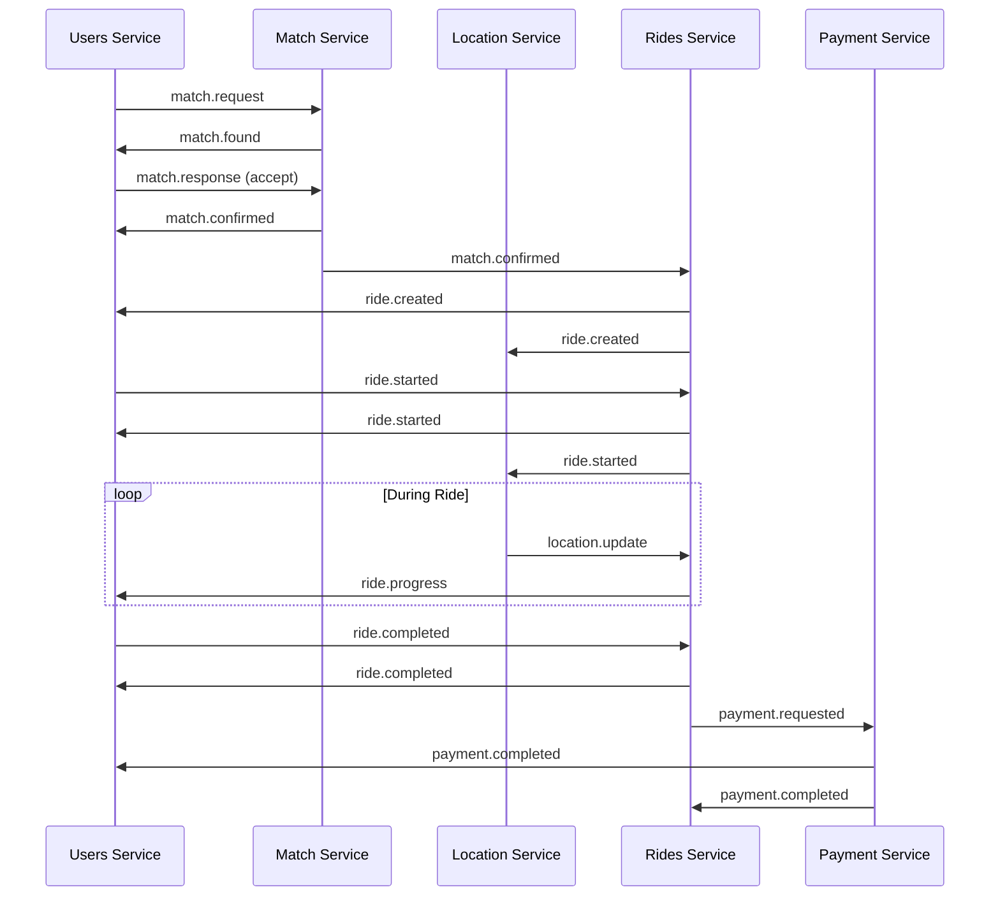
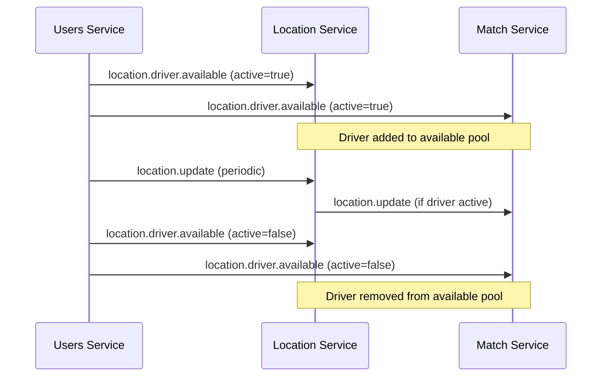

# NATS Event Schemas

## Overview

The NebengJek system uses NATS JetStream for asynchronous, event-driven communication between microservices. This document defines all NATS subjects, their payload schemas, and event flow patterns for reliable inter-service messaging.

## NATS JetStream Configuration

### Stream Configuration
```yaml
streams:
  - name: "NEBENGJEK_EVENTS"
    subjects: ["nebengjek.>"]
    storage: "file"
    retention: "limits"
    max_age: "24h"
    max_msgs: 1000000
    max_bytes: "1GB"
    replicas: 3
    
  - name: "LOCATION_EVENTS"
    subjects: ["location.>"]
    storage: "memory"
    retention: "workqueue"
    max_age: "1h"
    max_msgs: 100000
    
  - name: "RIDE_EVENTS"
    subjects: ["ride.>"]
    storage: "file"
    retention: "limits"
    max_age: "7d"
    max_msgs: 500000
```

### Consumer Groups
```yaml
consumers:
  - name: "location-service"
    stream: "NEBENGJEK_EVENTS"
    filter_subject: "location.>"
    durable_name: "location-processor"
    
  - name: "match-service"
    stream: "NEBENGJEK_EVENTS"
    filter_subject: "match.>"
    durable_name: "match-processor"
    
  - name: "ride-service"
    stream: "NEBENGJEK_EVENTS"
    filter_subject: "ride.>"
    durable_name: "ride-processor"
```

## Event Categories

### Location Events (`location.*`)

#### location.update
Real-time location updates from users.

**Subject**: `location.update`

**Payload**:
```json
{
  "event_id": "uuid",
  "event_type": "location.update",
  "timestamp": "2025-01-08T10:00:00Z",
  "source_service": "users-service",
  "version": "1.0",
  "data": {
    "user_id": "uuid",
    "user_type": "driver|passenger",
    "location": {
      "latitude": -6.2088,
      "longitude": 106.8456,
      "accuracy": 10.5,
      "speed": 25.0,
      "heading": 180.0,
      "altitude": 100.0
    },
    "ride_id": "uuid",
    "session_id": "uuid",
    "device_info": {
      "platform": "android|ios",
      "app_version": "1.0.0"
    }
  }
}
```

**Consumers**: Location Service, Match Service (for active drivers)

#### location.driver.available
Driver availability status changes.

**Subject**: `location.driver.available`

**Payload**:
```json
{
  "event_id": "uuid",
  "event_type": "location.driver.available",
  "timestamp": "2025-01-08T10:00:00Z",
  "source_service": "users-service",
  "version": "1.0",
  "data": {
    "driver_id": "uuid",
    "is_available": true,
    "location": {
      "latitude": -6.2088,
      "longitude": 106.8456,
      "geohash": "qqgux4"
    },
    "vehicle_info": {
      "type": "motorcycle",
      "license_plate": "B1234XYZ",
      "capacity": 1
    },
    "service_area": {
      "city": "Jakarta",
      "zone": "Central"
    }
  }
}
```

**Consumers**: Location Service, Match Service

#### location.geofence.event
Geofence entry/exit events.

**Subject**: `location.geofence.event`

**Payload**:
```json
{
  "event_id": "uuid",
  "event_type": "location.geofence.event",
  "timestamp": "2025-01-08T10:00:00Z",
  "source_service": "location-service",
  "version": "1.0",
  "data": {
    "user_id": "uuid",
    "geofence_id": "uuid",
    "geofence_type": "pickup_zone|destination_zone|service_area|restricted_area",
    "action": "entered|exited",
    "location": {
      "latitude": -6.2088,
      "longitude": 106.8456
    },
    "ride_id": "uuid",
    "metadata": {
      "zone_name": "Sudirman Business District",
      "zone_radius_m": 500
    }
  }
}
```

**Consumers**: Users Service, Rides Service

### Match Events (`match.*`)

#### match.request
Passenger ride request.

**Subject**: `match.request`

**Payload**:
```json
{
  "event_id": "uuid",
  "event_type": "match.request",
  "timestamp": "2025-01-08T10:00:00Z",
  "source_service": "users-service",
  "version": "1.0",
  "data": {
    "match_request_id": "uuid",
    "passenger_id": "uuid",
    "pickup_location": {
      "latitude": -6.2088,
      "longitude": 106.8456,
      "address": "Jl. Sudirman No. 1, Jakarta",
      "landmark": "Plaza Indonesia"
    },
    "destination_location": {
      "latitude": -6.2200,
      "longitude": 106.8300,
      "address": "Jl. Thamrin No. 10, Jakarta",
      "landmark": "Grand Indonesia"
    },
    "preferences": {
      "vehicle_type": "motorcycle",
      "max_distance_km": 5.0,
      "max_wait_minutes": 10,
      "price_preference": "standard|premium"
    },
    "passenger_info": {
      "name": "Jane Doe",
      "phone": "+628987654321",
      "rating": 4.9
    },
    "expires_at": "2025-01-08T10:10:00Z"
  }
}
```

**Consumers**: Match Service

#### match.found
Driver-passenger match found.

**Subject**: `match.found`

**Payload**:
```json
{
  "event_id": "uuid",
  "event_type": "match.found",
  "timestamp": "2025-01-08T10:00:00Z",
  "source_service": "match-service",
  "version": "1.0",
  "data": {
    "match_id": "uuid",
    "match_request_id": "uuid",
    "driver_id": "uuid",
    "passenger_id": "uuid",
    "pickup_location": {
      "latitude": -6.2088,
      "longitude": 106.8456,
      "address": "Jl. Sudirman No. 1, Jakarta"
    },
    "destination_location": {
      "latitude": -6.2200,
      "longitude": 106.8300,
      "address": "Jl. Thamrin No. 10, Jakarta"
    },
    "driver_info": {
      "name": "John Driver",
      "phone": "+628123456789",
      "vehicle_type": "motorcycle",
      "license_plate": "B1234XYZ",
      "rating": 4.8,
      "current_location": {
        "latitude": -6.2100,
        "longitude": 106.8450
      }
    },
    "estimates": {
      "distance_km": 3.2,
      "duration_minutes": 15,
      "pickup_time_minutes": 5,
      "fare_estimate": 9600
    },
    "expires_at": "2025-01-08T10:05:00Z"
  }
}
```

**Consumers**: Users Service (for WebSocket notification)

#### match.response
Driver/passenger response to match proposal.

**Subject**: `match.response`

**Payload**:
```json
{
  "event_id": "uuid",
  "event_type": "match.response",
  "timestamp": "2025-01-08T10:00:00Z",
  "source_service": "users-service",
  "version": "1.0",
  "data": {
    "match_id": "uuid",
    "user_id": "uuid",
    "user_type": "driver|passenger",
    "response": "accepted|rejected",
    "reason": "too_far|price_too_high|other",
    "response_time_seconds": 15
  }
}
```

**Consumers**: Match Service

#### match.confirmed
Match confirmed by both parties.

**Subject**: `match.confirmed`

**Payload**:
```json
{
  "event_id": "uuid",
  "event_type": "match.confirmed",
  "timestamp": "2025-01-08T10:00:00Z",
  "source_service": "match-service",
  "version": "1.0",
  "data": {
    "match_id": "uuid",
    "driver_id": "uuid",
    "passenger_id": "uuid",
    "pickup_location": {
      "latitude": -6.2088,
      "longitude": 106.8456,
      "address": "Jl. Sudirman No. 1, Jakarta"
    },
    "destination_location": {
      "latitude": -6.2200,
      "longitude": 106.8300,
      "address": "Jl. Thamrin No. 10, Jakarta"
    },
    "confirmed_at": "2025-01-08T10:00:00Z",
    "estimated_pickup_time": "2025-01-08T10:05:00Z"
  }
}
```

**Consumers**: Users Service, Rides Service

#### match.cancelled
Match cancelled by user or system.

**Subject**: `match.cancelled`

**Payload**:
```json
{
  "event_id": "uuid",
  "event_type": "match.cancelled",
  "timestamp": "2025-01-08T10:00:00Z",
  "source_service": "match-service",
  "version": "1.0",
  "data": {
    "match_id": "uuid",
    "cancelled_by": "driver|passenger|system",
    "reason": "timeout|user_cancelled|driver_unavailable|passenger_unavailable",
    "message": "Driver is no longer available",
    "driver_id": "uuid",
    "passenger_id": "uuid",
    "cancelled_at": "2025-01-08T10:00:00Z"
  }
}
```

**Consumers**: Users Service, Rides Service

### Ride Events (`ride.*`)

#### ride.created
New ride created from confirmed match.

**Subject**: `ride.created`

**Payload**:
```json
{
  "event_id": "uuid",
  "event_type": "ride.created",
  "timestamp": "2025-01-08T10:00:00Z",
  "source_service": "rides-service",
  "version": "1.0",
  "data": {
    "ride_id": "uuid",
    "match_id": "uuid",
    "driver_id": "uuid",
    "passenger_id": "uuid",
    "pickup_location": {
      "latitude": -6.2088,
      "longitude": 106.8456,
      "address": "Jl. Sudirman No. 1, Jakarta"
    },
    "destination_location": {
      "latitude": -6.2200,
      "longitude": 106.8300,
      "address": "Jl. Thamrin No. 10, Jakarta"
    },
    "pricing": {
      "base_rate_per_km": 3000,
      "estimated_fare": 9600,
      "currency": "IDR"
    },
    "status": "created",
    "created_at": "2025-01-08T10:00:00Z"
  }
}
```

**Consumers**: Users Service, Location Service

#### ride.started
Ride started by driver.

**Subject**: `ride.started`

**Payload**:
```json
{
  "event_id": "uuid",
  "event_type": "ride.started",
  "timestamp": "2025-01-08T10:00:00Z",
  "source_service": "rides-service",
  "version": "1.0",
  "data": {
    "ride_id": "uuid",
    "driver_id": "uuid",
    "passenger_id": "uuid",
    "start_location": {
      "latitude": -6.2088,
      "longitude": 106.8456,
      "timestamp": "2025-01-08T10:00:00Z"
    },
    "destination_location": {
      "latitude": -6.2200,
      "longitude": 106.8300
    },
    "status": "in_progress",
    "started_at": "2025-01-08T10:00:00Z"
  }
}
```

**Consumers**: Users Service, Location Service

#### ride.progress
Ride progress updates (periodic).

**Subject**: `ride.progress`

**Payload**:
```json
{
  "event_id": "uuid",
  "event_type": "ride.progress",
  "timestamp": "2025-01-08T10:05:00Z",
  "source_service": "rides-service",
  "version": "1.0",
  "data": {
    "ride_id": "uuid",
    "current_location": {
      "latitude": -6.2150,
      "longitude": 106.8400,
      "timestamp": "2025-01-08T10:05:00Z"
    },
    "distance_traveled_km": 1.5,
    "duration_minutes": 5,
    "current_fare": 4500,
    "estimated_remaining": {
      "distance_km": 1.7,
      "time_minutes": 10,
      "fare": 5100
    },
    "status": "in_progress"
  }
}
```

**Consumers**: Users Service

#### ride.completed
Ride completed with final billing.

**Subject**: `ride.completed`

**Payload**:
```json
{
  "event_id": "uuid",
  "event_type": "ride.completed",
  "timestamp": "2025-01-08T10:15:00Z",
  "source_service": "rides-service",
  "version": "1.0",
  "data": {
    "ride_id": "uuid",
    "driver_id": "uuid",
    "passenger_id": "uuid",
    "start_location": {
      "latitude": -6.2088,
      "longitude": 106.8456,
      "timestamp": "2025-01-08T10:00:00Z"
    },
    "end_location": {
      "latitude": -6.2200,
      "longitude": 106.8300,
      "timestamp": "2025-01-08T10:15:00Z"
    },
    "trip_summary": {
      "total_distance_km": 3.2,
      "total_duration_minutes": 15,
      "average_speed_kmh": 12.8
    },
    "billing": {
      "base_fare": 9600,
      "adjustment_factor": 0.9,
      "adjusted_fare": 8640,
      "admin_fee_percent": 5.0,
      "admin_fee": 432,
      "final_fare": 8208,
      "currency": "IDR"
    },
    "status": "completed",
    "completed_at": "2025-01-08T10:15:00Z"
  }
}
```

**Consumers**: Users Service, Payment Service

#### ride.cancelled
Ride cancelled during trip.

**Subject**: `ride.cancelled`

**Payload**:
```json
{
  "event_id": "uuid",
  "event_type": "ride.cancelled",
  "timestamp": "2025-01-08T10:10:00Z",
  "source_service": "rides-service",
  "version": "1.0",
  "data": {
    "ride_id": "uuid",
    "driver_id": "uuid",
    "passenger_id": "uuid",
    "cancelled_by": "driver|passenger|system",
    "reason": "emergency|passenger_request|driver_issue|system_error",
    "cancellation_location": {
      "latitude": -6.2150,
      "longitude": 106.8400
    },
    "partial_billing": {
      "distance_traveled_km": 1.5,
      "duration_minutes": 10,
      "cancellation_fee": 2000,
      "currency": "IDR"
    },
    "status": "cancelled",
    "cancelled_at": "2025-01-08T10:10:00Z"
  }
}
```

**Consumers**: Users Service, Payment Service

### User Events (`user.*`)

#### user.created
New user registration.

**Subject**: `user.created`

**Payload**:
```json
{
  "event_id": "uuid",
  "event_type": "user.created",
  "timestamp": "2025-01-08T10:00:00Z",
  "source_service": "users-service",
  "version": "1.0",
  "data": {
    "user_id": "uuid",
    "msisdn": "+628123456789",
    "name": "John Doe",
    "email": "john@example.com",
    "role": "passenger",
    "registration_source": "mobile_app|web|api",
    "created_at": "2025-01-08T10:00:00Z"
  }
}
```

**Consumers**: Analytics Service, Notification Service

#### user.driver.registered
User registered as driver.

**Subject**: `user.driver.registered`

**Payload**:
```json
{
  "event_id": "uuid",
  "event_type": "user.driver.registered",
  "timestamp": "2025-01-08T10:00:00Z",
  "source_service": "users-service",
  "version": "1.0",
  "data": {
    "user_id": "uuid",
    "driver_id": "uuid",
    "vehicle_info": {
      "type": "motorcycle",
      "brand": "Honda",
      "model": "Vario 150",
      "year": 2023,
      "license_plate": "B1234XYZ",
      "color": "Black"
    },
    "driver_license": "1234567890123456",
    "verification_status": "pending|verified|rejected",
    "registered_at": "2025-01-08T10:00:00Z"
  }
}
```

**Consumers**: Match Service, Analytics Service

#### user.session.started
User session started.

**Subject**: `user.session.started`

**Payload**:
```json
{
  "event_id": "uuid",
  "event_type": "user.session.started",
  "timestamp": "2025-01-08T10:00:00Z",
  "source_service": "users-service",
  "version": "1.0",
  "data": {
    "user_id": "uuid",
    "session_id": "uuid",
    "device_info": {
      "platform": "android|ios|web",
      "app_version": "1.0.0",
      "device_model": "Samsung Galaxy S21",
      "os_version": "Android 12"
    },
    "location": {
      "latitude": -6.2088,
      "longitude": 106.8456,
      "city": "Jakarta"
    },
    "started_at": "2025-01-08T10:00:00Z"
  }
}
```

**Consumers**: Analytics Service

### Payment Events (`payment.*`)

#### payment.requested
Payment requested for completed ride.

**Subject**: `payment.requested`

**Payload**:
```json
{
  "event_id": "uuid",
  "event_type": "payment.requested",
  "timestamp": "2025-01-08T10:15:00Z",
  "source_service": "rides-service",
  "version": "1.0",
  "data": {
    "payment_id": "uuid",
    "ride_id": "uuid",
    "passenger_id": "uuid",
    "driver_id": "uuid",
    "amount": 8208,
    "currency": "IDR",
    "breakdown": {
      "base_fare": 9600,
      "adjustment": -960,
      "admin_fee": 432,
      "driver_earnings": 7776
    },
    "payment_methods": ["wallet", "bank_transfer", "credit_card"],
    "expires_at": "2025-01-08T10:25:00Z"
  }
}
```

**Consumers**: Payment Service, Users Service

#### payment.completed
Payment successfully processed.

**Subject**: `payment.completed`

**Payload**:
```json
{
  "event_id": "uuid",
  "event_type": "payment.completed",
  "timestamp": "2025-01-08T10:16:00Z",
  "source_service": "payment-service",
  "version": "1.0",
  "data": {
    "payment_id": "uuid",
    "ride_id": "uuid",
    "passenger_id": "uuid",
    "driver_id": "uuid",
    "amount": 8208,
    "currency": "IDR",
    "payment_method": "wallet",
    "transaction_id": "uuid",
    "processing_time_ms": 1500,
    "fees": {
      "admin_fee": 432,
      "payment_gateway_fee": 50
    },
    "driver_payout": {
      "amount": 7776,
      "payout_method": "wallet",
      "payout_id": "uuid"
    },
    "completed_at": "2025-01-08T10:16:00Z"
  }
}
```

**Consumers**: Users Service, Rides Service, Analytics Service

#### payment.failed
Payment processing failed.

**Subject**: `payment.failed`

**Payload**:
```json
{
  "event_id": "uuid",
  "event_type": "payment.failed",
  "timestamp": "2025-01-08T10:16:00Z",
  "source_service": "payment-service",
  "version": "1.0",
  "data": {
    "payment_id": "uuid",
    "ride_id": "uuid",
    "passenger_id": "uuid",
    "amount": 8208,
    "currency": "IDR",
    "payment_method": "wallet",
    "error_code": "INSUFFICIENT_BALANCE",
    "error_message": "Insufficient wallet balance",
    "retry_allowed": true,
    "retry_count": 1,
    "max_retries": 3,
    "failed_at": "2025-01-08T10:16:00Z"
  }
}
```

**Consumers**: Users Service, Rides Service

## Event Flow Patterns

### Complete Ride Workflow


### Driver Availability Flow


## Error Handling

### Dead Letter Queue
Failed events are moved to dead letter queues for manual inspection:

```yaml
dead_letter_queues:
  - name: "failed_location_events"
    source_stream: "LOCATION_EVENTS"
    max_retries: 3
    
  - name: "failed_ride_events"
    source_stream: "RIDE_EVENTS"
    max_retries: 5
    
  - name: "failed_payment_events"
    source_stream: "PAYMENT_EVENTS"
    max_retries: 10
```

### Retry Policies
```yaml
retry_policies:
  location_events:
    max_retries: 3
    backoff: "exponential"
    initial_delay: "1s"
    max_delay: "30s"
    
  ride_events:
    max_retries: 5
    backoff: "linear"
    initial_delay: "2s"
    max_delay: "60s"
    
  payment_events:
    max_retries: 10
    backoff: "exponential"
    initial_delay: "5s"
    max_delay: "300s"
```

## Event Versioning

### Schema Evolution
Events support backward-compatible schema evolution:

```json
{
  "event_id": "uuid",
  "event_type": "ride.completed",
  "timestamp": "2025-01-08T10:15:00Z",
  "source_service": "rides-service",
  "version": "2.0",
  "schema_version": "2.0",
  "backward_compatible": true,
  "data": {
    // New schema with additional fields
  },
  "legacy_data": {
    // v1.0 compatible data for older consumers
  }
}
```

### Version Migration
```yaml
version_migration:
  - from: "1.0"
    to: "2.0"
    migration_strategy: "dual_write"
    deprecation_date: "2025-06-01"
    
  - from: "2.0"
    to: "3.0"
    migration_strategy: "transform"
    transformer: "ride_event_transformer_v3"
```

## Monitoring and Observability

### Event Tracing
All events include tracing information for distributed tracing:

```json
{
  "event_id": "uuid",
  "trace_id": "uuid",
  "span_id": "uuid",
  "parent_span_id": "uuid",
  "correlation_id": "uuid",
  "causation_id": "uuid"
}
```

## Best Practices

### Event Design
1. **Immutable Events**: Events should be immutable once published
2. **Self-Contained**: Events should contain all necessary information
3. **Idempotent**: Event processing should be idempotent
4. **Versioned**: Always include version information

### Performance
1. **Batch Processing**: Process events in batches when possible
2. **Async Processing**: Use async processing for non-critical events
3. **Compression**: Use compression for large event payloads
4. **Partitioning**: Partition events by user_id or ride_id for ordering

### Security
1. **Data Sanitization**: Sanitize sensitive data in events
2. **Encryption**: Encrypt sensitive event payloads
3. **Access Control**: Implement proper access control for event streams
4. **Audit Trail**: Maintain audit trail for critical events

## Related Documentation

- [NATS Messaging System](nats-messaging.md) - NATS configuration and setup
- [WebSocket Events Specification](websocket-events-specification.md) - Client-facing events
- [API Reference](api-reference.md) - REST API documentation
- [System Architecture](system-architecture.md) - Overall system design