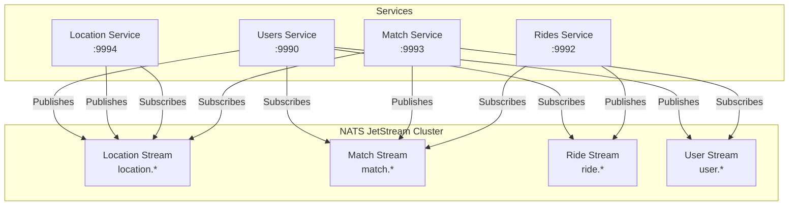
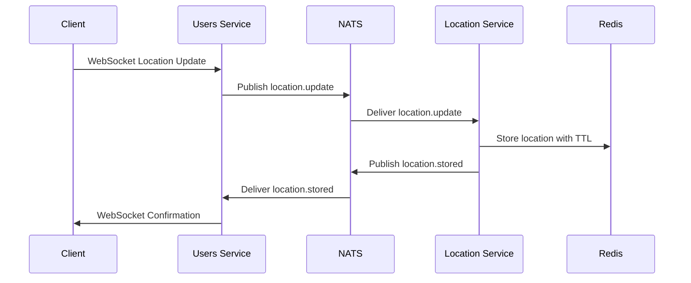
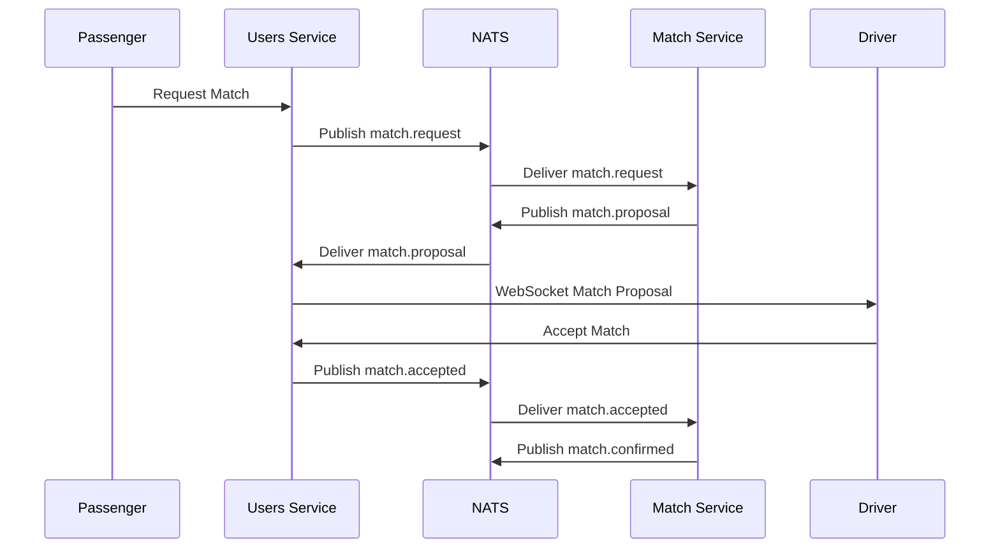
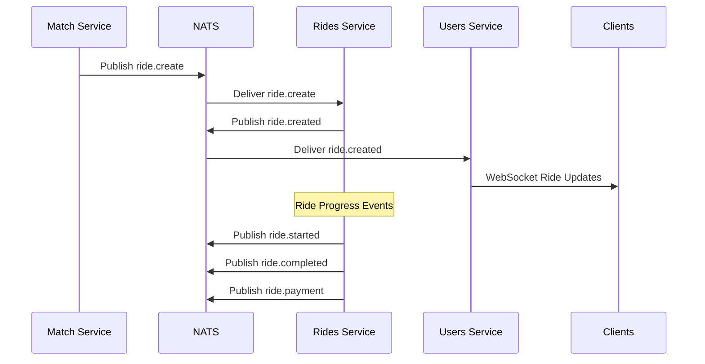

# NATS Messaging System

## Overview

NebengJek uses NATS JetStream for asynchronous and event-driven communication between microservices. This enables scalable, reliable message delivery with persistence and replay capabilities.

## JetStream Architecture

### Stream Configuration

The system implements 4 main JetStream streams with specific retention policies:

#### 1. Location Stream
- **Name**: `LOCATION`
- **Subjects**: `location.>` (all location-related events)
- **Retention**: `WorkQueuePolicy` (messages deleted after acknowledgment)
- **Storage**: `FileStorage` for persistence
- **Purpose**: Real-time location updates and tracking

#### 2. Match Stream  
- **Name**: `MATCH`
- **Subjects**: `match.>` (all matching-related events)
- **Retention**: `WorkQueuePolicy`
- **Storage**: `FileStorage`
- **Purpose**: Driver-passenger matching events

#### 3. Ride Stream
- **Name**: `RIDE` 
- **Subjects**: `ride.>` (all ride-related events)
- **Retention**: `WorkQueuePolicy`
- **Storage**: `FileStorage`
- **Purpose**: Ride lifecycle management events

#### 4. User Stream
- **Name**: `USER`
- **Subjects**: `user.>` (all user-related events)
- **Retention**: `WorkQueuePolicy`
- **Storage**: `FileStorage`
- **Purpose**: User management and authentication events

### Stream Architecture Diagram



## Event-Driven Communication Patterns

### 1. Location Update Flow



### 2. Driver Matching Flow



### 3. Ride Lifecycle Flow



## Subject Patterns and Routing

### Subject Naming Convention
- **Pattern**: `{service}.{action}.{entity}`
- **Examples**:
  - `location.update.driver`
  - `match.request.passenger`
  - `ride.start.trip`
  - `user.beacon.status`

### Subject Routing Table

| Subject Pattern | Publisher | Subscribers | Purpose |
|----------------|-----------|-------------|---------|
| `location.update.*` | Users Service | Location Service | Real-time location updates |
| `location.stored.*` | Location Service | Users Service | Location storage confirmation |
| `match.request.*` | Users Service | Match Service | Match requests from passengers |
| `match.proposal.*` | Match Service | Users Service | Driver match proposals |
| `match.accepted.*` | Users Service | Match Service | Driver acceptance |
| `match.confirmed.*` | Match Service | Rides Service | Confirmed matches |
| `ride.create.*` | Match Service | Rides Service | New ride creation |
| `ride.started.*` | Rides Service | Users Service | Ride start notifications |
| `ride.completed.*` | Rides Service | Users Service | Ride completion |
| `ride.payment.*` | Rides Service | Users Service | Payment processing |
| `user.beacon.*` | Users Service | Match Service | Driver availability |

## Consumer Configuration

### Durable Consumers

Each service implements durable consumers for reliable message processing:

#### Users Service Consumers
```go
// Location update consumer
consumer, err := js.AddConsumer("LOCATION", &nats.ConsumerConfig{
    Durable:       "users-location-consumer",
    FilterSubject: "location.stored.*",
    AckPolicy:     nats.AckExplicitPolicy,
    MaxDeliver:    3,
})

// Match proposal consumer  
consumer, err := js.AddConsumer("MATCH", &nats.ConsumerConfig{
    Durable:       "users-match-consumer",
    FilterSubject: "match.proposal.*",
    AckPolicy:     nats.AckExplicitPolicy,
    MaxDeliver:    3,
})
```

#### Match Service Consumers
```go
// Beacon status consumer
consumer, err := js.AddConsumer("USER", &nats.ConsumerConfig{
    Durable:       "match-beacon-consumer",
    FilterSubject: "user.beacon.*",
    AckPolicy:     nats.AckExplicitPolicy,
    MaxDeliver:    3,
})

// Location update consumer
consumer, err := js.AddConsumer("LOCATION", &nats.ConsumerConfig{
    Durable:       "match-location-consumer", 
    FilterSubject: "location.update.*",
    AckPolicy:     nats.AckExplicitPolicy,
    MaxDeliver:    3,
})
```

### Consumer Implementation Pattern

```go
// Example consumer implementation
func (h *NatsHandler) InitConsumers() error {
    js, err := h.natsClient.JetStream()
    if err != nil {
        return fmt.Errorf("failed to get JetStream context: %w", err)
    }

    // Subscribe to match proposals
    _, err = js.Subscribe("match.proposal.*", h.handleMatchProposal, nats.Durable("users-match-consumer"))
    if err != nil {
        return fmt.Errorf("failed to subscribe to match proposals: %w", err)
    }

    return nil
}

func (h *NatsHandler) handleMatchProposal(msg *nats.Msg) {
    var proposal models.MatchProposal
    if err := json.Unmarshal(msg.Data, &proposal); err != nil {
        logger.Error("Failed to unmarshal match proposal", logger.Err(err))
        msg.Nak()
        return
    }

    // Process the match proposal
    if err := h.processMatchProposal(proposal); err != nil {
        logger.Error("Failed to process match proposal", logger.Err(err))
        msg.Nak()
        return
    }

    msg.Ack()
}
```

## Message Serialization and Validation

### JSON Message Format
All messages use JSON serialization with strict validation:

```go
type LocationUpdate struct {
    UserID    string    `json:"user_id" validate:"required,uuid"`
    Latitude  float64   `json:"latitude" validate:"required,latitude"`
    Longitude float64   `json:"longitude" validate:"required,longitude"`
    Timestamp time.Time `json:"timestamp" validate:"required"`
}

type MatchProposal struct {
    MatchID      string  `json:"match_id" validate:"required,uuid"`
    DriverID     string  `json:"driver_id" validate:"required,uuid"`
    PassengerID  string  `json:"passenger_id" validate:"required,uuid"`
    Distance     float64 `json:"distance" validate:"required,min=0"`
    EstimatedETA int     `json:"estimated_eta" validate:"required,min=0"`
}
```

### Message Validation
```go
func validateMessage(msg interface{}) error {
    validate := validator.New()
    if err := validate.Struct(msg); err != nil {
        return fmt.Errorf("message validation failed: %w", err)
    }
    return nil
}
```

## Error Handling and Reliability

### Acknowledgment Policies
- **Explicit Acknowledgment**: All consumers use explicit ACK/NAK
- **Max Delivery**: 3 attempts before dead letter handling
- **Retry Logic**: Exponential backoff for failed messages

### Dead Letter Handling
```go
func (h *NatsHandler) handleFailedMessage(msg *nats.Msg, err error) {
    logger.Error("Message processing failed",
        logger.String("subject", msg.Subject),
        logger.Err(err),
        logger.Int("delivery_count", int(msg.Header.Get("Nats-Delivered-Count"))))
    
    // Send to dead letter queue after max retries
    if msg.Header.Get("Nats-Delivered-Count") >= "3" {
        h.sendToDeadLetter(msg)
    }
    
    msg.Nak()
}
```

### Circuit Breaker Pattern
```go
type CircuitBreaker struct {
    maxFailures int
    timeout     time.Duration
    failures    int
    lastFailure time.Time
    state       string // "closed", "open", "half-open"
}

func (cb *CircuitBreaker) Call(fn func() error) error {
    if cb.state == "open" {
        if time.Since(cb.lastFailure) > cb.timeout {
            cb.state = "half-open"
        } else {
            return errors.New("circuit breaker is open")
        }
    }
    
    err := fn()
    if err != nil {
        cb.failures++
        cb.lastFailure = time.Now()
        if cb.failures >= cb.maxFailures {
            cb.state = "open"
        }
        return err
    }
    
    cb.failures = 0
    cb.state = "closed"
    return nil
}
```

## Performance and Monitoring

### JetStream Metrics
- **Stream Storage**: File-based persistence for durability
- **Consumer Lag**: Monitored via NATS monitoring endpoints
- **Message Throughput**: Tracked per stream and subject
- **Acknowledgment Rates**: Success/failure ratios

### Health Checks
```go
func (h *HealthChecker) CheckNATS() error {
    js, err := h.natsClient.JetStream()
    if err != nil {
        return fmt.Errorf("JetStream not available: %w", err)
    }
    
    // Check stream health
    for _, streamName := range []string{"LOCATION", "MATCH", "RIDE", "USER"} {
        _, err := js.StreamInfo(streamName)
        if err != nil {
            return fmt.Errorf("stream %s not healthy: %w", streamName, err)
        }
    }
    
    return nil
}
```

### Performance Optimization
- **Batch Processing**: Group related messages for efficiency
- **Connection Pooling**: Reuse NATS connections across goroutines
- **Message Compression**: Optional compression for large payloads
- **Flow Control**: Backpressure handling for high-volume streams

## Configuration

### Environment Variables
```bash
# NATS Configuration
NATS_URL=nats://localhost:4222
NATS_CLUSTER_ID=nebengjek-cluster
NATS_CLIENT_ID=users-service-1

# JetStream Configuration
JETSTREAM_ENABLED=true
JETSTREAM_DOMAIN=nebengjek
JETSTREAM_MAX_MEMORY=1GB
JETSTREAM_MAX_STORAGE=10GB
```

### Stream Creation
```go
func createStreams(js nats.JetStreamContext) error {
    streams := []nats.StreamConfig{
        {
            Name:      "LOCATION",
            Subjects:  []string{"location.>"},
            Retention: nats.WorkQueuePolicy,
            Storage:   nats.FileStorage,
            MaxAge:    24 * time.Hour,
        },
        {
            Name:      "MATCH", 
            Subjects:  []string{"match.>"},
            Retention: nats.WorkQueuePolicy,
            Storage:   nats.FileStorage,
            MaxAge:    24 * time.Hour,
        },
        // ... other streams
    }
    
    for _, stream := range streams {
        _, err := js.AddStream(&stream)
        if err != nil && !errors.Is(err, nats.ErrStreamNameAlreadyInUse) {
            return fmt.Errorf("failed to create stream %s: %w", stream.Name, err)
        }
    }
    
    return nil
}
```

## Security Considerations

### Authentication and Authorization
- **TLS Encryption**: All NATS communication encrypted
- **Token Authentication**: Service-specific authentication tokens
- **Subject Permissions**: Fine-grained access control per service

### Message Security
- **Payload Validation**: Strict JSON schema validation
- **Rate Limiting**: Per-service message rate limits
- **Audit Logging**: All message publishing/consumption logged

## Troubleshooting

### Common Issues

#### Consumer Lag
```bash
# Check consumer lag
nats consumer info LOCATION users-location-consumer

# Reset consumer position
nats consumer reset LOCATION users-location-consumer
```

#### Stream Health
```bash
# Check stream status
nats stream info LOCATION

# View stream subjects
nats stream subjects LOCATION
```

#### Message Debugging
```bash
# Monitor messages in real-time
nats sub "location.>"

# Publish test message
nats pub location.test '{"test": "data"}'
```

## See Also
- [Database Architecture](database-architecture.md)
- [WebSocket Implementation](websocket-implementation.md)
- [Monitoring and Observability](monitoring-observability.md)
- [API Reference](api-reference.md)