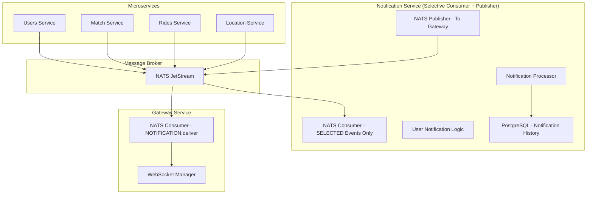
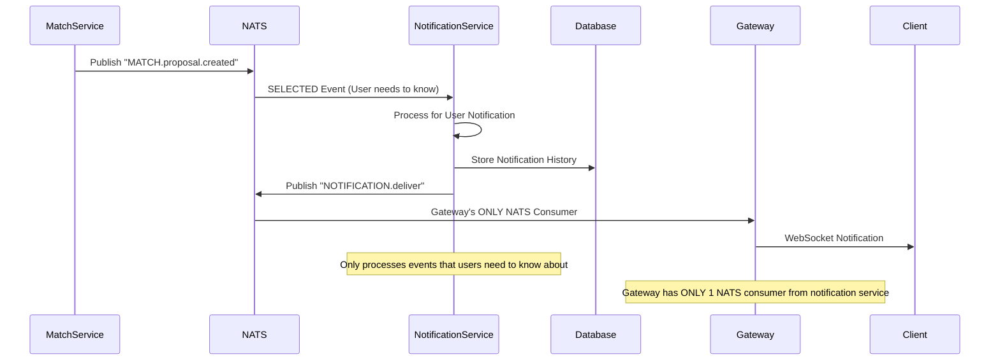

# Notification Service Implementation Plan

## 🎯 **NOTIFICATION SERVICE ARCHITECTURE**

### **Notification Service (Selective & Enhanced)**:
- ✅ **ONLY selected events** that users need to know about
- ✅ **Match & ride lifecycle** notifications only
- ✅ **Database allowed** for notification history
- ✅ **Sends to gateway via NATS** (gateway's only consumer)
- ✅ **NO WebSocket, NO Redis**

## 🏗️ NOTIFICATION SERVICE ARCHITECTURE



## 🎯 SELECTIVE NOTIFICATION STRATEGY

### Events That NEED User Notifications:
```go
// Notification Service - SELECTIVE Event Processing
func (ns *NotificationService) initSelectiveConsumers() error {
    // ONLY subscribe to events that need user notifications
    userNotificationEvents := []string{
        "MATCH.proposal.created",    // User needs to know about match proposals
        "MATCH.accepted",           // User needs to know match was accepted
        "MATCH.rejected",           // User needs to know match was rejected
        "RIDE.started",            // User needs to know ride started
        "RIDE.pickup.arrived",     // User needs to know driver arrived
        "RIDE.completed",          // User needs to know ride completed
        "RIDE.cancelled",          // User needs to know ride cancelled
        "PAYMENT.processed",       // User needs to know payment status
    }
    
    for _, event := range userNotificationEvents {
        err := ns.natsClient.Subscribe(event, ns.handleUserNotificationEvent)
        if err != nil {
            return err
        }
    }
    
    return nil
}
```

### Events That DON'T Need User Notifications:
```go
// These events happen between microservices but users don't need to know
// Examples:
// - "LOCATION.driver.position.updated" (internal tracking)
// - "MATCH.algorithm.recalculated" (internal matching logic)
// - "USER.session.refreshed" (internal session management)
// - "RIDE.metrics.calculated" (internal analytics)
// - "PAYMENT.gateway.validated" (internal payment processing)

// Notification Service IGNORES these events
```

## 🔧 NOTIFICATION SERVICE IMPLEMENTATION

### Notification Service with Database
```go
// Notification Service - Selective Processing with Database
type NotificationService struct {
    natsClient *nats.Client
    db         *sql.DB  // For notification history
    logger     *slog.Logger
}

func (ns *NotificationService) handleUserNotificationEvent(msg *nats.Msg) error {
    subject := msg.Subject
    
    switch subject {
    case "MATCH.proposal.created":
        return ns.notifyMatchProposal(msg)
    case "RIDE.started":
        return ns.notifyRideStarted(msg)
    case "RIDE.completed":
        return ns.notifyRideCompleted(msg)
    default:
        ns.logger.Warn("Unexpected event received", slog.String("subject", subject))
        return nil
    }
}

func (ns *NotificationService) notifyMatchProposal(msg *nats.Msg) error {
    var match MatchProposal
    json.Unmarshal(msg.Data, &match)
    
    // Create notification
    notification := &UserNotification{
        UserID: match.DriverID,
        Type:   "match_proposal",
        Data:   match,
        Timestamp: time.Now(),
    }
    
    // Store in database for history
    err := ns.storeNotificationHistory(notification)
    if err != nil {
        ns.logger.Error("Failed to store notification history", slog.Any("error", err))
    }
    
    // Send to gateway via NATS
    return ns.sendToGatewayViaNATS(notification)
}

func (ns *NotificationService) storeNotificationHistory(notification *UserNotification) error {
    query := `
        INSERT INTO notification_history (user_id, type, data, timestamp, delivered)
        VALUES ($1, $2, $3, $4, $5)
    `
    _, err := ns.db.Exec(query, 
        notification.UserID, 
        notification.Type, 
        notification.Data, 
        notification.Timestamp, 
        false)
    
    return err
}

func (ns *NotificationService) sendToGatewayViaNATS(notification *UserNotification) error {
    return ns.natsClient.Publish("NOTIFICATION.deliver", notification)
}
```

## 📊 NOTIFICATION DATABASE SCHEMA

```sql
CREATE TABLE notification_history (
    id SERIAL PRIMARY KEY,
    user_id VARCHAR(255) NOT NULL,
    type VARCHAR(100) NOT NULL,
    data JSONB NOT NULL,
    timestamp TIMESTAMP WITH TIME ZONE NOT NULL,
    delivered BOOLEAN DEFAULT FALSE,
    created_at TIMESTAMP WITH TIME ZONE DEFAULT NOW(),
    updated_at TIMESTAMP WITH TIME ZONE DEFAULT NOW()
);

CREATE INDEX idx_notification_history_user_id ON notification_history(user_id);
CREATE INDEX idx_notification_history_type ON notification_history(type);
CREATE INDEX idx_notification_history_timestamp ON notification_history(timestamp);
```

## 🔍 NOTIFICATION FLOW PATTERN

### User Notification Flow (SELECTIVE via NATS)


---

**Note**: This notification service works with the existing WebSocket implementation in the gateway service. The gateway service handles all WebSocket connections and real-time communication.
