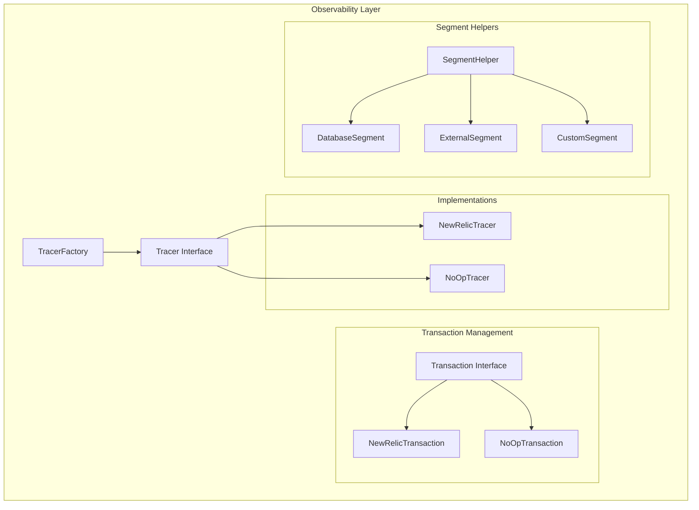

# Observability & Tracing System

## Overview

The NebengJek Observability & Tracing System provides a unified abstraction layer for Application Performance Monitoring (APM) that supports both New Relic integration for production environments and no-operation implementations for testing and development.

## Architecture



## Core Interfaces

### Tracer Interface

The [`Tracer`](../internal/pkg/observability/tracer.go:11) interface provides the main abstraction for APM operations:

```go
type Tracer interface {
    StartTransaction(name string) Transaction
    StartSegment(ctx context.Context, name string) (context.Context, func())
}
```

**Key Methods**:
- `StartTransaction`: Creates a new transaction for request tracking
- `StartSegment`: Creates a segment within the current transaction context

### Transaction Interface

The [`Transaction`](../internal/pkg/observability/tracer.go:17) interface manages individual request transactions:

```go
type Transaction interface {
    End()
    SetWebRequest(*http.Request)
    SetWebResponse(http.ResponseWriter)
    NoticeError(error)
    AddAttribute(key string, value interface{})
    GetContext() context.Context
}
```

**Key Methods**:
- `End`: Finalizes the transaction
- `SetWebRequest/SetWebResponse`: Associates HTTP request/response data
- `NoticeError`: Reports errors to the APM system
- `AddAttribute`: Adds custom business context
- `GetContext`: Returns context with transaction information

## Implementation Types

### New Relic Tracer

The [`NewRelicTracer`](../internal/pkg/observability/tracer.go:58) provides production APM integration:

```go
type NewRelicTracer struct {
    app *newrelic.Application
}

func NewNewRelicTracer(app *newrelic.Application) *NewRelicTracer {
    if app == nil {
        return nil
    }
    return &NewRelicTracer{app: app}
}
```

**Features**:
- Full New Relic APM integration
- Distributed tracing support
- Custom attribute collection
- Error tracking and reporting
- Performance metric collection

### NoOp Tracer

The [`NoOpTracer`](../internal/pkg/observability/tracer.go:27) provides a testing-friendly implementation:

```go
type NoOpTracer struct{}

func NewNoOpTracer() *NoOpTracer {
    return &NoOpTracer{}
}
```

**Features**:
- Zero overhead for testing
- No external dependencies
- Safe for development environments
- Maintains interface compatibility

## Transaction Lifecycle

### HTTP Request Transaction

```go
// Start transaction
txn := tracer.StartTransaction("HTTP /users/create")
defer txn.End()

// Associate request data
txn.SetWebRequest(request)

// Add business context
txn.AddAttribute("user_id", userID)
txn.AddAttribute("user_role", userRole)

// Handle errors
if err != nil {
    txn.NoticeError(err)
    return err
}

// Associate response data
txn.SetWebResponse(responseWriter)
```

### Context Propagation

```go
// Get transaction context for downstream operations
ctx := txn.GetContext()

// Pass context to other functions
result, err := userService.CreateUser(ctx, userData)
if err != nil {
    txn.NoticeError(err)
    return err
}
```

## Segment Management

### Database Segments

Track database operations with detailed timing:

```go
func (h *SegmentHelper) StartDatabaseSegment(ctx context.Context, operation, table string) (context.Context, func()) {
    segmentName := "Database/" + operation
    if table != "" {
        segmentName += "/" + table
    }
    return h.tracer.StartSegment(ctx, segmentName)
}

// Usage example
ctx, endSegment := segmentHelper.StartDatabaseSegment(ctx, "SELECT", "users")
defer endSegment()

user, err := repository.GetUserByID(ctx, userID)
```

### External Service Segments

Track external service calls:

```go
func (h *SegmentHelper) StartExternalSegment(ctx context.Context, service, operation string) (context.Context, func()) {
    segmentName := "External/" + service
    if operation != "" {
        segmentName += "/" + operation
    }
    return h.tracer.StartSegment(ctx, segmentName)
}

// Usage example
ctx, endSegment := segmentHelper.StartExternalSegment(ctx, "MatchService", "FindDrivers")
defer endSegment()

drivers, err := matchClient.FindNearbyDrivers(ctx, location)
```

### Custom Segments

Track custom business operations:

```go
func (h *SegmentHelper) StartCustomSegment(ctx context.Context, name string) (context.Context, func()) {
    return h.tracer.StartSegment(ctx, "Custom/"+name)
}

// Usage example
ctx, endSegment := segmentHelper.StartCustomSegment(ctx, "CalculateFare")
defer endSegment()

fare := calculateRideFare(distance, duration, baseRate)
```

## Middleware Integration

### Unified Middleware Integration

The observability system integrates seamlessly with the unified middleware:

```go
func (m *Middleware) Handler() echo.MiddlewareFunc {
    return func(next echo.HandlerFunc) echo.HandlerFunc {
        return func(c echo.Context) error {
            // ... request ID and context setup ...

            // Setup APM transaction (if tracer is enabled)
            var txn observability.Transaction
            if m.config.Tracer != nil {
                txn = m.config.Tracer.StartTransaction(c.Request().URL.Path)
                defer txn.End()
                txn.SetWebRequest(c.Request())

                // Add transaction context - ensures New Relic context is available for logging
                ctx = txn.GetContext()
                c.SetRequest(c.Request().WithContext(ctx))

                // Store transaction in Echo context for easy access
                c.Set("nr_txn", txn)
            }

            // ... execute handler ...

            // Set APM response (if enabled)
            if txn != nil {
                txn.SetWebResponse(c.Response().Writer)
            }

            return err
        }
    }
}
```

### Transaction Access in Handlers

Access the transaction from Echo context:

```go
func (h *UserHandler) CreateUser(c echo.Context) error {
    // Get transaction from context
    if txn, ok := c.Get("nr_txn").(observability.Transaction); ok && txn != nil {
        txn.AddAttribute("handler", "CreateUser")
        txn.AddAttribute("user_role", c.Get("role"))
    }

    // ... handler logic ...
}
```

## Configuration and Setup

### Tracer Factory

The [`TracerFactory`](../internal/pkg/observability/tracer.go:134) creates appropriate tracer implementations:

```go
type TracerFactory struct{}

func (f *TracerFactory) CreateTracer(nrApp *newrelic.Application) Tracer {
    if nrApp != nil {
        return NewNewRelicTracer(nrApp)
    }
    return NewNoOpTracer()
}
```

### Service Integration

```go
package main

import (
    "github.com/newrelic/go-agent/v3/newrelic"
    "github.com/piresc/nebengjek/internal/pkg/observability"
    "github.com/piresc/nebengjek/internal/pkg/middleware"
)

func main() {
    // Initialize New Relic (production)
    var nrApp *newrelic.Application
    if cfg.NewRelic.LicenseKey != "" {
        var err error
        nrApp, err = newrelic.NewApplication(
            newrelic.ConfigAppName(cfg.NewRelic.AppName),
            newrelic.ConfigLicense(cfg.NewRelic.LicenseKey),
            newrelic.ConfigDistributedTracerEnabled(true),
        )
        if err != nil {
            logger.Error("Failed to initialize New Relic", logger.Err(err))
        }
    }

    // Create tracer
    tracerFactory := observability.NewTracerFactory()
    tracer := tracerFactory.CreateTracer(nrApp)

    // Setup middleware with tracer
    middlewareConfig := middleware.Config{
        Logger:      logger,
        Tracer:      tracer,
        APIKeys:     cfg.APIKeys,
        ServiceName: "users-service",
    }
    
    unifiedMiddleware := middleware.NewMiddleware(middlewareConfig)
    e.Use(unifiedMiddleware.Handler())
}
```

## Performance Monitoring Patterns

### Business Metrics

Add custom business metrics to transactions:

```go
func (h *RideHandler) CompleteRide(c echo.Context) error {
    if txn, ok := c.Get("nr_txn").(observability.Transaction); ok && txn != nil {
        txn.AddAttribute("ride_distance_km", ride.DistanceKM)
        txn.AddAttribute("ride_duration_minutes", ride.DurationMinutes)
        txn.AddAttribute("ride_fare_idr", ride.FareIDR)
        txn.AddAttribute("driver_rating", ride.DriverRating)
        txn.AddAttribute("passenger_rating", ride.PassengerRating)
    }

    // ... handler logic ...
}
```

### Error Context

Provide rich error context for debugging:

```go
func (s *UserService) CreateUser(ctx context.Context, userData *models.User) error {
    // Start custom segment
    segmentHelper := observability.NewSegmentHelper(s.tracer)
    ctx, endSegment := segmentHelper.StartCustomSegment(ctx, "ValidateUserData")
    defer endSegment()

    if err := s.validateUserData(userData); err != nil {
        // Add error context to transaction
        if txn := newrelic.FromContext(ctx); txn != nil {
            txn.AddAttribute("validation_error", err.Error())
            txn.AddAttribute("user_msisdn", userData.MSISDN)
            txn.NoticeError(err)
        }
        return err
    }

    // ... continue processing ...
}
```

### Database Query Tracking

Track database operations with detailed context:

```go
func (r *UserRepository) GetUserByID(ctx context.Context, userID string) (*models.User, error) {
    // Start database segment
    segmentHelper := observability.NewSegmentHelper(r.tracer)
    ctx, endSegment := segmentHelper.StartDatabaseSegment(ctx, "SELECT", "users")
    defer endSegment()

    // Add query context
    if txn := newrelic.FromContext(ctx); txn != nil {
        txn.AddAttribute("query_type", "get_user_by_id")
        txn.AddAttribute("user_id", userID)
    }

    query := "SELECT id, msisdn, role, created_at FROM users WHERE id = $1"
    row := r.db.QueryRowContext(ctx, query, userID)

    var user models.User
    if err := row.Scan(&user.ID, &user.MSISDN, &user.Role, &user.CreatedAt); err != nil {
        if txn := newrelic.FromContext(ctx); txn != nil {
            txn.NoticeError(err)
        }
        return nil, err
    }

    return &user, nil
}
```

## Testing Strategies

### Unit Testing with NoOp Tracer

```go
func TestUserService_CreateUser(t *testing.T) {
    // Use NoOp tracer for testing
    tracer := observability.NewNoOpTracer()
    
    userService := &UserService{
        tracer: tracer,
        // ... other dependencies ...
    }

    // Test without APM overhead
    ctx := context.Background()
    user, err := userService.CreateUser(ctx, testUserData)
    
    assert.NoError(t, err)
    assert.NotNil(t, user)
}
```

### Integration Testing with Mock Tracer

```go
type MockTracer struct {
    transactions []string
    segments     []string
    errors       []error
}

func (m *MockTracer) StartTransaction(name string) observability.Transaction {
    m.transactions = append(m.transactions, name)
    return &MockTransaction{tracer: m}
}

func TestUserHandler_CreateUser_WithTracing(t *testing.T) {
    mockTracer := &MockTracer{}
    
    // Setup handler with mock tracer
    handler := &UserHandler{tracer: mockTracer}
    
    // Execute request
    req := httptest.NewRequest("POST", "/users", strings.NewReader(testJSON))
    rec := httptest.NewRecorder()
    c := echo.New().NewContext(req, rec)
    
    err := handler.CreateUser(c)
    
    assert.NoError(t, err)
    assert.Contains(t, mockTracer.transactions, "CreateUser")
}
```

## Best Practices

### Transaction Naming

Use consistent, hierarchical transaction names:

```go
// Good: Descriptive and hierarchical
tracer.StartTransaction("HTTP POST /users")
tracer.StartTransaction("NATS users.created")
tracer.StartTransaction("WebSocket beacon.update")

// Bad: Too generic or inconsistent
tracer.StartTransaction("request")
tracer.StartTransaction("user_stuff")
```

### Attribute Guidelines

Add meaningful business context:

```go
// Good: Business-relevant attributes
txn.AddAttribute("user_role", "driver")
txn.AddAttribute("ride_distance_km", 5.2)
txn.AddAttribute("payment_method", "wallet")

// Bad: Technical noise or sensitive data
txn.AddAttribute("sql_query", query) // Too verbose
txn.AddAttribute("password", pwd)    // Sensitive data
```

### Error Handling

Provide context for errors:

```go
if err != nil {
    if txn != nil {
        txn.AddAttribute("error_context", "user_validation")
        txn.AddAttribute("validation_field", "msisdn")
        txn.NoticeError(err)
    }
    return err
}
```

### Performance Considerations

1. **Minimal Overhead**: NoOp tracer has zero overhead for testing
2. **Context Propagation**: Always pass context through function calls
3. **Segment Granularity**: Balance detail with performance impact
4. **Attribute Limits**: Be mindful of attribute count and size limits

## Troubleshooting

### Common Issues

#### New Relic Connection Problems
```
Error: "license key is required"
Solution: Verify NEW_RELIC_LICENSE_KEY environment variable
```

#### Context Propagation Issues
```
Error: "transaction not found in context"
Solution: Ensure context is properly propagated through function calls
```

#### Missing Transaction Data
```
Issue: Transactions appear empty in New Relic
Solution: Verify SetWebRequest/SetWebResponse calls and attribute addition
```

### Debug Configuration

Enable debug logging for observability issues:

```go
// Enable New Relic debug logging
nrApp, err := newrelic.NewApplication(
    newrelic.ConfigAppName("nebengjek-users"),
    newrelic.ConfigLicense(licenseKey),
    newrelic.ConfigDebugLogger(os.Stdout),
)
```

### Performance Monitoring

Monitor observability overhead:

```go
// Track tracer performance
start := time.Now()
txn := tracer.StartTransaction("test")
txn.End()
overhead := time.Since(start)

logger.Debug("Tracer overhead", 
    slog.Duration("overhead", overhead))
```

## Related Documentation

- [Enhanced Health Checks](enhanced-health-checks.md) - Health monitoring integration
- [Unified Middleware Guide](unified-middleware-guide.md) - Middleware integration
- [Structured Logging Guide](structured-logging-guide.md) - Logging integration
- [Monitoring & Observability](monitoring-observability.md) - Overall monitoring strategy
- [Tech Stack Rationale](tech-stack-rationale.md) - New Relic configuration and technology choices