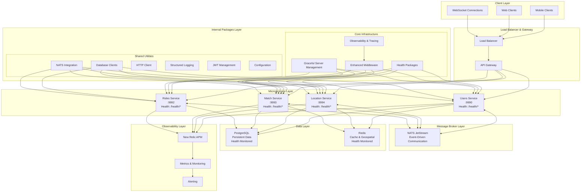
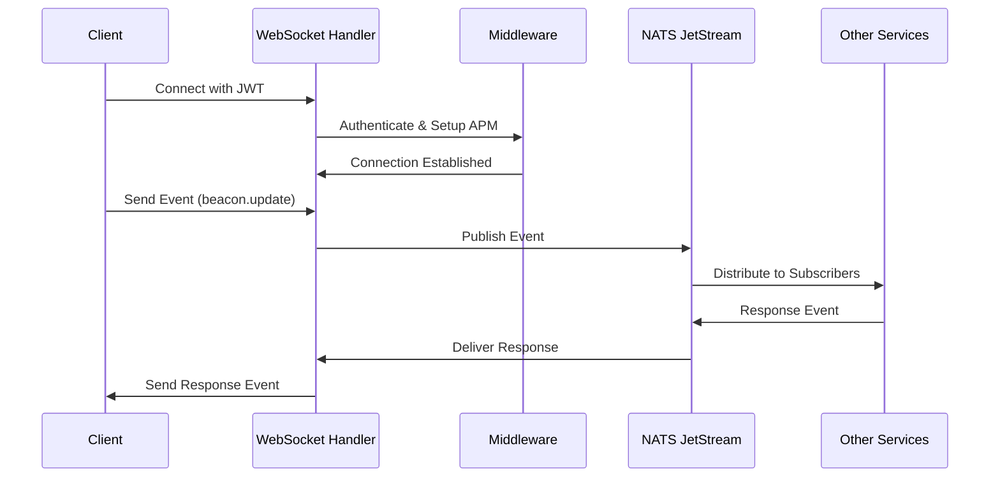
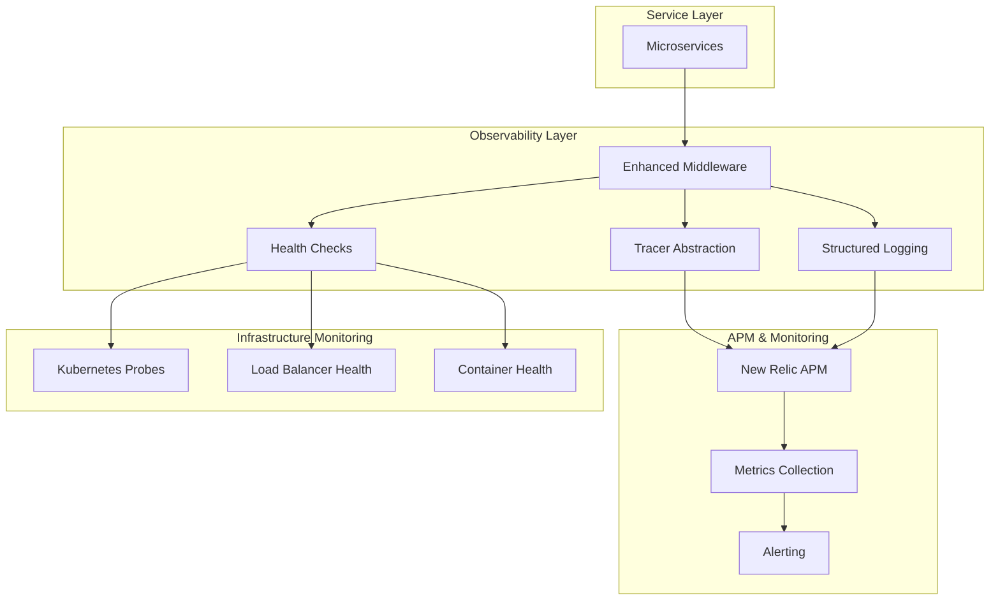

# NebengJek System Architecture

## Overview

NebengJek is a microservices-based trip-hailing platform built with enhanced observability, health monitoring, and graceful shutdown capabilities. The system is composed of four core services that communicate through both synchronous (HTTP) and asynchronous (NATS) channels, supported by a comprehensive internal package ecosystem for shared functionality.

## Enhanced Service Architecture



### Core Services

| Service | Primary Responsibility | Communication Protocols | Health Endpoints |
|---------|------------------------|--------------------------|------------------|
| **Users Service** | User management, authentication, real-time client communication | HTTP, WebSocket, NATS | `/health`, `/health/detailed`, `/health/ready`, `/health/live` |
| **Location Service** | Geospatial tracking and queries | HTTP, NATS | `/health`, `/health/detailed`, `/health/ready`, `/health/live` |
| **Match Service** | Driver-passenger pairing algorithms | HTTP, NATS | `/health`, `/health/detailed`, `/health/ready`, `/health/live` |
| **Rides Service** | Ride lifecycle, billing, payments | HTTP, NATS | `/health`, `/health/detailed`, `/health/ready`, `/health/live` |

### Internal Package Ecosystem

| Package Category | Components | Purpose |
|------------------|------------|---------|
| **Health & Monitoring** | [`health/enhanced.go`](../internal/pkg/health/enhanced.go) | Comprehensive dependency health checks with Kubernetes integration |
| **Observability** | [`observability/tracer.go`](../internal/pkg/observability/tracer.go) | APM abstraction layer with New Relic integration and NoOp testing support |
| **Server Management** | [`server/server.go`](../internal/pkg/server/server.go) | Graceful shutdown handling with signal management and component cleanup |
| **Enhanced Middleware** | [`middleware/unified.go`](../internal/pkg/middleware/unified.go) | Unified request lifecycle with WebSocket support, panic recovery, and APM integration |
| **Database Integration** | [`database/`](../internal/pkg/database/) | PostgreSQL and Redis client management with connection pooling |
| **Messaging** | [`nats/`](../internal/pkg/nats/) | NATS JetStream client with producer/consumer patterns |
| **HTTP Communication** | [`http/client.go`](../internal/pkg/http/client.go) | Inter-service HTTP client with retry logic and circuit breakers |
| **Structured Logging** | [`logger/slog.go`](../internal/pkg/logger/slog.go) | Go slog integration with New Relic APM forwarding |
| **Authentication** | [`jwt/token.go`](../internal/pkg/jwt/token.go) | JWT token management and validation |
| **Configuration** | [`config/config.go`](../internal/pkg/config/config.go) | Environment-based configuration management |

## Enhanced Communication Patterns

NebengJek employs multiple communication patterns with comprehensive observability and health monitoring:

### Synchronous Communication (HTTP)

**Enhanced Features**:
- Unified middleware with APM integration
- Request/response logging with structured context
- Health check endpoints for all services
- JWT authentication with WebSocket support
- API key validation for service-to-service calls

**Used for**:
- User authentication and profile management
- Driver registration and management
- Health check endpoints (`/health/*`)
- Administrative operations
- Direct requests requiring immediate response

**Middleware Stack**:

```mermaid
graph LR
    REQ[HTTP Request] --> RID[Request ID Generation]
    RID --> APM[APM Transaction Start]
    APM --> AUTH[Authentication/API Key]
    AUTH --> LOG[Request Logging]
    LOG --> HAND[Handler Execution]
    HAND --> ERR[Error Handling]
    ERR --> RES[Response Logging]
    RES --> END[APM Transaction End]
```


### Real-time Bidirectional Communication (WebSocket)

**Enhanced Features**:
- JWT authentication for WebSocket connections
- Enhanced panic recovery with WebSocket diagnostics
- Connection hijacking support in middleware
- Real-time event broadcasting with NATS integration

**Used for**:
- Real-time location updates
- Match notifications and confirmations
- Ride status updates
- Driver beacon status changes
- Live passenger-driver communication

**WebSocket Event Flow**:


### Asynchronous Communication (NATS JetStream)

**Enhanced Features**:
- JetStream persistence and replay capabilities
- Health monitoring for NATS connections
- Stream management and consumer groups
- Error handling and dead letter queues

**Used for**:
- Service-to-service event communication
- Location tracking and geospatial updates
- Match processing and notifications
- Ride lifecycle events
- Billing and payment processing

**Event Categories**:
- `location.*` - Location and geospatial events
- `match.*` - Driver-passenger matching events
- `ride.*` - Ride lifecycle and billing events
- `user.*` - User management and authentication events

## Event Flow Diagrams

### 1. Authentication Flow

```
┌──────────┐     1. Login Request     ┌─────────────┐
│  Mobile  ├────────────────────────▶ │ User Service│
│  Client  │                          └──────┬──────┘
│          │ 2. OTP Verification               │
│          │◀───────────────────────────────── │
│          │                                   │
│          │ 3. JWT Token                      │
└──────────┘◀──────────────────────────────────┘
```

### 2. Beacon Activation & Location Flow

```
┌──────────┐  1. WebSocket Connect   ┌─────────────┐    2. Beacon Event     ┌────────────────┐
│  Mobile  ├────────────────────────▶│ User Service├─────────────────────▶  │ Match Service  │
│  Client  │                         └──────┬──────┘                        └────────────────┘
│          │                                │
│          │ 3. Location Updates            │       4. Location Event      ┌────────────────┐
│          ├────────────────────────────────┼─────────────────────────────▶│Location Service│
└──────────┘                                │                              └────────────────┘
```

### 3. Match Flow

```
┌──────────┐  1. Match Request       ┌─────────────┐    2. Match Request     ┌────────────────┐
│ Passenger├────────────────────────▶│ User Service├─────────────────────────▶│ Match Service  │
└──────────┘                         └─────────────┘                          │                │
                                                                              │ 3. Find nearby │
┌──────────┐                         ┌─────────────┐  5. Match Proposal       │    drivers     │
│  Driver  │◀───────────────────────▶│ User Service│◀────────────────────────┤                │
└──────────┘                         └─────────────┘                          │ 4. Location    │
     │                                      ▲                                 │    query       │
     │                                      │                                 │                │
     │ 6. Accept Match                      │ 7. Match Accepted              └───────┬────────┘
     └──────────────────────────────────────┴─────────────────────────────────────────┘
```

### 4. Ride Flow

```
┌──────────┐                         ┌─────────────┐     Match Accepted     ┌────────────────┐
│  Driver  │                         │ User Service│                        │ Match Service  │
└──────────┘                         └─────────────┘                        └───────┬────────┘
     │                                      │                                       │
     │ Location Updates                     │                                       │
     ├──────────────────────────────────────┼───────────────────────────┐           │
     │                                      │                           │           │
     │                                      │                           ▼           │
     │                                      │                   ┌───────────────┐   │
     │                                      │                   │Location Service│   │
     │                                      │                   └───────┬───────┘   │
     │                                      │                           │           │
     │                                      │                           │           │
     │                                      │      Ride Created         ▼           │
┌────┴─────┐                         ┌──────┴────┐◀──────────────┌──────────────┐◀──┘
│ Passenger│◀────────────────────────│User Service│               │ Ride Service │
└──────────┘  Ride Update Events     └─────────────┘              └──────┬───────┘
                                                                         │
                                                                         │
                   ┌───────────────────────────────────────────────────┐ │
                   │                                                   │ │
                   │  Fare calculation, billing ledger updates,        │◀┘
                   │  trip completion, payment processing              │
                   │                                                   │
                   └───────────────────────────────────────────────────┘
```

## Data Storage

### PostgreSQL

The primary relational database for persistent storage:

| Service | Tables | Purpose |
|---------|--------|---------|
| User Service | `users`, `drivers`, `otp_codes` | User profiles, authentication |
| Match Service | `matches` | Match proposals and history |
| Rides Service | `rides`, `billing_ledger`, `payments` | Ride tracking and billing |
| Location Service | `locations` | Historical location data |

### Redis

Used for caching, real-time data, and spatial indexing:

| Service | Data Structures | Purpose |
|---------|-----------------|---------|
| User Service | Key-value store | OTP storage, session cache |
| Match Service | Lists, Sorted sets | Active drivers, match proposals |
| Location Service | Geo-indexes | Real-time location tracking |

## API Gateway and Security

### Authentication

- MSISDN-based authentication with OTP verification
- JWT tokens for authenticated API access
- API keys for service-to-service communication

### Security Measures

- Rate limiting on authentication endpoints
- Input validation and sanitization
- JWT token verification middleware
- HTTPS encryption for all API endpoints

## Scalability Considerations

The NebengJek architecture is designed to scale horizontally:

- Stateless services allow for multiple instances
- NATS supports message load balancing across service instances
- Redis clustering for distributed caching
- Database read replicas for query scaling

## Enhanced Monitoring and Observability

The system includes comprehensive monitoring and observability features:

### Health Monitoring
- **Comprehensive Health Checks**: PostgreSQL, Redis, and NATS health validation
- **Kubernetes Integration**: Readiness (`/health/ready`) and liveness (`/health/live`) probes
- **Detailed Health Reports**: Dependency-specific health status with error details
- **Load Balancer Support**: Basic health endpoint (`/health`) for traffic routing

### Application Performance Monitoring (APM)
- **New Relic Integration**: Full APM with distributed tracing
- **Transaction Tracking**: HTTP request lifecycle monitoring
- **Custom Segments**: Database, external service, and business operation tracking
- **Error Tracking**: Automatic error reporting with context
- **Business Metrics**: Custom attributes for business intelligence

### Structured Logging
- **Go slog Integration**: Native Go 1.21+ structured logging
- **APM Log Forwarding**: Automatic ERROR level log forwarding to New Relic
- **Context Correlation**: Request ID, user ID, and trace correlation
- **Performance Optimized**: Minimal allocation overhead

### Graceful Shutdown Monitoring
- **Signal Handling**: SIGINT/SIGTERM graceful shutdown tracking
- **Component Cleanup**: Individual component shutdown monitoring
- **Shutdown Timing**: Performance tracking for shutdown operations
- **Container Integration**: Docker and Kubernetes shutdown coordination

### Observability Architecture


## Deployment

NebengJek services are containerized with Docker and can be deployed:

- As individual containers for development
- With Docker Compose for integrated testing
- On Kubernetes for production environments

## Failure Handling

The system incorporates several patterns for resilience:

- Circuit breakers for external service calls
- Retry mechanisms with exponential backoff
- Dead letter queues for failed events
- Graceful degradation of non-critical features