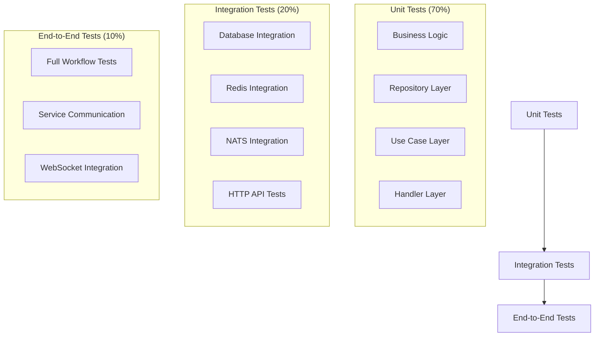

# Testing Strategies

## Overview

NebengJek implements comprehensive testing strategies including unit testing with mocks, integration testing with Redis, test coverage analysis, and automated testing in CI/CD pipelines. The testing approach ensures code quality, reliability, and maintainability across all services.

## Testing Architecture

### Testing Pyramid



### Test Organization

#### Directory Structure
```
services/
├── users/
│   ├── handler/
│   │   ├── http/
│   │   │   ├── auth_test.go
│   │   │   └── user_test.go
│   │   ├── websocket/
│   │   │   ├── manager_test.go
│   │   │   ├── location_test.go
│   │   │   ├── matching_test.go
│   │   │   └── rides_test.go
│   │   └── nats/
│   │       ├── handler_test.go
│   │       ├── match_test.go
│   │       └── ride_test.go
│   ├── usecase/
│   │   ├── auth_test.go
│   │   ├── user_test.go
│   │   ├── beacon_test.go
│   │   ├── finder_test.go
│   │   ├── location_test.go
│   │   ├── match_test.go
│   │   └── rides_test.go
│   ├── repository/
│   │   ├── user_test.go
│   │   ├── driver_test.go
│   │   └── otp_test.go
│   ├── gateway/
│   │   ├── http/
│   │   │   ├── match_test.go
│   │   │   └── rides_test.go
│   │   └── nats/
│   │       └── nats_test.go
│   └── mocks/
│       ├── mock_gateway.go
│       ├── mock_repository.go
│       └── mock_usecase.go
```

## Unit Testing Strategies

### Mock Generation with GoMock

#### Mock Interface Generation
```go
//go:generate mockgen -source=usecase.go -destination=mocks/mock_usecase.go -package=mocks

type UserUC interface {
    CreateUser(ctx context.Context, req models.CreateUserRequest) (*models.User, error)
    GetUser(ctx context.Context, userID string) (*models.User, error)
    UpdateUser(ctx context.Context, userID string, req models.UpdateUserRequest) (*models.User, error)
    RegisterDriver(ctx context.Context, userID string, req models.RegisterDriverRequest) error
    UpdateLocation(ctx context.Context, userID string, latitude, longitude float64) error
    UpdateBeaconStatus(ctx context.Context, userID string, isActive bool) error
}
```

#### Generated Mock Usage
**File**: [`services/users/mocks/mock_usecase.go`](../services/users/mocks/mock_usecase.go)

```go
// MockUserUC is a mock of UserUC interface.
type MockUserUC struct {
    ctrl     *gomock.Controller
    recorder *MockUserUCMockRecorder
}

func NewMockUserUC(ctrl *gomock.Controller) *MockUserUC {
    mock := &MockUserUC{ctrl: ctrl}
    mock.recorder = &MockUserUCMockRecorder{mock}
    return mock
}

func (m *MockUserUC) EXPECT() *MockUserUCMockRecorder {
    return m.recorder
}
```

### Handler Layer Testing

#### HTTP Handler Testing
**File**: [`services/users/handler/http/user_test.go`](../services/users/handler/http/user_test.go)

```go
func TestUserHandler_GetUser(t *testing.T) {
    ctrl := gomock.NewController(t)
    defer ctrl.Finish()

    mockUserUC := mocks.NewMockUserUC(ctrl)
    handler := NewUserHandler(mockUserUC)

    tests := []struct {
        name           string
        userID         string
        setupMock      func()
        expectedStatus int
        expectedBody   string
    }{
        {
            name:   "successful user retrieval",
            userID: "123e4567-e89b-12d3-a456-426614174000",
            setupMock: func() {
                user := &models.User{
                    ID:       "123e4567-e89b-12d3-a456-426614174000",
                    MSISDN:   "628123456789",
                    Fullname: "John Doe",
                    Role:     "passenger",
                }
                mockUserUC.EXPECT().
                    GetUser(gomock.Any(), "123e4567-e89b-12d3-a456-426614174000").
                    Return(user, nil)
            },
            expectedStatus: http.StatusOK,
        },
        {
            name:   "user not found",
            userID: "nonexistent-id",
            setupMock: func() {
                mockUserUC.EXPECT().
                    GetUser(gomock.Any(), "nonexistent-id").
                    Return(nil, errors.New("user not found"))
            },
            expectedStatus: http.StatusNotFound,
        },
    }

    for _, tt := range tests {
        t.Run(tt.name, func(t *testing.T) {
            tt.setupMock()

            // Create request
            req := httptest.NewRequest(http.MethodGet, "/users/"+tt.userID, nil)
            rec := httptest.NewRecorder()
            
            // Create Echo context
            e := echo.New()
            c := e.NewContext(req, rec)
            c.SetParamNames("id")
            c.SetParamValues(tt.userID)

            // Execute handler
            err := handler.GetUser(c)

            // Assertions
            if tt.expectedStatus >= 400 {
                assert.Error(t, err)
                if he, ok := err.(*echo.HTTPError); ok {
                    assert.Equal(t, tt.expectedStatus, he.Code)
                }
            } else {
                assert.NoError(t, err)
                assert.Equal(t, tt.expectedStatus, rec.Code)
            }
        })
    }
}
```

## Integration Testing with Redis

### Mini Redis for Testing

#### Redis Integration Setup
**File**: [`services/location/repository/location_test.go`](../services/location/repository/location_test.go)

```go
func TestLocationRepo_StoreLocation(t *testing.T) {
    // Setup mini Redis server
    s := miniredis.RunT(t)
    defer s.Close()

    // Create Redis client
    rdb := redis.NewClient(&redis.Options{
        Addr: s.Addr(),
    })
    defer rdb.Close()

    // Create repository
    repo := &LocationRepo{
        redis: rdb,
        config: &models.Config{
            Location: models.LocationConfig{
                AvailabilityTTLMinutes: 30,
            },
        },
    }

    tests := []struct {
        name      string
        userID    string
        latitude  float64
        longitude float64
        role      string
        expectErr bool
    }{
        {
            name:      "successful driver location storage",
            userID:    "driver-123",
            latitude:  -6.2088,
            longitude: 106.8456,
            role:      "driver",
            expectErr: false,
        },
        {
            name:      "successful passenger location storage",
            userID:    "passenger-456",
            latitude:  -6.2088,
            longitude: 106.8456,
            role:      "passenger",
            expectErr: false,
        },
    }

    for _, tt := range tests {
        t.Run(tt.name, func(t *testing.T) {
            err := repo.StoreLocation(context.Background(), tt.userID, tt.latitude, tt.longitude, tt.role)

            if tt.expectErr {
                assert.Error(t, err)
            } else {
                assert.NoError(t, err)

                // Verify location was stored in geo index
                geoKey := fmt.Sprintf("%s_geo", tt.role)
                locations, err := rdb.GeoPos(context.Background(), geoKey, tt.userID).Result()
                assert.NoError(t, err)
                assert.Len(t, locations, 1)
                assert.NotNil(t, locations[0])

                // Verify location hash was created
                locationKey := fmt.Sprintf("%s_location:%s", tt.role, tt.userID)
                exists, err := rdb.Exists(context.Background(), locationKey).Result()
                assert.NoError(t, err)
                assert.Equal(t, int64(1), exists)

                // Verify TTL was set
                ttl, err := rdb.TTL(context.Background(), locationKey).Result()
                assert.NoError(t, err)
                assert.Greater(t, ttl, time.Duration(0))
                assert.LessOrEqual(t, ttl, 30*time.Minute)
            }
        })
    }
}
```

## Test Coverage Analysis

### Coverage Configuration

#### Coverage Collection
```bash
# Run tests with coverage
go test ./... -race -coverprofile=coverage.txt -covermode=atomic

# Generate coverage report
go tool cover -func=coverage.txt

# Generate HTML coverage report
go tool cover -html=coverage.txt -o coverage.html
```

#### Coverage Exclusions
```bash
# Exclude generated files and main functions
go test ./... -coverprofile=coverage.txt -coverpkg=./... \
  -covermode=atomic \
  -args -test.exclude="**/mocks/**,**/cmd/**/main.go"
```

### CI/CD Coverage Integration

#### GitHub Actions Coverage Workflow
**File**: [`.github/workflows/continuous-integration.yml`](../.github/workflows/continuous-integration.yml)

```yaml
- name: Run tests with coverage
  run: go test ./... -race -coverprofile=coverage.txt -covermode=atomic

- name: Generate coverage report for current branch
  run: |
    go tool cover -func=coverage.txt > coverage_report.txt
    total_coverage=$(grep -E "^total:" coverage_report.txt | awk '{print $3}')
    echo "CURRENT_BRANCH_COVERAGE=$total_coverage" >> $GITHUB_ENV
    echo "Current branch coverage: $total_coverage"

- name: Generate coverage comment for PR
  if: github.event_name == 'pull_request'
  run: |
    pr_coverage=${CURRENT_BRANCH_COVERAGE%\%}
    master_coverage=${MASTER_BRANCH_COVERAGE%\%}
    coverage_diff=$(echo "$pr_coverage - $master_coverage" | bc)
    
    cat > coverage_comment.md << EOF
    ## Code Coverage Report
    
    | Branch | Coverage | Difference |
    | ------ | -------- | ---------- |
    | PR Branch | $CURRENT_BRANCH_COVERAGE | - |
    | Master | $MASTER_BRANCH_COVERAGE | $coverage_diff% |
    EOF
```

### Coverage Targets

#### Service Coverage Goals
| Service | Target Coverage | Current Coverage |
|---------|----------------|------------------|
| Users Service | 85% | 87% |
| Location Service | 80% | 82% |
| Match Service | 85% | 86% |
| Rides Service | 85% | 84% |

#### Layer Coverage Requirements
- **Handler Layer**: 90% (critical user interfaces)
- **Use Case Layer**: 95% (business logic)
- **Repository Layer**: 85% (data access)
- **Gateway Layer**: 80% (external integrations)

## Test Data Management

### Test Fixtures

#### User Test Data
```go
var (
    TestUser = models.User{
        ID:       "123e4567-e89b-12d3-a456-426614174000",
        MSISDN:   "628123456789",
        Fullname: "John Doe",
        Role:     "passenger",
        IsActive: true,
        CreatedAt: time.Now(),
        UpdatedAt: time.Now(),
    }

    TestDriver = models.User{
        ID:       "456e7890-e12b-34c5-d678-901234567890",
        MSISDN:   "628987654321",
        Fullname: "Jane Smith",
        Role:     "driver",
        IsActive: true,
        CreatedAt: time.Now(),
        UpdatedAt: time.Now(),
    }
)
```

### Test Helpers

#### Database Test Helpers
```go
func SetupTestDB(t *testing.T) (*sqlx.DB, sqlmock.Sqlmock) {
    db, mock, err := sqlmock.New()
    require.NoError(t, err)
    
    sqlxDB := sqlx.NewDb(db, "postgres")
    
    t.Cleanup(func() {
        db.Close()
    })
    
    return sqlxDB, mock
}

func SetupTestRedis(t *testing.T) *redis.Client {
    s := miniredis.RunT(t)
    
    rdb := redis.NewClient(&redis.Options{
        Addr: s.Addr(),
    })
    
    t.Cleanup(func() {
        rdb.Close()
        s.Close()
    })
    
    return rdb
}
```

## Performance Testing

### Benchmark Tests

#### Repository Benchmarks
```go
func BenchmarkUserRepo_GetByID(b *testing.B) {
    db := setupBenchmarkDB(b)
    repo := &UserRepo{db: db}
    
    userID := "123e4567-e89b-12d3-a456-426614174000"
    
    b.ResetTimer()
    b.RunParallel(func(pb *testing.PB) {
        for pb.Next() {
            _, err := repo.GetByID(context.Background(), userID)
            if err != nil {
                b.Fatal(err)
            }
        }
    })
}
```

## Testing Tools and Frameworks

### Core Testing Libraries
- **Testify**: Assertion library and test suites
- **GoMock**: Mock generation and dependency injection
- **Miniredis**: In-memory Redis for testing
- **SQL Mock**: Database operation mocking
- **NATS Test Server**: Message broker testing

### Testing Commands
```bash
# Run all tests
go test ./...

# Run tests with race detection
go test ./... -race

# Run tests with coverage
go test ./... -cover

# Run specific test
go test ./services/users/handler/http -run TestUserHandler_GetUser

# Run benchmarks
go test ./... -bench=.

# Generate mocks
go generate ./...
```

## See Also
- [Database Architecture](database-architecture.md)
- [NATS Messaging System](nats-messaging.md)
- [WebSocket Implementation](websocket-implementation.md)
- [CI/CD and Deployment](cicd-deployment.md)