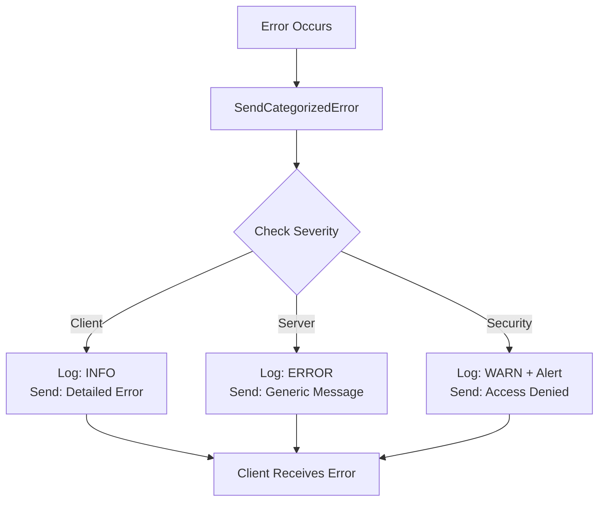

# WebSocket Error Handling Categories

This document explains the new categorized error handling system implemented for WebSocket connections.

## Error Severity Levels

### 1. ErrorSeverityClient
**When to use:** Validation errors, malformed input, user mistakes
**Behavior:** Shows detailed error message to client
**Example:**
```go
// JSON parsing error - client can fix this
if err := json.Unmarshal(data, &req); err != nil {
    return m.SendCategorizedError(client, err, constants.ErrorInvalidFormat, constants.ErrorSeverityClient)
}
```

### 2. ErrorSeverityServer  
**When to use:** Database errors, service unavailable, internal system issues
**Behavior:** Logs detailed error server-side, sends generic message to client
**Example:**
```go
// Database connection failed - hide details from client
if err := m.userUC.UpdateFinderStatus(ctx, &req); err != nil {
    return m.SendCategorizedError(client, err, constants.ErrorInvalidBeacon, constants.ErrorSeverityServer)
}
```

### 3. ErrorSeveritySecurity
**When to use:** Authentication failures, authorization issues, security violations
**Behavior:** Minimal info to client + security alert logging
**Example:**
```go
// Unauthorized access attempt
if !hasPermission {
    return m.SendCategorizedError(client, err, constants.ErrorUnauthorized, constants.ErrorSeveritySecurity)
}
```

## Usage Examples

### Before (Problematic)
```go
// Exposed internal error details to client
if err := m.userUC.UpdateLocation(ctx, &location); err != nil {
    return m.manager.SendErrorMessage(client.Conn, constants.ErrorInvalidLocation, err.Error())
}
```

### After (Secure)
```go
// Categorized error handling
if err := m.userUC.UpdateLocation(ctx, &location); err != nil {
    return m.SendCategorizedError(client, err, constants.ErrorInvalidLocation, constants.ErrorSeverityServer)
}
```

## Error Flow



## Benefits

1. **Security**: Prevents information leakage
2. **Debugging**: Maintains detailed server-side logging
3. **User Experience**: Provides appropriate error messages
4. **Monitoring**: Enables proper alerting for different error types

## Implementation Status

✅ **Completed Files:**
- `internal/pkg/constants/websocket.go` - Error severity types
- `internal/pkg/websocket/manager.go` - Categorized error handling
- `services/users/handler/websocket/manager.go` - User service integration
- `services/users/handler/websocket/matching.go` - Match operations
- `services/users/handler/websocket/location.go` - Location updates
- `services/users/handler/websocket/rides.go` - Ride operations

All WebSocket error handling now uses the categorized approach for improved security and debugging.