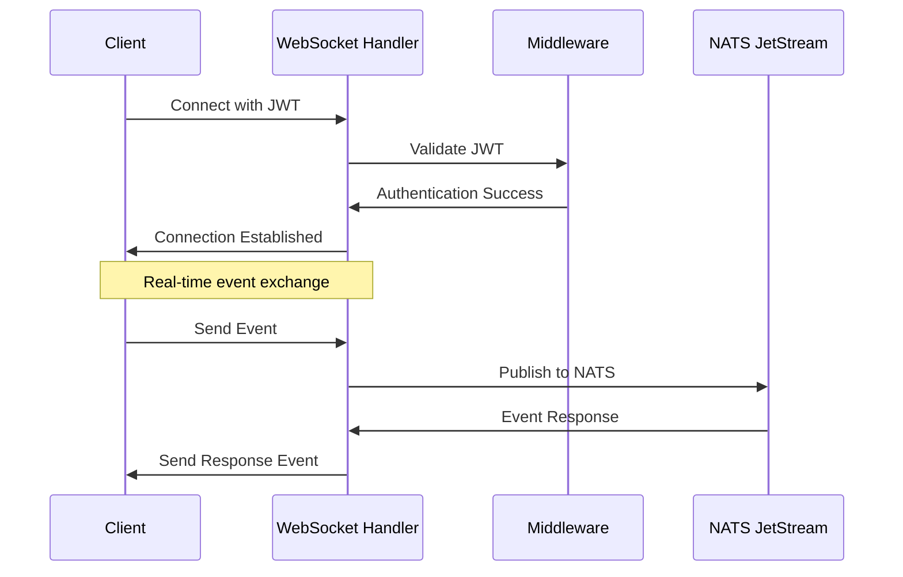
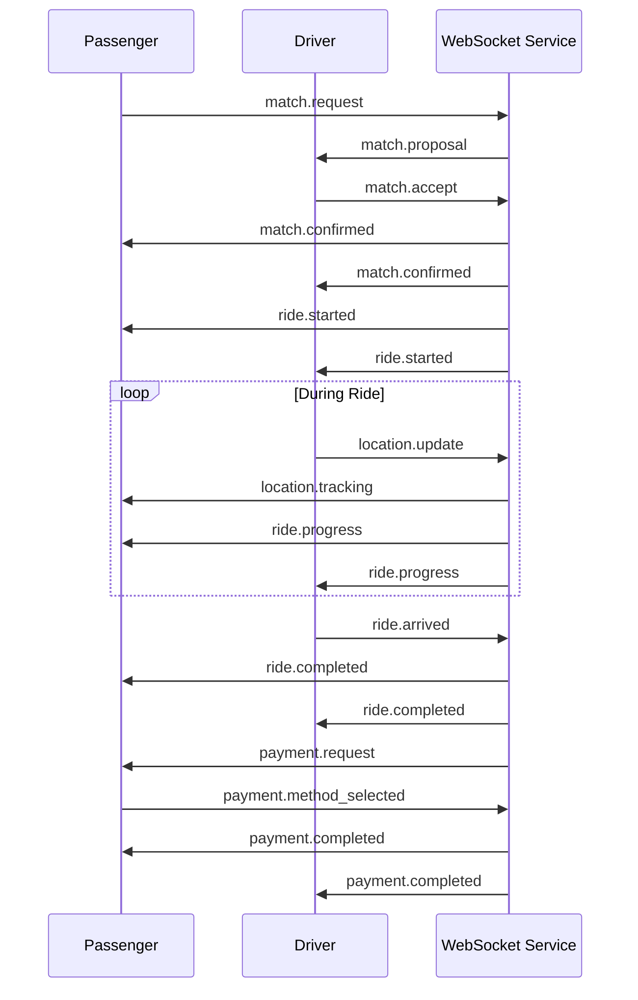
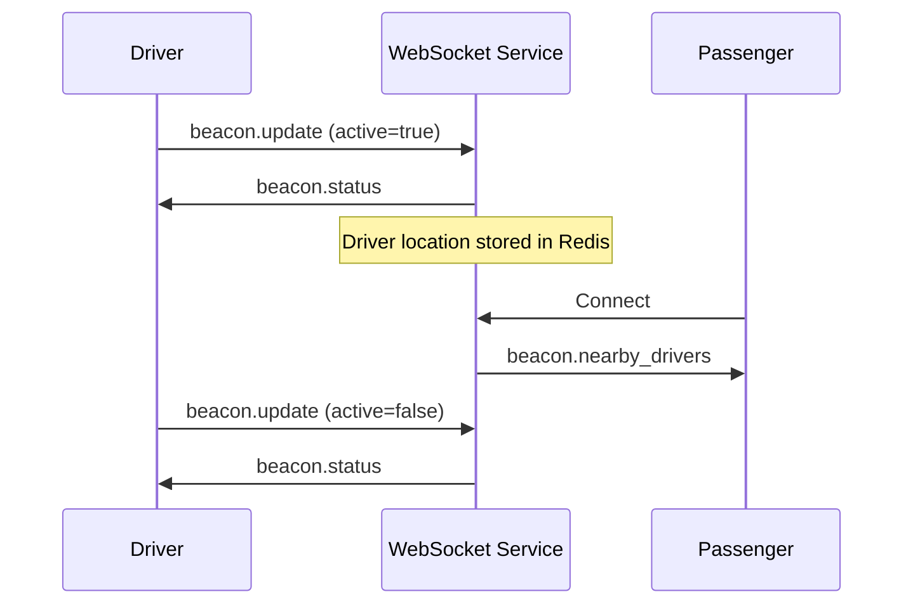

# WebSocket Events Specification

## Overview

The NebengJek WebSocket system provides real-time bidirectional communication between clients and the Users Service. This document specifies all WebSocket events, their payloads, and usage patterns for implementing real-time features.

## Connection Management

### Authentication
WebSocket connections require JWT authentication via the Authorization header:

```
Authorization: Bearer <jwt_token>
```

### Connection Flow


### Connection Lifecycle Events

#### Connection Established
Sent when WebSocket connection is successfully established.

```json
{
  "type": "connection.established",
  "payload": {
    "user_id": "uuid",
    "role": "driver|passenger",
    "connection_id": "uuid",
    "timestamp": "2025-01-08T10:00:00Z"
  }
}
```

#### Connection Error
Sent when connection encounters an error.

```json
{
  "type": "connection.error",
  "payload": {
    "error": "Authentication failed",
    "code": "AUTH_ERROR",
    "timestamp": "2025-01-08T10:00:00Z"
  }
}
```

## Beacon Events

Beacon events manage driver availability status.

### beacon.update (Client → Server)
Update driver/passenger availability status.

```json
{
  "type": "beacon.update",
  "payload": {
    "is_active": true,
    "user_type": "driver",
    "location": {
      "latitude": -6.2088,
      "longitude": 106.8456,
      "accuracy": 10.5
    },
    "vehicle_info": {
      "type": "motorcycle",
      "license_plate": "B1234XYZ"
    }
  }
}
```

**Payload Fields**:
- `is_active` (boolean): Whether user is available for rides
- `user_type` (string): "driver" or "passenger"
- `location` (object): Current GPS coordinates
- `vehicle_info` (object, optional): Vehicle information for drivers

### beacon.status (Server → Client)
Confirmation of beacon status update.

```json
{
  "type": "beacon.status",
  "payload": {
    "user_id": "uuid",
    "is_active": true,
    "user_type": "driver",
    "location": {
      "latitude": -6.2088,
      "longitude": 106.8456,
      "geohash": "qqgux4"
    },
    "updated_at": "2025-01-08T10:00:00Z"
  }
}
```

### beacon.nearby_drivers (Server → Client)
Notify passenger about nearby available drivers.

```json
{
  "type": "beacon.nearby_drivers",
  "payload": {
    "passenger_id": "uuid",
    "drivers": [
      {
        "driver_id": "uuid",
        "distance_km": 0.5,
        "estimated_arrival_minutes": 3,
        "vehicle_type": "motorcycle",
        "rating": 4.8
      }
    ],
    "search_radius_km": 5.0,
    "timestamp": "2025-01-08T10:00:00Z"
  }
}
```

## Location Events

Location events handle real-time GPS tracking during rides.

### location.update (Client → Server)
Send real-time location updates.

```json
{
  "type": "location.update",
  "payload": {
    "location": {
      "latitude": -6.2088,
      "longitude": 106.8456,
      "accuracy": 10.5,
      "speed": 25.0,
      "heading": 180.0
    },
    "ride_id": "uuid",
    "timestamp": "2025-01-08T10:00:00Z"
  }
}
```

**Payload Fields**:
- `location` (object): GPS coordinates and metadata
- `ride_id` (string, optional): Associated ride ID if in active ride
- `timestamp` (string): ISO 8601 timestamp

### location.tracking (Server → Client)
Real-time location updates for ride participants.

```json
{
  "type": "location.tracking",
  "payload": {
    "ride_id": "uuid",
    "user_id": "uuid",
    "user_type": "driver",
    "location": {
      "latitude": -6.2088,
      "longitude": 106.8456,
      "accuracy": 10.5
    },
    "distance_from_pickup_km": 0.3,
    "estimated_arrival_minutes": 2,
    "timestamp": "2025-01-08T10:00:00Z"
  }
}
```

### location.geofence (Server → Client)
Notify when user enters/exits geofenced areas.

```json
{
  "type": "location.geofence",
  "payload": {
    "user_id": "uuid",
    "geofence_type": "pickup_zone|destination_zone|service_area",
    "action": "entered|exited",
    "location": {
      "latitude": -6.2088,
      "longitude": 106.8456
    },
    "ride_id": "uuid",
    "timestamp": "2025-01-08T10:00:00Z"
  }
}
```

## Match Events

Match events handle driver-passenger pairing workflow.

### match.request (Client → Server)
Request a ride match (from passenger).

```json
{
  "type": "match.request",
  "payload": {
    "pickup_location": {
      "latitude": -6.2088,
      "longitude": 106.8456,
      "address": "Jl. Sudirman No. 1, Jakarta"
    },
    "destination_location": {
      "latitude": -6.2200,
      "longitude": 106.8300,
      "address": "Jl. Thamrin No. 10, Jakarta"
    },
    "preferences": {
      "vehicle_type": "motorcycle",
      "max_distance_km": 5.0,
      "max_wait_minutes": 10
    }
  }
}
```

### match.proposal (Server → Client)
Send match proposal to driver and passenger.

```json
{
  "type": "match.proposal",
  "payload": {
    "match_id": "uuid",
    "driver_id": "uuid",
    "passenger_id": "uuid",
    "pickup_location": {
      "latitude": -6.2088,
      "longitude": 106.8456,
      "address": "Jl. Sudirman No. 1, Jakarta"
    },
    "destination_location": {
      "latitude": -6.2200,
      "longitude": 106.8300,
      "address": "Jl. Thamrin No. 10, Jakarta"
    },
    "estimated_distance_km": 3.2,
    "estimated_duration_minutes": 15,
    "estimated_fare": 9600,
    "driver_info": {
      "name": "John Driver",
      "vehicle_type": "motorcycle",
      "license_plate": "B1234XYZ",
      "rating": 4.8
    },
    "expires_at": "2025-01-08T10:05:00Z"
  }
}
```

### match.accept (Client → Server)
Accept a match proposal.

```json
{
  "type": "match.accept",
  "payload": {
    "match_id": "uuid",
    "user_type": "driver|passenger"
  }
}
```

### match.reject (Client → Server)
Reject a match proposal.

```json
{
  "type": "match.reject",
  "payload": {
    "match_id": "uuid",
    "user_type": "driver|passenger",
    "reason": "too_far|price_too_high|other"
  }
}
```

### match.confirmed (Server → Client)
Notify both parties that match is confirmed.

```json
{
  "type": "match.confirmed",
  "payload": {
    "match_id": "uuid",
    "driver_id": "uuid",
    "passenger_id": "uuid",
    "pickup_location": {
      "latitude": -6.2088,
      "longitude": 106.8456,
      "address": "Jl. Sudirman No. 1, Jakarta"
    },
    "driver_info": {
      "name": "John Driver",
      "phone": "+628123456789",
      "vehicle_type": "motorcycle",
      "license_plate": "B1234XYZ",
      "current_location": {
        "latitude": -6.2100,
        "longitude": 106.8450
      }
    },
    "passenger_info": {
      "name": "Jane Passenger",
      "phone": "+628987654321"
    },
    "estimated_pickup_time_minutes": 5,
    "confirmed_at": "2025-01-08T10:00:00Z"
  }
}
```

### match.cancelled (Server → Client)
Notify that match was cancelled.

```json
{
  "type": "match.cancelled",
  "payload": {
    "match_id": "uuid",
    "cancelled_by": "driver|passenger|system",
    "reason": "timeout|user_cancelled|driver_unavailable",
    "message": "Driver is no longer available",
    "cancelled_at": "2025-01-08T10:00:00Z"
  }
}
```

## Ride Events

Ride events manage the complete ride lifecycle.

### ride.started (Server → Client)
Notify that ride has started.

```json
{
  "type": "ride.started",
  "payload": {
    "ride_id": "uuid",
    "match_id": "uuid",
    "driver_id": "uuid",
    "passenger_id": "uuid",
    "start_location": {
      "latitude": -6.2088,
      "longitude": 106.8456,
      "address": "Jl. Sudirman No. 1, Jakarta"
    },
    "destination_location": {
      "latitude": -6.2200,
      "longitude": 106.8300,
      "address": "Jl. Thamrin No. 10, Jakarta"
    },
    "base_rate_per_km": 3000,
    "started_at": "2025-01-08T10:00:00Z"
  }
}
```

### ride.progress (Server → Client)
Real-time ride progress updates.

```json
{
  "type": "ride.progress",
  "payload": {
    "ride_id": "uuid",
    "current_location": {
      "latitude": -6.2150,
      "longitude": 106.8400
    },
    "distance_traveled_km": 1.5,
    "duration_minutes": 8,
    "current_fare": 4500,
    "estimated_remaining_time_minutes": 7,
    "estimated_remaining_distance_km": 1.7,
    "timestamp": "2025-01-08T10:08:00Z"
  }
}
```

### ride.arrived (Client → Server)
Driver signals arrival at destination.

```json
{
  "type": "ride.arrived",
  "payload": {
    "ride_id": "uuid",
    "arrival_location": {
      "latitude": -6.2200,
      "longitude": 106.8300
    },
    "adjustment_factor": 0.9,
    "adjustment_reason": "traffic_was_light"
  }
}
```

**Payload Fields**:
- `adjustment_factor` (number): Fare adjustment (0.0-1.0, where 1.0 = no adjustment)
- `adjustment_reason` (string, optional): Reason for fare adjustment

### ride.completed (Server → Client)
Notify ride completion with final billing.

```json
{
  "type": "ride.completed",
  "payload": {
    "ride_id": "uuid",
    "driver_id": "uuid",
    "passenger_id": "uuid",
    "start_location": {
      "latitude": -6.2088,
      "longitude": 106.8456,
      "address": "Jl. Sudirman No. 1, Jakarta"
    },
    "end_location": {
      "latitude": -6.2200,
      "longitude": 106.8300,
      "address": "Jl. Thamrin No. 10, Jakarta"
    },
    "total_distance_km": 3.2,
    "total_duration_minutes": 15,
    "billing": {
      "base_fare": 9600,
      "adjustment_factor": 0.9,
      "adjusted_fare": 8640,
      "admin_fee_percent": 5.0,
      "admin_fee": 432,
      "final_fare": 8208
    },
    "completed_at": "2025-01-08T10:15:00Z"
  }
}
```

## Payment Events

Payment events handle transaction processing.

### payment.request (Server → Client)
Request payment from passenger.

```json
{
  "type": "payment.request",
  "payload": {
    "ride_id": "uuid",
    "payment_id": "uuid",
    "amount": 8208,
    "currency": "IDR",
    "payment_methods": ["wallet", "bank_transfer", "credit_card"],
    "expires_at": "2025-01-08T10:25:00Z"
  }
}
```

### payment.method_selected (Client → Server)
Passenger selects payment method.

```json
{
  "type": "payment.method_selected",
  "payload": {
    "payment_id": "uuid",
    "method": "wallet",
    "wallet_balance": 50000
  }
}
```

### payment.processing (Server → Client)
Payment is being processed.

```json
{
  "type": "payment.processing",
  "payload": {
    "payment_id": "uuid",
    "ride_id": "uuid",
    "amount": 8208,
    "method": "wallet",
    "status": "processing",
    "transaction_id": "uuid"
  }
}
```

### payment.completed (Server → Client)
Payment successfully completed.

```json
{
  "type": "payment.completed",
  "payload": {
    "payment_id": "uuid",
    "ride_id": "uuid",
    "amount": 8208,
    "method": "wallet",
    "transaction_id": "uuid",
    "driver_earnings": 7776,
    "admin_fee": 432,
    "completed_at": "2025-01-08T10:16:00Z"
  }
}
```

### payment.failed (Server → Client)
Payment failed.

```json
{
  "type": "payment.failed",
  "payload": {
    "payment_id": "uuid",
    "ride_id": "uuid",
    "amount": 8208,
    "method": "wallet",
    "error": "insufficient_balance",
    "message": "Insufficient wallet balance",
    "retry_allowed": true,
    "failed_at": "2025-01-08T10:16:00Z"
  }
}
```

## Notification Events

General notification events for user communication.

### notification.message (Server → Client)
Send notification message to user.

```json
{
  "type": "notification.message",
  "payload": {
    "notification_id": "uuid",
    "title": "Ride Completed",
    "message": "Your ride has been completed successfully",
    "type": "info|success|warning|error",
    "action": {
      "type": "open_ride_details",
      "ride_id": "uuid"
    },
    "timestamp": "2025-01-08T10:16:00Z"
  }
}
```

### notification.system (Server → Client)
System-wide notifications.

```json
{
  "type": "notification.system",
  "payload": {
    "title": "Service Maintenance",
    "message": "The service will be under maintenance from 2:00 AM to 4:00 AM",
    "type": "warning",
    "priority": "high",
    "affects_services": ["matching", "payments"],
    "scheduled_at": "2025-01-09T02:00:00Z"
  }
}
```

## Error Events

Error handling for WebSocket communication.

### error.validation (Server → Client)
Validation error for sent event.

```json
{
  "type": "error.validation",
  "payload": {
    "original_event_type": "match.request",
    "error": "Invalid pickup location coordinates",
    "field": "pickup_location.latitude",
    "code": "INVALID_COORDINATES",
    "timestamp": "2025-01-08T10:00:00Z"
  }
}
```

### error.rate_limit (Server → Client)
Rate limit exceeded.

```json
{
  "type": "error.rate_limit",
  "payload": {
    "error": "Rate limit exceeded",
    "limit": 10,
    "window_seconds": 60,
    "retry_after_seconds": 30,
    "timestamp": "2025-01-08T10:00:00Z"
  }
}
```

## Event Flow Examples

### Complete Ride Flow


### Driver Beacon Flow


## Implementation Guidelines

### Client Implementation
1. **Connection Management**: Implement automatic reconnection with exponential backoff
2. **Event Handling**: Use event-driven architecture with proper error handling
3. **State Management**: Maintain local state synchronized with server events
4. **Offline Handling**: Queue events when offline and sync when reconnected

### Error Handling
1. **Validation**: Validate all outgoing events before sending
2. **Timeouts**: Implement timeouts for events expecting responses
3. **Retry Logic**: Implement retry logic for failed events
4. **Graceful Degradation**: Handle connection failures gracefully

### Performance Considerations
1. **Event Batching**: Batch location updates to reduce message frequency
2. **Compression**: Use WebSocket compression for large payloads
3. **Rate Limiting**: Respect rate limits to avoid disconnection
4. **Memory Management**: Clean up event listeners and state properly

## Related Documentation

- [API Reference](api-reference.md) - REST API documentation
- [NATS Event Schemas](nats-event-schemas.md) - Backend event schemas
- [System Architecture](system-architecture.md) - Overall system design
- [Security Implementation](security-implementation.md) - Authentication and security