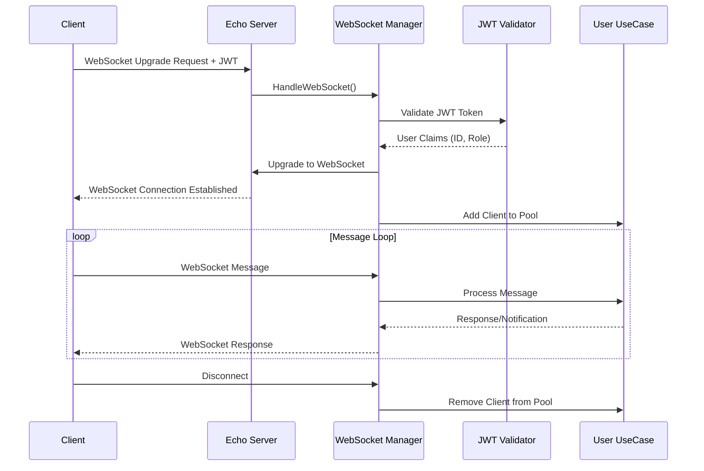

# WebSocket Implementation

## Overview

NebengJek implements real-time bidirectional communication through WebSocket connections, enabling instant notifications for location updates, match proposals, ride status changes, and driver availability. The implementation uses JWT authentication and provides comprehensive error handling.

## WebSocket Architecture

### Core Components

#### 1. WebSocket Manager
**File**: [`internal/pkg/websocket/manager.go`](../internal/pkg/websocket/manager.go)

The base WebSocket manager handles connection lifecycle, authentication, and message routing:

```go
type Manager struct {
    sync.RWMutex
    clients  map[string]*models.WebSocketClient
    cfg      models.JWTConfig
    upgrader websocket.Upgrader
}

func NewManager(jwtConfig models.JWTConfig) *Manager {
    return &Manager{
        clients: make(map[string]*models.WebSocketClient),
        cfg:     jwtConfig,
        upgrader: websocket.Upgrader{
            CheckOrigin: func(r *http.Request) bool { return true },
        },
    }
}
```

#### 2. Service-Specific WebSocket Manager
**File**: [`services/users/handler/websocket/manager.go`](../services/users/handler/websocket/manager.go)

Extends the base manager with user-specific functionality:

```go
type WebSocketManager struct {
    userUC  users.UserUC
    manager *pkgws.Manager
}

func NewWebSocketManager(
    userUC users.UserUC,
    manager *pkgws.Manager,
) *WebSocketManager {
    return &WebSocketManager{
        manager: manager,
        userUC:  userUC,
    }
}
```

### WebSocket Connection Flow



## Authentication and Authorization

### JWT-Based Authentication

#### WebSocket Claims Structure
```go
type WebSocketClaims struct {
    jwt.RegisteredClaims
    UserID string `json:"user_id"`
    Role   string `json:"role"`
}

type WebSocketClient struct {
    UserID string
    Role   string
    Conn   *websocket.Conn
}
```

#### Authentication Process
```go
func (m *Manager) HandleConnection(c echo.Context, handleClient func(*models.WebSocketClient, *websocket.Conn) error) error {
    // Authenticate client using JWT
    client, err := m.authenticateClient(c)
    if err != nil {
        logger.Error("WebSocket authentication failed", logger.Err(err))
        return echo.NewHTTPError(http.StatusUnauthorized, "Authentication failed")
    }

    // Upgrade HTTP connection to WebSocket
    ws, err := m.upgrader.Upgrade(c.Response(), c.Request(), nil)
    if err != nil {
        logger.Error("WebSocket upgrade failed", logger.Err(err))
        return err
    }
    defer ws.Close()

    // Add client to manager and handle connection
    m.AddClient(client)
    defer m.RemoveClient(client.UserID)

    logger.Info("WebSocket client connected",
        logger.String("user_id", client.UserID),
        logger.String("role", client.Role))

    return handleClient(client, ws)
}
```

#### Token Validation
```go
func (m *Manager) authenticateClient(c echo.Context) (*models.WebSocketClient, error) {
    authHeader := c.Request().Header.Get("Authorization")
    if authHeader == "" {
        return nil, errors.New("authorization header missing")
    }

    tokenString := strings.TrimPrefix(authHeader, "Bearer ")
    if tokenString == authHeader {
        return nil, errors.New("bearer token format invalid")
    }

    claims, err := m.validateToken(tokenString)
    if err != nil {
        return nil, fmt.Errorf("token validation failed: %w", err)
    }

    return &models.WebSocketClient{
        UserID: claims.UserID,
        Role:   claims.Role,
    }, nil
}
```

### Connection Management

#### Client Pool Management
```go
func (m *Manager) AddClient(client *models.WebSocketClient) {
    m.Lock()
    defer m.Unlock()
    
    // Remove existing connection for same user (single session per user)
    if existingClient, exists := m.clients[client.UserID]; exists {
        existingClient.Conn.Close()
        logger.Info("Replaced existing WebSocket connection",
            logger.String("user_id", client.UserID))
    }
    
    m.clients[client.UserID] = client
}

func (m *Manager) RemoveClient(userID string) {
    m.Lock()
    defer m.Unlock()
    delete(m.clients, userID)
    
    logger.Info("WebSocket client disconnected",
        logger.String("user_id", userID))
}

func (m *Manager) GetClient(userID string) (*models.WebSocketClient, bool) {
    m.RLock()
    defer m.RUnlock()
    client, exists := m.clients[userID]
    return client, exists
}
```

## Message Handling

### Message Structure

#### WebSocket Message Format
```go
type WSMessage struct {
    Type string          `json:"type"`
    Data json.RawMessage `json:"data"`
}

type WSErrorMessage struct {
    Code    string `json:"code"`
    Message string `json:"message"`
}
```

#### Message Types and Constants
**File**: [`internal/pkg/constants/websocket.go`](../internal/pkg/constants/websocket.go)

```go
// WebSocket event types
const (
    EventLocationUpdate    = "location_update"
    EventBeaconUpdate     = "beacon_update"
    EventFinderUpdate     = "finder_update"
    EventMatchProposal    = "match_proposal"
    EventMatchConfirm     = "match_confirm"
    EventRideStart        = "ride_start"
    EventRideArrived      = "ride_arrived"
    EventRideCompleted    = "ride_completed"
    EventPaymentProcess   = "payment_process"
    EventError            = "error"
)

// WebSocket error codes
const (
    ErrorInvalidFormat    = "INVALID_FORMAT"
    ErrorUnauthorized     = "UNAUTHORIZED"
    ErrorValidationFailed = "VALIDATION_FAILED"
    ErrorInternalError    = "INTERNAL_ERROR"
    ErrorRateLimit        = "RATE_LIMIT"
)
```

### Message Processing

#### Main Message Handler
**File**: [`services/users/handler/websocket/manager.go`](../services/users/handler/websocket/manager.go)

```go
func (m *WebSocketManager) handleMessage(client *models.WebSocketClient, msg []byte) error {
    var wsMsg models.WSMessage
    if err := json.Unmarshal(msg, &wsMsg); err != nil {
        return m.SendCategorizedError(client, err, constants.ErrorInvalidFormat, constants.ErrorSeverityClient)
    }

    logger.Debug("Processing WebSocket message",
        logger.String("user_id", client.UserID),
        logger.String("message_type", wsMsg.Type))

    // Route message based on type
    switch wsMsg.Type {
    case constants.EventLocationUpdate:
        return m.handleLocationUpdate(client.UserID, wsMsg.Data)
    case constants.EventBeaconUpdate:
        return m.handleBeaconUpdate(client, wsMsg.Data)
    case constants.EventFinderUpdate:
        return m.handleFinderUpdate(client, wsMsg.Data)
    case constants.EventMatchConfirm:
        return m.handleMatchConfirmation(client, wsMsg.Data)
    case constants.EventRideStart:
        return m.handleRideStart(client, wsMsg.Data)
    case constants.EventRideArrived:
        return m.handleRideArrived(client, wsMsg.Data)
    case constants.EventPaymentProcess:
        return m.handleProcessPayment(client, wsMsg.Data)
    default:
        return m.SendCategorizedError(client, 
            fmt.Errorf("unknown message type: %s", wsMsg.Type),
            constants.ErrorInvalidFormat, 
            constants.ErrorSeverityClient)
    }
}
```

### Specific Message Handlers

#### Location Update Handler
**File**: [`services/users/handler/websocket/location.go`](../services/users/handler/websocket/location.go)

```go
func (m *WebSocketManager) handleLocationUpdate(driverID string, data json.RawMessage) error {
    var locationUpdate models.LocationUpdate
    if err := json.Unmarshal(data, &locationUpdate); err != nil {
        tempClient := &models.WebSocketClient{UserID: driverID}
        m.SendCategorizedError(tempClient, err, constants.ErrorInvalidFormat, constants.ErrorSeverityClient)
        return err
    }

    // Validate location data
    if err := validateLocationUpdate(&locationUpdate); err != nil {
        tempClient := &models.WebSocketClient{UserID: driverID}
        m.SendCategorizedError(tempClient, err, constants.ErrorValidationFailed, constants.ErrorSeverityClient)
        return err
    }

    // Process location update through use case
    ctx := context.Background()
    err := m.userUC.UpdateLocation(ctx, driverID, locationUpdate.Latitude, locationUpdate.Longitude)
    if err != nil {
        logger.Error("Failed to update location",
            logger.String("driver_id", driverID),
            logger.Err(err))
        return err
    }

    logger.Debug("Location updated successfully",
        logger.String("driver_id", driverID),
        logger.Float64("latitude", locationUpdate.Latitude),
        logger.Float64("longitude", locationUpdate.Longitude))

    return nil
}
```

#### Beacon Status Handler
**File**: [`services/users/handler/websocket/matching.go`](../services/users/handler/websocket/matching.go)

```go
func (m *WebSocketManager) handleBeaconUpdate(client *models.WebSocketClient, data json.RawMessage) error {
    var req models.BeaconRequest
    if err := json.Unmarshal(data, &req); err != nil {
        return m.SendCategorizedError(client, err, constants.ErrorInvalidFormat, constants.ErrorSeverityClient)
    }

    // Process beacon status update
    ctx := context.Background()
    err := m.userUC.UpdateBeaconStatus(ctx, client.UserID, req.IsActive)
    if err != nil {
        return m.SendCategorizedError(client, err, constants.ErrorInternalError, constants.ErrorSeverityServer)
    }

    logger.Info("Beacon status updated",
        logger.String("user_id", client.UserID),
        logger.Bool("is_active", req.IsActive))

    return nil
}
```

#### Match Confirmation Handler
```go
func (m *WebSocketManager) handleMatchConfirmation(client *models.WebSocketClient, data json.RawMessage) error {
    var confirm models.MatchConfirmRequest
    if err := json.Unmarshal(data, &confirm); err != nil {
        return m.SendCategorizedError(client, err, constants.ErrorInvalidFormat, constants.ErrorSeverityClient)
    }

    // Validate match confirmation
    if confirm.MatchID == "" {
        return m.SendCategorizedError(client, 
            errors.New("match_id is required"),
            constants.ErrorValidationFailed, 
            constants.ErrorSeverityClient)
    }

    // Process match confirmation
    ctx := context.Background()
    err := m.userUC.ConfirmMatch(ctx, client.UserID, confirm.MatchID, confirm.Accepted)
    if err != nil {
        return m.SendCategorizedError(client, err, constants.ErrorInternalError, constants.ErrorSeverityServer)
    }

    logger.Info("Match confirmation processed",
        logger.String("user_id", client.UserID),
        logger.String("match_id", confirm.MatchID),
        logger.Bool("accepted", confirm.Accepted))

    return nil
}
```

## Real-Time Notifications

### Notification System

#### Client Notification
```go
func (m *WebSocketManager) NotifyClient(userID string, event string, data interface{}) {
    m.manager.NotifyClient(userID, event, data)
}

func (m *Manager) NotifyClient(userID string, event string, data interface{}) {
    client, exists := m.GetClient(userID)
    if !exists {
        logger.Debug("Client not connected for notification",
            logger.String("user_id", userID),
            logger.String("event", event))
        return
    }

    if err := m.SendMessage(client.Conn, event, data); err != nil {
        logger.Error("Failed to send notification",
            logger.String("user_id", userID),
            logger.String("event", event),
            logger.Err(err))
        
        // Remove client on send failure
        m.RemoveClient(userID)
    }
}
```

#### Message Sending
```go
func (m *Manager) SendMessage(conn *websocket.Conn, event string, data interface{}) error {
    if conn == nil {
        return errors.New("connection is nil")
    }

    message := models.WSMessage{
        Type: event,
        Data: nil,
    }

    if data != nil {
        jsonData, err := json.Marshal(data)
        if err != nil {
            return fmt.Errorf("failed to marshal message data: %w", err)
        }
        message.Data = jsonData
    }

    return conn.WriteJSON(message)
}
```

### NATS Integration for Notifications

#### NATS Handler for WebSocket Notifications
**File**: [`services/users/handler/nats/handler.go`](../services/users/handler/nats/handler.go)

```go
type NatsHandler struct {
    wsManager  *websocket.WebSocketManager
    natsClient *natspkg.Client
}

func NewNatsHandler(
    wsManager *websocket.WebSocketManager,
    natsClient *natspkg.Client,
) *NatsHandler {
    return &NatsHandler{
        wsManager:  wsManager,
        natsClient: natsClient,
    }
}
```

#### Match Proposal Notifications
**File**: [`services/users/handler/nats/match.go`](../services/users/handler/nats/match.go)

```go
func (h *NatsHandler) handleMatchProposal(msg *nats.Msg) {
    var matchProposal models.MatchProposal
    if err := json.Unmarshal(msg.Data, &matchProposal); err != nil {
        logger.Error("Failed to unmarshal match proposal", logger.Err(err))
        msg.Nak()
        return
    }

    logger.Info("Processing match proposal notification",
        logger.String("match_id", matchProposal.MatchID),
        logger.String("driver_id", matchProposal.DriverID),
        logger.String("passenger_id", matchProposal.PassengerID))

    // Send WebSocket notification to driver
    h.wsManager.NotifyClient(matchProposal.DriverID, constants.EventMatchProposal, matchProposal)

    // Send WebSocket notification to passenger
    h.wsManager.NotifyClient(matchProposal.PassengerID, constants.EventMatchProposal, matchProposal)

    msg.Ack()
}
```

#### Ride Status Notifications
**File**: [`services/users/handler/nats/ride.go`](../services/users/handler/nats/ride.go)

```go
func (h *NatsHandler) handleRidePickup(msg *nats.Msg) {
    var ridePickup models.RidePickupEvent
    if err := json.Unmarshal(msg.Data, &ridePickup); err != nil {
        logger.Error("Failed to unmarshal ride pickup event", logger.Err(err))
        msg.Nak()
        return
    }

    logger.Info("Processing ride pickup notification",
        logger.String("ride_id", ridePickup.RideID),
        logger.String("driver_id", ridePickup.DriverID),
        logger.String("passenger_id", ridePickup.PassengerID))

    // Notify both driver and passenger
    h.wsManager.NotifyClient(ridePickup.DriverID, constants.EventRidePickup, ridePickup)
    h.wsManager.NotifyClient(ridePickup.PassengerID, constants.EventRidePickup, ridePickup)

    msg.Ack()
}
```

## Error Handling

### Categorized Error Handling

#### Error Severity Levels
```go
type ErrorSeverity int

const (
    ErrorSeverityClient ErrorSeverity = iota
    ErrorSeverityServer
    ErrorSeveritySecurity
)
```

#### Error Response Strategy
```go
func (m *Manager) SendCategorizedError(conn *websocket.Conn, err error, code string, severity constants.ErrorSeverity, userID string) error {
    // Always log detailed error server-side
    logger.Error("WebSocket operation failed",
        logger.String("user_id", userID),
        logger.String("error_code", code),
        logger.Err(err))

    var clientMessage string
    switch severity {
    case constants.ErrorSeverityClient:
        clientMessage = err.Error() // Full error for client issues
    case constants.ErrorSeverityServer:
        clientMessage = "Internal server error" // Generic message for server issues
    case constants.ErrorSeveritySecurity:
        clientMessage = "Authentication required" // Minimal info for security issues
    }

    return m.SendErrorMessage(conn, code, clientMessage)
}
```

### Connection Error Handling

#### Connection Monitoring
```go
func (m *WebSocketManager) messageLoop(client *models.WebSocketClient) error {
    for {
        _, msg, err := client.Conn.ReadMessage()
        if err != nil {
            if websocket.IsUnexpectedCloseError(err, websocket.CloseGoingAway, websocket.CloseAbnormalClosure) {
                logger.Error("WebSocket error",
                    logger.ErrorField(err))
            }
            return err
        }

        if err := m.handleMessage(client, msg); err != nil {
            logger.Error("Failed to handle WebSocket message",
                logger.String("user_id", client.UserID),
                logger.Err(err))
        }
    }
}
```

#### Graceful Disconnection
```go
func (m *WebSocketManager) handleClientConnection(client *models.WebSocketClient, ws *websocket.Conn) error {
    client.Conn = ws
    
    defer func() {
        logger.Info("WebSocket client disconnecting",
            logger.String("user_id", client.UserID))
        
        // Clean up resources
        m.manager.RemoveClient(client.UserID)
        ws.Close()
    }()

    return m.messageLoop(client)
}
```

## Performance Optimization

### Connection Pooling and Resource Management

#### Memory Management
```go
// Limit concurrent connections per user
const MaxConnectionsPerUser = 1

func (m *Manager) AddClient(client *models.WebSocketClient) {
    m.Lock()
    defer m.Unlock()
    
    // Enforce single connection per user
    if existingClient, exists := m.clients[client.UserID]; exists {
        existingClient.Conn.Close()
        logger.Info("Replaced existing WebSocket connection",
            logger.String("user_id", client.UserID))
    }
    
    m.clients[client.UserID] = client
}
```

#### Message Buffering
```go
// Configure WebSocket with appropriate buffer sizes
upgrader := websocket.Upgrader{
    ReadBufferSize:  1024,
    WriteBufferSize: 1024,
    CheckOrigin: func(r *http.Request) bool {
        return true // Configure based on security requirements
    },
}
```

### Monitoring and Metrics

#### Connection Metrics
```go
func (m *Manager) GetConnectionStats() map[string]interface{} {
    m.RLock()
    defer m.RUnlock()
    
    stats := map[string]interface{}{
        "total_connections": len(m.clients),
        "timestamp":        time.Now().UTC(),
    }
    
    // Count connections by role
    roleCount := make(map[string]int)
    for _, client := range m.clients {
        roleCount[client.Role]++
    }
    stats["connections_by_role"] = roleCount
    
    return stats
}
```

#### Health Check Integration
```go
func (m *Manager) HealthCheck() error {
    m.RLock()
    defer m.RUnlock()
    
    // Check for stale connections
    staleConnections := 0
    for userID, client := range m.clients {
        if err := client.Conn.WriteMessage(websocket.PingMessage, nil); err != nil {
            staleConnections++
            logger.Warn("Stale WebSocket connection detected",
                logger.String("user_id", userID),
                logger.Err(err))
        }
    }
    
    if staleConnections > len(m.clients)/2 {
        return fmt.Errorf("too many stale connections: %d/%d", staleConnections, len(m.clients))
    }
    
    return nil
}
```

## Testing Strategy

### WebSocket Testing with Mocks

#### Mock WebSocket Manager
**File**: [`services/users/handler/websocket/location_test.go`](../services/users/handler/websocket/location_test.go)

```go
type MockWebSocketManager struct {
    notifications []MockNotification
    sentMessages  []MockMessage
    sentErrors    []MockError
}

type MockNotification struct {
    UserID string
    Event  string
    Data   interface{}
}

func NewMockWebSocketManager() *MockWebSocketManager {
    return &MockWebSocketManager{
        notifications: []MockNotification{},
        sentMessages:  []MockMessage{},
        sentErrors:    []MockError{},
    }
}

func (m *MockWebSocketManager) NotifyClient(userID string, event string, data interface{}) {
    m.notifications = append(m.notifications, MockNotification{
        UserID: userID,
        Event:  event,
        Data:   data,
    })
}
```

#### Integration Testing
```go
func TestWebSocketLocationUpdate(t *testing.T) {
    ctrl := gomock.NewController(t)
    defer ctrl.Finish()

    mockUserUC := mocks.NewMockUserUC(ctrl)
    mockManager := NewMockWebSocketManager()

    wsManager := &testWebSocketManager{
        userUC:  mockUserUC,
        manager: mockManager,
    }

    // Test data
    driverID := uuid.New().String()
    locationData := models.LocationUpdate{
        Latitude:  -6.2088,
        Longitude: 106.8456,
        Timestamp: time.Now(),
    }

    // Mock expectations
    mockUserUC.EXPECT().
        UpdateLocation(gomock.Any(), driverID, locationData.Latitude, locationData.Longitude).
        Return(nil)

    // Execute test
    data, _ := json.Marshal(locationData)
    err := wsManager.handleLocationUpdate(driverID, data)

    // Assertions
    assert.NoError(t, err)
}
```

## Configuration

### WebSocket Configuration
```go
type WebSocketConfig struct {
    ReadBufferSize    int           `json:"read_buffer_size"`
    WriteBufferSize   int           `json:"write_buffer_size"`
    HandshakeTimeout  time.Duration `json:"handshake_timeout"`
    ReadTimeout       time.Duration `json:"read_timeout"`
    WriteTimeout      time.Duration `json:"write_timeout"`
    PingPeriod        time.Duration `json:"ping_period"`
    MaxMessageSize    int64         `json:"max_message_size"`
    AllowedOrigins    []string      `json:"allowed_origins"`
}
```

### Environment Variables
```bash
# WebSocket Configuration
WS_READ_BUFFER_SIZE=1024
WS_WRITE_BUFFER_SIZE=1024
WS_HANDSHAKE_TIMEOUT=10s
WS_READ_TIMEOUT=60s
WS_WRITE_TIMEOUT=10s
WS_PING_PERIOD=54s
WS_MAX_MESSAGE_SIZE=512
WS_ALLOWED_ORIGINS=https://app.nebengjek.com,https://driver.nebengjek.com
```

## Architectural Rationale

### Why WebSocket for Real-Time Communication

#### Benefits
1. **Low Latency**: Instant bidirectional communication
2. **Persistent Connection**: Eliminates connection overhead
3. **Real-Time Updates**: Immediate location and status updates
4. **Efficient**: Lower bandwidth usage compared to polling
5. **Scalable**: Handles thousands of concurrent connections

#### Use Cases in NebengJek
1. **Location Tracking**: Real-time driver location updates
2. **Match Notifications**: Instant match proposals and confirmations
3. **Ride Updates**: Live ride status and progress updates
4. **Driver Availability**: Beacon status changes
5. **Payment Notifications**: Transaction status updates

### Alternative Considerations

#### Server-Sent Events (SSE)
- **Pros**: Simpler implementation, automatic reconnection
- **Cons**: Unidirectional, limited browser connection pool
- **Decision**: WebSocket chosen for bidirectional communication needs

#### HTTP Polling
- **Pros**: Simple, stateless, works with all HTTP infrastructure
- **Cons**: Higher latency, increased server load, inefficient
- **Decision**: WebSocket chosen for real-time requirements

#### gRPC Streaming
- **Pros**: Type safety, efficient binary protocol
- **Cons**: Limited browser support, more complex
- **Decision**: WebSocket chosen for broader client compatibility

## See Also
- [Security Implementation](security-implementation.md)
- [NATS Messaging System](nats-messaging.md)
- [Monitoring and Observability](monitoring-observability.md)
- [Testing Strategies](testing-strategies.md)